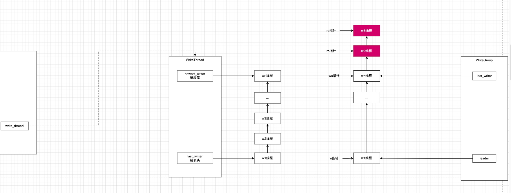

RocksDB选择了无锁化的策略控制并发，做法是把写请求缓存，选出leader线程作为代表统一进行写请求提交。

## 1 线程缓冲区

```cpp
/**
 * 无锁(mutex)入队
 * 用的是头插 不用尾插的原因是如果用尾插就每次要遍历链表到尾结点
 * @param w 要入队的写线程
 * @param newest_writer 当前的队列链表头
 * @return 返回值标识当前的线程w有没有晋升成WriterThead管理器的leader
 */
bool WriteThread::LinkOne(Writer* w, std::atomic<Writer*>* newest_writer) {
  assert(newest_writer != nullptr);
  assert(w->state == STATE_INIT); // 入队的线程状态必定是刚初始化好的
  // 原子读写 读到当前链表头结点
  Writer* writers = newest_writer->load(std::memory_order_relaxed);
  while (true) {
    assert(writers != w);
    // If write stall in effect, and w->no_slowdown is not true,
    // block here until stall is cleared. If its true, then return
    // immediately
    // 链表指向了阻断标识
    if (writers == &write_stall_dummy_) {
      if (w->no_slowdown) {
        w->status = Status::Incomplete("Write stall");
        SetState(w, STATE_COMPLETED);
        return false;
      }
      // Since no_slowdown is false, wait here to be notified of the write
      // stall clearing
      {
        MutexLock lock(&stall_mu_);
        writers = newest_writer->load(std::memory_order_relaxed);
        // 锁内检查
        if (writers == &write_stall_dummy_) {
          TEST_SYNC_POINT_CALLBACK("WriteThread::WriteStall::Wait", w);
          // 还是阻断标识 让当前写线程阻塞在这 暂停写 等待阻塞解除
          stall_cv_.Wait();
          // Load newest_writers_ again since it may have changed
          writers = newest_writer->load(std::memory_order_relaxed);
          continue;
        }
      }
    }
    w->link_older = writers;
    if (newest_writer->compare_exchange_weak(writers, w)) {
      // 这行代码什么意思 为什么要这么判断
      // WriterThread会让链表尾成为leader
      // 1 在当前线程入队之前 队列是空的 那么当前线程入队后自己就是队尾 那么当前线程就可以成为leader
      // 2 在当前线程入队之前 队列不是空的 那么也就说队尾已经有了线程 也就是说已经有了leader 那么当前线程就不能当leader了
      // 所以判断writers==nullptr本质就是看看当前入队的现成有没有资格成为leader
      return (writers == nullptr);
    }
  }
}
```



## 2 竞选leader

RocksDB把每个写线程都封装成Writer，然后用WriteThead对这些所有线程进行统一管理。链表管理线程采用头插，能晋选leader的是链表的尾结点上的线程。

## 3 Leader收集Group

Leader的职责是进行批处理，所以前提是Leader需要先识别出来哪些写线程请求算是一批的，抽象了WriteGroup用来表达集中处理的批。

### 3.1 WriteGroup结构

```cpp
  // leader把线程链表归于批处理的整合到一起 通过WriteGroup管理 Group用边界指针管理哪些线程是一批的
  struct WriteGroup {
    // 边界指针 [leader...last_writer]
    Writer* leader = nullptr;
    // 边界指针 [leader...last_writer]
    Writer* last_writer = nullptr;
  }
```

### 3.2 Leader怎么收集WriteGroup

单纯指针操作

#### 3.2.1 不能批处理的单独放到临时队列

```cpp
      // 不能加入到Group的线程丢到临时队列里面 把它们从现在的队列摘出来的原因是Group用的边界指针维护 所以必须要保证链表里面的线程结点在内存上连续的
      // 先从链表上摘除
      // remove from list
      w->link_older->link_newer = w->link_newer;
      if (w->link_newer != nullptr) {
        w->link_newer->link_older = w->link_older;
      }
      // 摘下来后保持相对位置放到临时链表里面
      // insert into r_list
      if (re == nullptr) {
        rb = re = w;
        w->link_older = nullptr;
      } else {
        w->link_older = re;
        re->link_newer = w;
        re = w;
      }
```

#### 3.2.2 能批处理的交给Group

```cpp
      // grow up
      we = w;
      w->write_group = write_group;
      size += WriteBatchInternal::ByteSize(w->batch);
      // 可以放到一个Group的线程 加到这个Group里面
      write_group->last_writer = w;
      write_group->size++;
```

#### 3.2.3 依然保证所有线程时序

```cpp
  // 哪些需要交给Group将来由Leader一次性操作的已经准备好 上面挑选线程的时候分出来不能在一个Group处理的需要再按照时序挂到Group队列后面 由下一个Leader继续处理
  if (rb != nullptr) {
    rb->link_older = we;
    re->link_newer = nullptr;
    we->link_newer = rb;
    if (!newest_writer_.compare_exchange_weak(w, re)) {
      while (w->link_older != newest_writer) {
        w = w->link_older;
      }
      w->link_older = re;
    }
  }
```

## 4 数据汇总

现在Group里面[leader...last_writer]区间是要提交的数据，要把这些数据汇总起来放到一起

```cpp
    // WriteGroup类写了Iterator的begin和end函数 所以可以for循环
    for (auto writer : write_group) {
      if (!writer->CallbackFailed()) {
        // 把线程要提交的数据拷贝一份到merged_batch上
        Status s = WriteBatchInternal::Append(*merged_batch, writer->batch,
                                              /*WAL_only*/ true);
        if (!s.ok()) {
          tmp_batch->Clear();
          return s;
        }
        if (WriteBatchInternal::IsLatestPersistentState(writer->batch)) {
          // We only need to cache the last of such write batch
          *to_be_cached_state = writer->batch;
        }
        (*write_with_wal)++;
      }
    }
```

## 5 一次性写到WAL

先从WriteBatch协议中拿到二进制格式

```cpp
  // 线程要提交的数据 二进制格式
  Slice log_entry = WriteBatchInternal::Contents(&merged_batch);
```

然后把二进制数据写到WAL

```cpp
  // 把二进制的WriteBatch协议写到WAL中
  io_s = log_writer->AddRecord(write_options, log_entry, sequence);
```

## 6 写到内存缓冲表

这个地方用到了经典的回调方式来解耦

```cpp
/**
 * 1个WriteBatch里面可能会有多个put record
 * 这个地方的设计把数据和对数据的操作解耦
 * 1 对于WriteBatch而言 我只负责把数据遍历出来 怎么做我不关心
 * 2 对数据要怎么操作完全交给回调
 * 解析里面每个put record
 * @param handler Handler接口
 *                ProtectionInfoUpdater对象
 *                MemTableInserter
 */
Status WriteBatch::Iterate(Handler* handler) const {
  if (rep_.size() < WriteBatchInternal::kHeader) {
    return Status::Corruption("malformed WriteBatch (too small)");
  }
  // WriteBatch逻辑协议带头 所以要跳过头部 直接跳到put record部分 把Handler回调接口丢进去 对数据的真正处理交给回调
  return WriteBatchInternal::Iterate(this, handler, WriteBatchInternal::kHeader,
                                     rep_.size());
}
```

真正把数据写到内存表的实现是`class MemTableInserter : public WriteBatch::Handler`