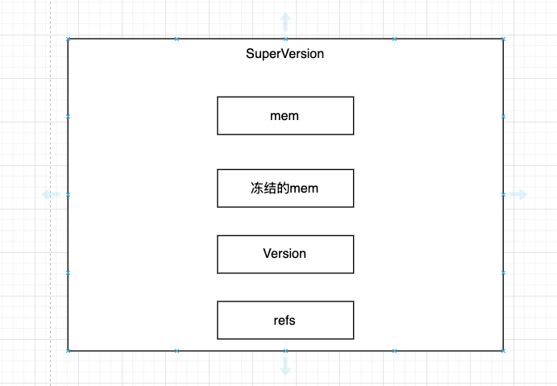

## 1 结构和布局



这个类重要的成员有4个

```cpp
/**
 * 这个组件的作用 拿到某个时刻DB的读视图的原子打包
 * 拿到了3大组件的快照版本
 * 因为3个组件是分别独立进行数据更新的
 *   1 写入会替换mem
 *   2 flush会改变冻结mem
 *   3 compaction会改变version
 * 如果没有SuperVersion的话 分别去拿这3个组件的指针 很容易拿到状态不一致的数据
 * 所以要把3个组件的数据绑定成一个不可以改变的快照
 * SuperVersion的重要性
 *   1 无锁读
 *   2 一致性保证不会读到一半数据结构发生变化
 *   3 生命周期安全 引用计数保证内存资源不会在读的过程中被回收
 */
struct SuperVersion {
  ReadOnlyMemTable* mem; // 当前写入表 正在写的内存表
  MemTableListVersion* imm; // 冻结的MemTable 已经停止写入等待flush到SST
  Version* current; // SST文件视图 levels+files

  // 引用计数 保证在使用过程中 不至于发生内存被回收的情况
  std::atomic<uint32_t> refs;
}
```

3大组件

- 
- 
- 

## 2 怎么拿快照

```cpp
SuperVersion* ColumnFamilyData::GetThreadLocalSuperVersion(DBImpl* db) {
  // The SuperVersion is cached in thread local storage to avoid acquiring
  // mutex when SuperVersion does not change since the last use. When a new
  // SuperVersion is installed, the compaction or flush thread cleans up
  // cached SuperVersion in all existing thread local storage. To avoid
  // acquiring mutex for this operation, we use atomic Swap() on the thread
  // local pointer to guarantee exclusive access. If the thread local pointer
  // is being used while a new SuperVersion is installed, the cached
  // SuperVersion can become stale. In that case, the background thread would
  // have swapped in kSVObsolete. We re-check the value at when returning
  // SuperVersion back to thread local, with an atomic compare and swap.
  // The superversion will need to be released if detected to be stale.
  // 取出当前thread-local的值 把它替换成当前线程正在用的
  void* ptr = local_sv_->Swap(SuperVersion::kSVInUse);
  // Invariant:
  // (1) Scrape (always) installs kSVObsolete in ThreadLocal storage
  // (2) the Swap above (always) installs kSVInUse, ThreadLocal storage
  // should only keep kSVInUse before ReturnThreadLocalSuperVersion call
  // (if no Scrape happens).
  // 防御性检查 保证不会重入 为什么这个地方要校验 如果不校验 这个函数外面会对引用计数+1 那么同一个对象的引用计数是2 将来释放的时候-1 影响对象的释放
  assert(ptr != SuperVersion::kSVInUse);
  SuperVersion* sv = static_cast<SuperVersion*>(ptr);
  if (sv == SuperVersion::kSVObsolete) {
    /**
     * 看看有没有过期
     * 什么时候会过期呢
     *   1 写入会替换memTable
     *   2 flush会冻结mem
     *   3 compaction会改变Version
     * 当这些动作发生的时候 后台线程会标记已经过期
     */
    RecordTick(ioptions_.stats, NUMBER_SUPERVERSION_ACQUIRES);
    // 缓存失效了 要上锁 重新去拿最新的快照
    db->mutex()->Lock();
    sv = super_version_->Ref();
    db->mutex()->Unlock();
  }
  assert(sv != nullptr);
  return sv;
}
```