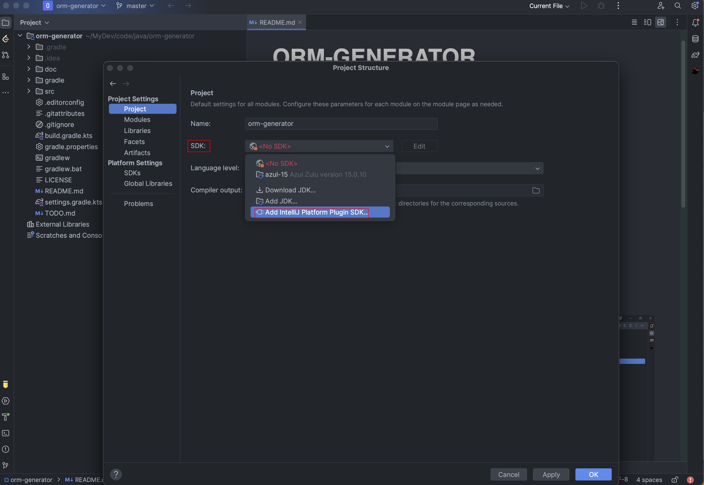

故事还得从下面两个插件说起

- `MyBatisCodeHelperPro`是付费插件，还有2个月到期。虽然该插件提供了丰富的特性功能，但是我也仅仅在新建项目或者添加数据表的时候用到它的基础代码生成功能。

- `LeetCode Editor`用来刷题的，整体不错，但是有点小瑕疵。首先IDEA会经常提示该插件的`Exception`，应该是源码实现上抛的异常，虽然不影响使用但是每每看到提示总觉得不是很友好。再者最近使用时候发现登陆存在问题，可能leetcode官网更换了用户登陆登出机制，插件没有及时更新。

基于上述，我想自己熟悉在IDEA上的插件开发，以便定制化自己的需求，显而易见的是代码生成是更简单的，只涉及简单的UI交互和编码生成。而leetcode刷题插件需要更多的网络API接口交互。

### 1 [官方文档](https://plugins.jetbrains.com/docs/intellij/welcome.html)

首先就要找到官方的资源支持，包括

- 完备丰富的文档

- SDK介绍

- QuickStart及Example演示

- 社区问答

### 2 插件开发

- [mybatis代码生成插件orm-generator](https://github.com/Bannirui/orm-generator)

#### 2.1 orm-generator

##### 2.1.1 新建项目

IDEA提供了项目模版选项，只要简单地填写项目信息即可。

##### 2.1.2 SDK配置

为当前项目配置SDK(jetbrains提供的platform devkit)。

##### 2.1.3 编码

除了源码开发之外，比较重要的文件就两个

- build.gradle.kts
- plugin.xml

##### 2.1.4 调试编译

IDEA提供了Grade插件，我们甚至可以不用写一条命令，直接达到期望的效果。

##### 2.1.5 插件发布

开发好并调试完毕之后，就可以申请发布到官方的marketplace了，我选择的方式是手工上传网页。

需要注意的点

- 选择的文件为项目根目录下`./build/distribution/`下的`.zip`文件
- 每次编译都更新`build.gradle.kts`和`plugin.xml`文件，迭代升级对应的版本(marketplace校验同channel中文件版本不能重复)

之后根据收到的邮件提示信息操作即可

