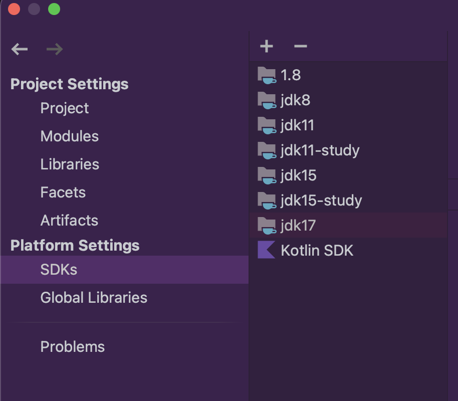
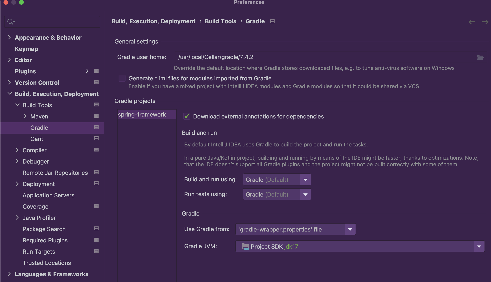
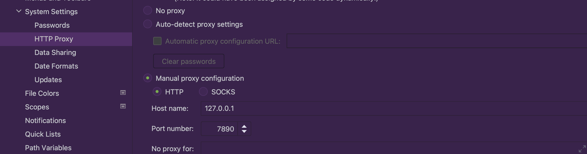
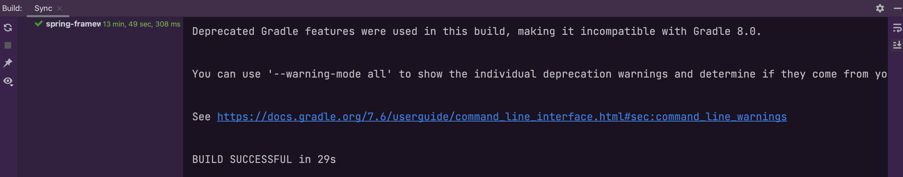

## 1 源码

[Git地址](https://github.com/Bannirui/spring-framework.git)，分支my-study-6.0.3。

```sh
git clone git@github.com:Bannirui/spring-framework.git
cd spring-framework

git remote add upstream git@github.com:spring-projects/spring-framework.git
git remote set-url --push upstream no_push

git checkout my-study-6.0.3

sudo apt install openjdk-17-jdk
```

新版本的分支看

## 2 文件修改

修改源码路径下gradle.properties，增加两行

```shell
org.gradle.configureondemand=true
org.gradle.daemon=true
```

## 3 IDEA设置

### 3.1 SDK设置



### 3.2 Gradle设置



### 3.3 代理设置

设置代理网络代理。



### 3.4 自动编译



## 4 新建模块

Spring源码工程下新建模块用于调试源码，名称以*spring*为前缀。

## 5 引入依赖

```groovy
plugins {
    id 'java'
}

group 'org.springframework'
version '6.0.3-SNAPSHOT'

repositories {
    mavenCentral()
}

dependencies {
    api(project(":spring-context"))

    testImplementation 'org.junit.jupiter:junit-jupiter-api:5.8.1'
    testRuntimeOnly 'org.junit.jupiter:junit-jupiter-engine:5.8.1'
}

test {
    useJUnitPlatform()
}
```

## 6 调试代码

```java
public class Main {

	public static void main(String[] args) {
		ApplicationContext ctx = new AnnotationConfigApplicationContext(MyConfig.class);
		MyBean1 myBean1 = ctx.getBean(MyBean1.class);
		String name = myBean1.getName();
		System.out.println(name);
	}
}
```

```java
@Configuration
public class MyConfig {

	@Bean
	public MyBean1 myBean1() {
		return new MyBean1();
	}
}

class MyBean1 {

	private String name;

	public String getName() {
		return name;
	}

	public void setName(String name) {
		this.name = name;
	}
}
```