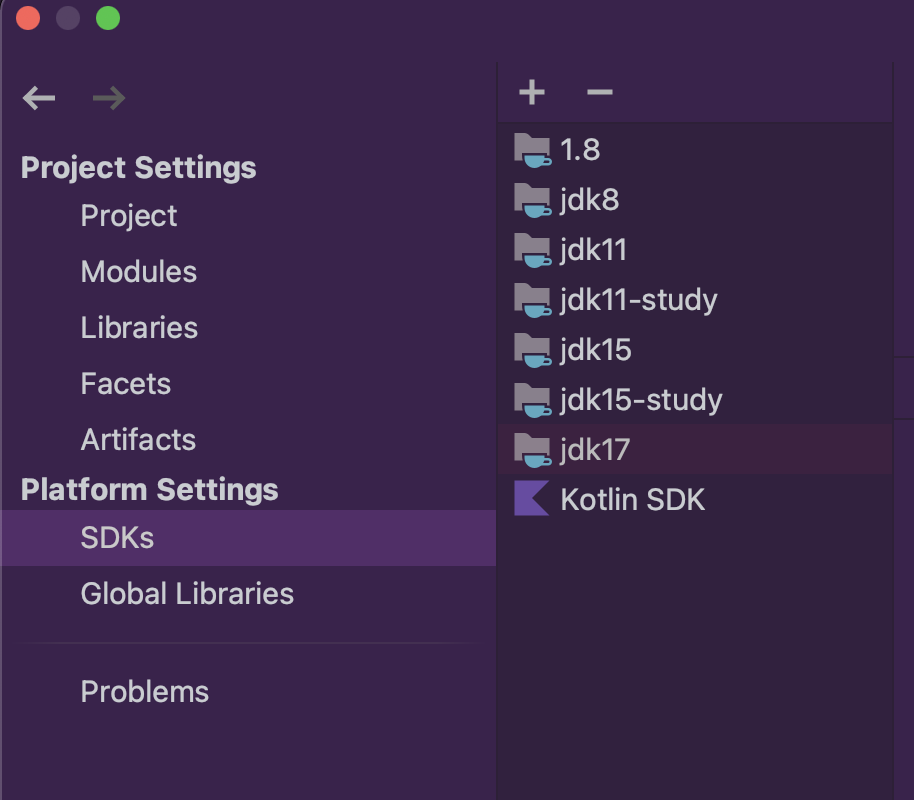
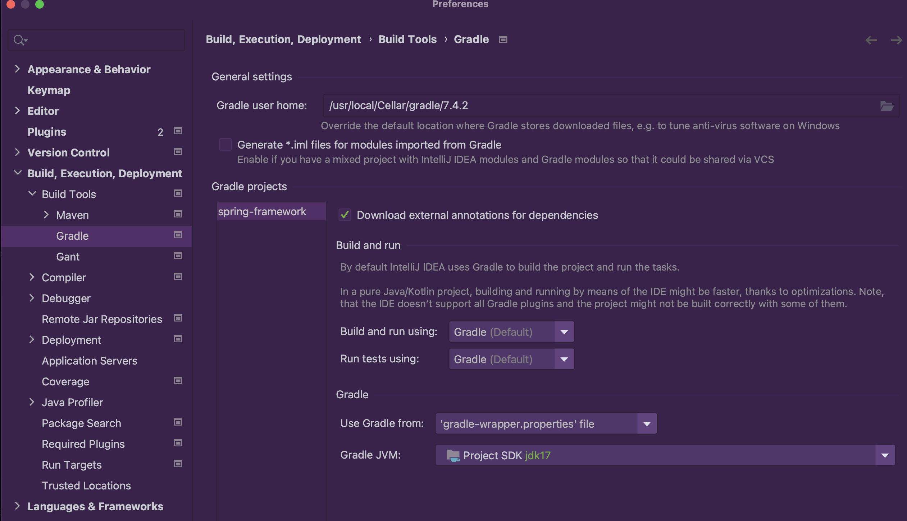
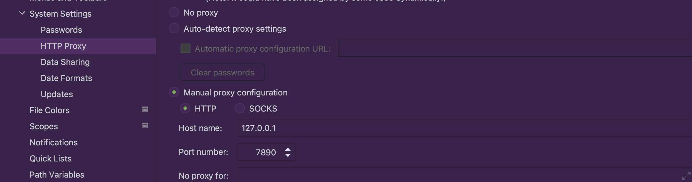
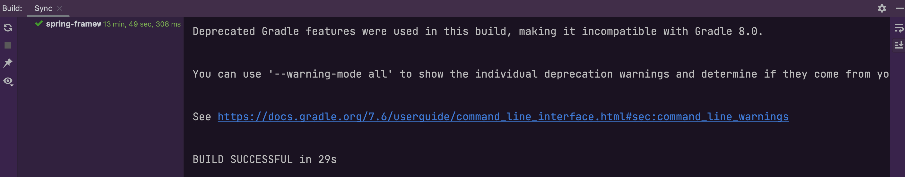

## 1 源码

[Git地址](https://github.com/Bannirui/spring-framework.git)，分支my-study-6.0.3。

## 2 编译环境

|        | 版本           |
| ------ | -------------- |
| Spring | 6.0.3-SNAPSHOT |
| OS     | macOS 11.5.2   |
| Java   | 17.0.1         |
| Gradle | 7.4.2          |
| IDEA   | 2022.2.1       |

## 3 文件修改

修改源码路径下gradle.properties，增加两行

```shell
org.gradle.configureondemand=true
org.gradle.daemon=true
```

## 4 IDEA设置

### 4.1 SDK设置



### 4.2 Gradle设置



### 4.3 代理设置

设置代理网络代理。



### 4.4 自动编译



## 5 新建模块

Spring源码工程下新建模块用于调试源码，名称以*spring*为前缀。


## 6 引入依赖

```groovy
plugins {
    id 'java'
}

group 'org.springframework'
version '6.0.3-SNAPSHOT'

repositories {
    mavenCentral()
}

dependencies {
    api(project(":spring-context"))

    testImplementation 'org.junit.jupiter:junit-jupiter-api:5.8.1'
    testRuntimeOnly 'org.junit.jupiter:junit-jupiter-engine:5.8.1'
}

test {
    useJUnitPlatform()
}
```

## 7 调试代码

```java
public class Main {

	public static void main(String[] args) {
		ApplicationContext ctx = new AnnotationConfigApplicationContext(MyConfig.class);
		MyBean1 myBean1 = ctx.getBean(MyBean1.class);
		String name = myBean1.getName();
		System.out.println(name);
	}
}
```

```java
@Configuration
public class MyConfig {

	@Bean
	public MyBean1 myBean1() {
		return new MyBean1();
	}
}

class MyBean1 {

	private String name;

	public String getName() {
		return name;
	}

	public void setName(String name) {
		this.name = name;
	}
}
```

