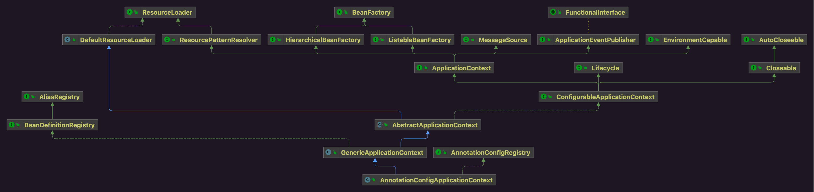
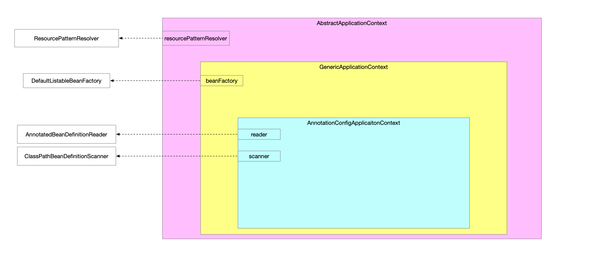
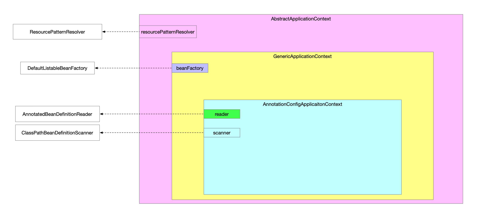

## 1 类关系



## 2 宏观视角



## 3 容器创建

注解Bean方式

```java
public class AnnotationCtxMain02 {

    public static void main(String[] args) {
        new AnnotationConfigApplicationContext(MyCfg02.class);
    }
}
```

```java
// AnnotationConfigApplicationContext.java
public AnnotationConfigApplicationContext(Class<?>... componentClasses) {
    /**
		 * 完成容器的基础组件初始化
		 *     - beanFactory
		 *         - 实现是DefaultListableBeanFactory
		 *     - reader
		 *         - 注解Bean读取
		 *         - BeanDefinition注入容器
		 *     - scanner
		 *         - 指定路径扫包
		 *         - BeanDefinition注入容器
		 */
    this();
    this.register(componentClasses); // Bean读取器读取注解Bean将类信息封装BeanDefinition注入容器 配置类
    /**
		 * 到此为止完成了准备工作
		 *     - 向IoC容器中注册了用于处理注解Bean这种场景下的后置处理器
		 *     - 向IoC容器中注册了用户配置类
		 *
		 * 
		 */
    super.refresh();
}
```

容器创建主要3个步骤

* 基础组件初始化
* 注入BeanDefinition
* refresh

### 3.1 基础组件

```java
// AnnotationConfigApplicationContext.java
public AnnotationConfigApplicationContext() {
    super();
    StartupStep createAnnotatedBeanDefReader = this.getApplicationStartup().start("spring.context.annotated-bean-reader.create");
    this.reader = new AnnotatedBeanDefinitionReader(this); // 注解Bean读取器
    createAnnotatedBeanDefReader.end();
    this.scanner = new ClassPathBeanDefinitionScanner(this); // 路径扫包器
}
```

```java
// GenericApplicationContext.java
public GenericApplicationContext() {
    super();
    this.beanFactory = new DefaultListableBeanFactory();
}
```

```java
// AbstractApplicationContext.java
public AbstractApplicationContext() {
    this.resourcePatternResolver = getResourcePatternResolver();
}
```

也就是如图：



### 3.2 注解Bean读取器

。

完成了2个工作：

* 向IoC容器中注册了用于处理注解Bean这种场景下的后置处理器
* 向IoC容器中注册了用户配置类

| 后置处理器类                                                 |
| ------------------------------------------------------------ |
|  |
| AutowiredAnnotationBeanPostProcessor                         |
| CommonAnnotationBeanPostProcessor                            |
| InitDestroyAnnotationBeanPostProcessor                       |
| PersistenceAnnotationBeanPostProcessor                       |
| EventListenerMethodProcessor                                 |
| DefaultEventListenerFactory                                  |

## 4 

