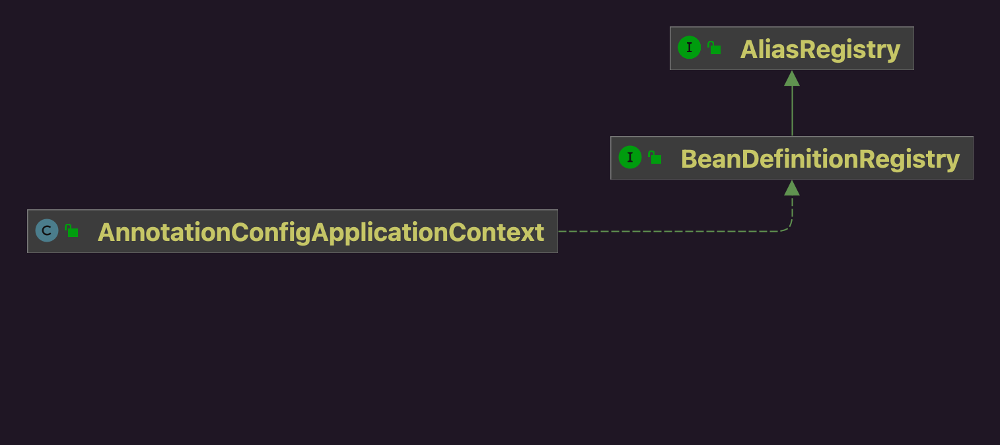
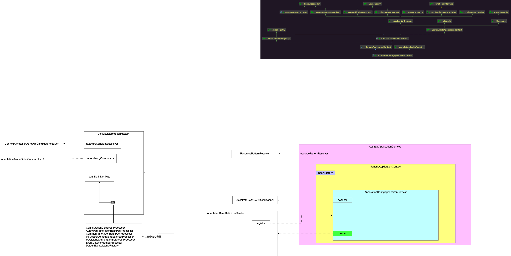

AnnotatedBeanDefinitionReader，注解Bean读取器。

## 1 构造方法

```java
public AnnotatedBeanDefinitionReader(BeanDefinitionRegistry registry, Environment environment) {
    Assert.notNull(registry, "BeanDefinitionRegistry must not be null");
    Assert.notNull(environment, "Environment must not be null");
    this.registry = registry;
    this.conditionEvaluator = new ConditionEvaluator(registry, environment, null);
    /**
		 * 向IoC容器注册BeanDefinition
		 *     - 所谓注册就是放到IoC容器中 将来在实例化Bean过程中发挥作用
		 *         - IoC容器中DefaultListableBeanFactory
		 *         - 缓存到beanFactory的beanDefinitionMap中
		 *     - BeanDefinition的角色是后置处理器
		 *     - 尝试将以下几个注册到IoC容器中
		 *         - ConfigurationClassPostProcessor
		 *         - AutowiredAnnotationBeanPostProcessor
		 *         - CommonAnnotationBeanPostProcessor
		 *         - InitDestroyAnnotationBeanPostProcessor
		 *         - PersistenceAnnotationBeanPostProcessor
		 *         - EventListenerMethodProcessor
		 *         - DefaultEventListenerFactory
		 */
    AnnotationConfigUtils.registerAnnotationConfigProcessors(this.registry);
}
```

## 2 registry

也就是Bean读取器持有IoC容器实例。



## 3 注册后置处理器

```java
// AnnotationConfigUtils.java
public static void registerAnnotationConfigProcessors(BeanDefinitionRegistry registry) {
    registerAnnotationConfigProcessors(registry, null);
}
```

```java
// AnnotationConfigUtils.java
public static Set<BeanDefinitionHolder> registerAnnotationConfigProcessors(
    BeanDefinitionRegistry registry, @Nullable Object source) {

    DefaultListableBeanFactory beanFactory = unwrapDefaultListableBeanFactory(registry);
    if (beanFactory != null) {
        if (!(beanFactory.getDependencyComparator() instanceof AnnotationAwareOrderComparator)) {
            beanFactory.setDependencyComparator(AnnotationAwareOrderComparator.INSTANCE);
        }
        if (!(beanFactory.getAutowireCandidateResolver() instanceof ContextAnnotationAutowireCandidateResolver)) {
            beanFactory.setAutowireCandidateResolver(new ContextAnnotationAutowireCandidateResolver());
        }
    }

    Set<BeanDefinitionHolder> beanDefs = new LinkedHashSet<>(8);

    if (!registry.containsBeanDefinition(CONFIGURATION_ANNOTATION_PROCESSOR_BEAN_NAME)) {
        RootBeanDefinition def = new RootBeanDefinition(ConfigurationClassPostProcessor.class);
        def.setSource(source);
        beanDefs.add(registerPostProcessor(registry, def, CONFIGURATION_ANNOTATION_PROCESSOR_BEAN_NAME));
    }

    if (!registry.containsBeanDefinition(AUTOWIRED_ANNOTATION_PROCESSOR_BEAN_NAME)) {
        RootBeanDefinition def = new RootBeanDefinition(AutowiredAnnotationBeanPostProcessor.class);
        def.setSource(source);
        beanDefs.add(registerPostProcessor(registry, def, AUTOWIRED_ANNOTATION_PROCESSOR_BEAN_NAME));
    }

    // Check for Jakarta Annotations support, and if present add the CommonAnnotationBeanPostProcessor.
    if (jakartaAnnotationsPresent && !registry.containsBeanDefinition(COMMON_ANNOTATION_PROCESSOR_BEAN_NAME)) {
        RootBeanDefinition def = new RootBeanDefinition(CommonAnnotationBeanPostProcessor.class);
        def.setSource(source);
        beanDefs.add(registerPostProcessor(registry, def, COMMON_ANNOTATION_PROCESSOR_BEAN_NAME));
    }

    // Check for JSR-250 support, and if present add an InitDestroyAnnotationBeanPostProcessor
    // for the javax variant of PostConstruct/PreDestroy.
    if (jsr250Present && !registry.containsBeanDefinition(JSR250_ANNOTATION_PROCESSOR_BEAN_NAME)) {
        try {
            RootBeanDefinition def = new RootBeanDefinition(InitDestroyAnnotationBeanPostProcessor.class);
            def.getPropertyValues().add("initAnnotationType", classLoader.loadClass("javax.annotation.PostConstruct"));
            def.getPropertyValues().add("destroyAnnotationType", classLoader.loadClass("javax.annotation.PreDestroy"));
            def.setSource(source);
            beanDefs.add(registerPostProcessor(registry, def, JSR250_ANNOTATION_PROCESSOR_BEAN_NAME));
        }
        catch (ClassNotFoundException ex) {
            // Failed to load javax variants of the annotation types -> ignore.
        }
    }

    // Check for JPA support, and if present add the PersistenceAnnotationBeanPostProcessor.
    if (jpaPresent && !registry.containsBeanDefinition(PERSISTENCE_ANNOTATION_PROCESSOR_BEAN_NAME)) {
        RootBeanDefinition def = new RootBeanDefinition();
        try {
            def.setBeanClass(ClassUtils.forName(PERSISTENCE_ANNOTATION_PROCESSOR_CLASS_NAME,
                                                AnnotationConfigUtils.class.getClassLoader()));
        }
        catch (ClassNotFoundException ex) {
            throw new IllegalStateException(
                "Cannot load optional framework class: " + PERSISTENCE_ANNOTATION_PROCESSOR_CLASS_NAME, ex);
        }
        def.setSource(source);
        beanDefs.add(registerPostProcessor(registry, def, PERSISTENCE_ANNOTATION_PROCESSOR_BEAN_NAME));
    }

    if (!registry.containsBeanDefinition(EVENT_LISTENER_PROCESSOR_BEAN_NAME)) {
        RootBeanDefinition def = new RootBeanDefinition(EventListenerMethodProcessor.class);
        def.setSource(source);
        beanDefs.add(registerPostProcessor(registry, def, EVENT_LISTENER_PROCESSOR_BEAN_NAME));
    }

    if (!registry.containsBeanDefinition(EVENT_LISTENER_FACTORY_BEAN_NAME)) {
        RootBeanDefinition def = new RootBeanDefinition(DefaultEventListenerFactory.class);
        def.setSource(source);
        beanDefs.add(registerPostProcessor(registry, def, EVENT_LISTENER_FACTORY_BEAN_NAME));
    }

    return beanDefs;
}
```

```java
// AnnotationConfigUtils.java
private static BeanDefinitionHolder registerPostProcessor(
    BeanDefinitionRegistry registry, RootBeanDefinition definition, String beanName) {

    definition.setRole(BeanDefinition.ROLE_INFRASTRUCTURE);
    registry.registerBeanDefinition(beanName, definition); // BeanDefinition注册到IoC容器
    return new BeanDefinitionHolder(definition, beanName);
}
```

。

## 4 示意图



读取器的职责就是前置化向IoC容器中注册几个特定的后置处理器，将来在Bean的生命周期中发挥作用。

## 5 注册配置类

```java
// AnnotationConfigApplicationContext.java
this.register(componentClasses); // Bean读取器读取注解Bean将类信息封装BeanDefinition注入容器 配置类
```

```java
// AnnotationConfigApplicationContext.java
@Override
public void register(Class<?>... componentClasses) {
    Assert.notEmpty(componentClasses, "At least one component class must be specified");
    StartupStep registerComponentClass = this.getApplicationStartup().start("spring.context.component-classes.register")
        .tag("classes", () -> Arrays.toString(componentClasses));
    this.reader.register(componentClasses);
    registerComponentClass.end();
}
```

```java
// AnnotatedBeanDefinitionReader.java
public void register(Class<?>... componentClasses) {
    for (Class<?> componentClass : componentClasses) {
        this.registerBean(componentClass);
    }
}
```

```java
// AnnotatedBeanDefinitionReader.java
public void registerBean(Class<?> beanClass) {
    this.doRegisterBean(beanClass, null, null, null, null);
}
```

```java
// AnnotatedBeanDefinitionReader.java
private <T> void doRegisterBean(Class<T> beanClass, @Nullable String name,
                                @Nullable Class<? extends Annotation>[] qualifiers, @Nullable Supplier<T> supplier,
                                @Nullable BeanDefinitionCustomizer[] customizers) {

    AnnotatedGenericBeanDefinition abd = new AnnotatedGenericBeanDefinition(beanClass); // 封装BeanDefinition
    if (this.conditionEvaluator.shouldSkip(abd.getMetadata())) {
        return;
    }

    abd.setInstanceSupplier(supplier);
    ScopeMetadata scopeMetadata = this.scopeMetadataResolver.resolveScopeMetadata(abd);
    abd.setScope(scopeMetadata.getScopeName());
    String beanName = (name != null ? name : this.beanNameGenerator.generateBeanName(abd, this.registry));

    AnnotationConfigUtils.processCommonDefinitionAnnotations(abd);
    if (qualifiers != null) {
        for (Class<? extends Annotation> qualifier : qualifiers) {
            if (Primary.class == qualifier) {
                abd.setPrimary(true);
            }
            else if (Lazy.class == qualifier) {
                abd.setLazyInit(true);
            }
            else {
                abd.addQualifier(new AutowireCandidateQualifier(qualifier));
            }
        }
    }
    if (customizers != null) {
        for (BeanDefinitionCustomizer customizer : customizers) {
            customizer.customize(abd);
        }
    }

    BeanDefinitionHolder definitionHolder = new BeanDefinitionHolder(abd, beanName);
    definitionHolder = AnnotationConfigUtils.applyScopedProxyMode(scopeMetadata, definitionHolder, this.registry);
    BeanDefinitionReaderUtils.registerBeanDefinition(definitionHolder, this.registry); // BeanDefinition注册到IoC容器
}
```


```java
// BeanDefinitionReaderUtils.java
public static void registerBeanDefinition(
    BeanDefinitionHolder definitionHolder, BeanDefinitionRegistry registry)
    throws BeanDefinitionStoreException {

    // Register bean definition under primary name.
    String beanName = definitionHolder.getBeanName();
    registry.registerBeanDefinition(beanName, definitionHolder.getBeanDefinition()); // BeanDefinition注册IoC容器

    // Register aliases for bean name, if any.
    String[] aliases = definitionHolder.getAliases();
    if (aliases != null) {
        for (String alias : aliases) {
            registry.registerAlias(beanName, alias);
        }
    }
}
```
