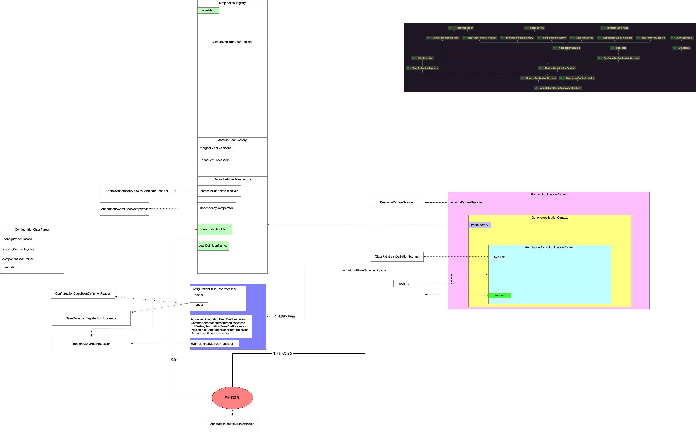

## 1 refresh

```java
// AbstractApplicationContext.java
@Override
public void refresh() throws BeansException, IllegalStateException {
    synchronized (this.startupShutdownMonitor) {
        StartupStep contextRefresh = this.applicationStartup.start("spring.context.refresh");

        // Prepare this context for refreshing.
        /**
			 * 1 容器启动前置准备
			 */
        this.prepareRefresh();

        // Tell the subclass to refresh the internal bean factory.
        /**
			 * 模板方法
			 * 从子类的实现(GenericApplicationContext)获取Bean工厂beanFactory(DefaultListableBeanFactory)
			 */
        ConfigurableListableBeanFactory beanFactory = this.obtainFreshBeanFactory();

        // Prepare the bean factory for use in this context.
        /**
			 * 2 Bean工厂前置准备
			 */
        this.prepareBeanFactory(beanFactory);

        try {
            // Allows post-processing of the bean factory in context subclasses.
            /**
				 * 3 空实现
				 */
            this.postProcessBeanFactory(beanFactory);

            StartupStep beanPostProcess = this.applicationStartup.start("spring.context.beans.post-process");
            // Invoke factory processors registered as beans in the context.
            /**
				 * 4 调用所有注册的BeanFactoryPostProcessor的实例
				 *     - BeanFactoryPostProcessor
				 *     - BeanDefinitionRegistryPostProcessor
				 * Bean工厂后置处理器职责
				 *     - 作用对象是Bean工厂
				 *     - 现在还没有将用户BeanDefinition注册到Bean工厂中
				 *     - 特定的后置处理器作用是将用户BeanDefinition注册Bean工厂中
				 * ConfigurationClassPostProcessor作用的时机
				 *     - 解析配置类
				 *     - 注册BeanDefinition到Bean工厂
				 *     - 增强full型配置类
				 *     - 向Bean工厂注册一个Bean后置处理器ImportAwareBeanPostProcessor
				 */
            this.invokeBeanFactoryPostProcessors(beanFactory);

            // Register bean processors that intercept bean creation.
            /**
				 * 5 Bean实例化初始化之前将后置处理器注册到容器中
				 * 后置处理器的职责
				 *     - BeanDefinition都已经注册到了Bean工厂中(DefaultListableBeanFactory的beanDefinitionMap)
				 *     - Spring可以根据BeanDefinition进行Bean的实例化和初始化
				 *     - 在此之前注册Bean的后置处理器
				 *         - 在Bean实例化前后回调
				 *         - 在Bean初始化前后回调
				 * 上面Bean工厂后置处理器执行结束之后 就已经将BeanDefinition都注册到Bean工厂beanDefinitionMap中了
				 * 现在将所有Bean工厂中BeanDefinition中是Bean后置处理器的都进行实例化注册到Bean工厂的beanPostProcessors中
				 */
            registerBeanPostProcessors(beanFactory);
            beanPostProcess.end();

            // Initialize message source for this context.
            /**
				 * 6 初始化信息源
				 *     - 国际化
				 */
            initMessageSource();

            // Initialize event multicaster for this context.
            /**
				 * 7 初始化容器事件传播器
				 */
            initApplicationEventMulticaster();

            // Initialize other special beans in specific context subclasses.
            /**
				 * 8 特定上下文子类中初始化特殊的Bean
				 */
            onRefresh();

            // Check for listener beans and register them.
            /**
				 * 9 监听器Bean
				 */
            registerListeners();

            // Instantiate all remaining (non-lazy-init) singletons.
            /**
				 * 10 实例化非延迟初始化单例
				 */
            finishBeanFactoryInitialization(beanFactory);

            // Last step: publish corresponding event.
            /**
				 * 11 初始化容器生命周期事件处理器 发布容器生命周期事件
				 */
            finishRefresh();
        }

        catch (BeansException ex) {
            if (logger.isWarnEnabled()) {
                logger.warn("Exception encountered during context initialization - " +
                            "cancelling refresh attempt: " + ex);
            }

            // Destroy already created singletons to avoid dangling resources.
            destroyBeans();

            // Reset 'active' flag.
            cancelRefresh(ex);

            // Propagate exception to caller.
            throw ex;
        }

        finally {
            // Reset common introspection caches in Spring's core, since we
            // might not ever need metadata for singleton beans anymore...
            resetCommonCaches();
            contextRefresh.end();
        }
    }
}
```

## 2 步骤

| 序号 | 传送门                                                       |
| ---- | ------------------------------------------------------------ |
| 1    | prepareRefresh方法                                           |
| 2    | prepareBeanFactory方法                                       |
| 3    | postProcessBeanFactory方法                                   |
| 4    |  |
| 5    |  |
| 6    | initMessageSource方法                                        |
| 7    | initApplicationEventMulticaster方法                          |
| 8    | onRefresh方法                                                |
| 9    | registerListeners方法                                        |
| 10   | finishBeanFactoryInitialization方法                          |
| 11   | finishRefresh方法                                            |

## 3 示意图



