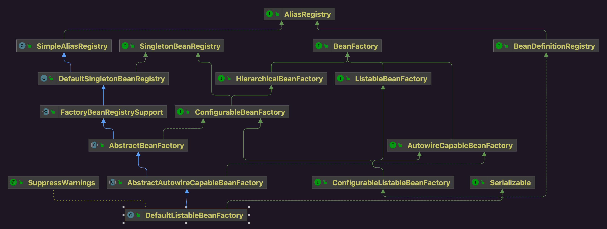
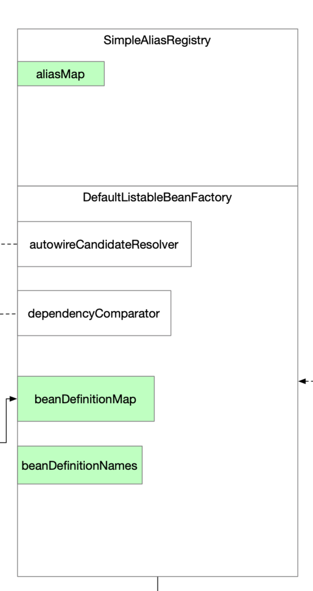

实现在DefaultListableRegistry。

## 1 类图



## 2 BeanDefinition注册Bean工厂

### 2.1 源码

```java
// DefaultListableBeanFactory.java
@Override
public void registerBeanDefinition(String beanName, BeanDefinition beanDefinition)
    throws BeanDefinitionStoreException {

    Assert.hasText(beanName, "Bean name must not be empty");
    Assert.notNull(beanDefinition, "BeanDefinition must not be null");

    if (beanDefinition instanceof AbstractBeanDefinition abd) {
        try {
            abd.validate();
        }
        catch (BeanDefinitionValidationException ex) {
            throw new BeanDefinitionStoreException(beanDefinition.getResourceDescription(), beanName,
                                                   "Validation of bean definition failed", ex);
        }
    }

    BeanDefinition existingDefinition = this.beanDefinitionMap.get(beanName); // 校验是否注册过Bean
    if (existingDefinition != null) { // 注册过相同名字
        if (!this.isAllowBeanDefinitionOverriding()) { // 容器默认配置同名覆盖
            throw new BeanDefinitionOverrideException(beanName, beanDefinition, existingDefinition);
        }
        else if (existingDefinition.getRole() < beanDefinition.getRole()) {
            // e.g. was ROLE_APPLICATION, now overriding with ROLE_SUPPORT or ROLE_INFRASTRUCTURE
            if (logger.isInfoEnabled()) {
                logger.info("Overriding user-defined bean definition for bean '" + beanName +
                            "' with a framework-generated bean definition: replacing [" +
                            existingDefinition + "] with [" + beanDefinition + "]");
            }
        }
        else if (!beanDefinition.equals(existingDefinition)) {
            if (logger.isDebugEnabled()) {
                logger.debug("Overriding bean definition for bean '" + beanName +
                             "' with a different definition: replacing [" + existingDefinition +
                             "] with [" + beanDefinition + "]");
            }
        }
        else {
            if (logger.isTraceEnabled()) {
                logger.trace("Overriding bean definition for bean '" + beanName +
                             "' with an equivalent definition: replacing [" + existingDefinition +
                             "] with [" + beanDefinition + "]");
            }
        }
        this.beanDefinitionMap.put(beanName, beanDefinition);
    }
    else { // 没有注册过Bean
        if (super.isAlias(beanName)) { // 存在别名
            if (!isAllowBeanDefinitionOverriding()) {
                String aliasedName = canonicalName(beanName);
                if (containsBeanDefinition(aliasedName)) {  // alias for existing bean definition
                    throw new BeanDefinitionOverrideException(
                        beanName, beanDefinition, getBeanDefinition(aliasedName));
                }
                else {  // alias pointing to non-existing bean definition
                    throw new BeanDefinitionStoreException(beanDefinition.getResourceDescription(), beanName,
                                                           "Cannot register bean definition for bean '" + beanName +
                                                           "' since there is already an alias for bean '" + aliasedName + "' bound.");
                }
            }
            else {
                removeAlias(beanName);
            }
        }
        if (hasBeanCreationStarted()) { // 当前有Bean在创建中
            // Cannot modify startup-time collection elements anymore (for stable iteration)
            synchronized (this.beanDefinitionMap) {
                this.beanDefinitionMap.put(beanName, beanDefinition);
                List<String> updatedDefinitions = new ArrayList<>(this.beanDefinitionNames.size() + 1);
                updatedDefinitions.addAll(this.beanDefinitionNames);
                updatedDefinitions.add(beanName);
                this.beanDefinitionNames = updatedDefinitions;
                removeManualSingletonName(beanName);
            }
        }
        else {
            // Still in startup registration phase
            this.beanDefinitionMap.put(beanName, beanDefinition); // 缓存BeanDefinition
            this.beanDefinitionNames.add(beanName); // 缓存beanName
            this.removeManualSingletonName(beanName);
        }
        this.frozenBeanDefinitionNames = null;
    }

    if (existingDefinition != null || containsSingleton(beanName)) {
        resetBeanDefinition(beanName);
    }
    else if (isConfigurationFrozen()) {
        clearByTypeCache();
    }
}
```

### 2.2 示意图

注册就是缓存的过程

* 每个BeanDefinition注册时指定名称
* 名称缓存到beanDefinitionNames
* BeanDefinition缓存到beanDefinitionMap

## 3 根据类型从Bean工厂查找Bean名称

```java
// DefaultListableBeanFactory.java
@Override
public String[] getBeanNamesForType(@Nullable Class<?> type, boolean includeNonSingletons, boolean allowEagerInit) {
    if (!isConfigurationFrozen() || type == null || !allowEagerInit) {
        return this.doGetBeanNamesForType(ResolvableType.forRawClass(type), includeNonSingletons, allowEagerInit);
    }
    Map<Class<?>, String[]> cache =
        (includeNonSingletons ? this.allBeanNamesByType : this.singletonBeanNamesByType);
    String[] resolvedBeanNames = cache.get(type);
    if (resolvedBeanNames != null) {
        return resolvedBeanNames;
    }
    resolvedBeanNames = doGetBeanNamesForType(ResolvableType.forRawClass(type), includeNonSingletons, true);
    if (ClassUtils.isCacheSafe(type, getBeanClassLoader())) {
        cache.put(type, resolvedBeanNames);
    }
    return resolvedBeanNames;
}
```

## 4 合并继承关系的类

```java
// AbstractBeanFactory.java
protected RootBeanDefinition getMergedLocalBeanDefinition(String beanName) throws BeansException {
    // Quick check on the concurrent map first, with minimal locking.
    RootBeanDefinition mbd = this.mergedBeanDefinitions.get(beanName); // 缓存
    if (mbd != null && !mbd.stale) {
        return mbd;
    }
    return this.getMergedBeanDefinition(beanName, getBeanDefinition(beanName)); // 从子类DefaultListableBeanFactory的缓存beanDefinitionMap中拿到BeanDefinition
}
```

```java
// AbstractBeanFactory.java
protected RootBeanDefinition getMergedBeanDefinition(String beanName, BeanDefinition bd)
    throws BeanDefinitionStoreException {

    return this.getMergedBeanDefinition(beanName, bd, null);
}
```

```java
// AbstractBeanFactory.java
protected RootBeanDefinition getMergedBeanDefinition(
    String beanName, BeanDefinition bd, @Nullable BeanDefinition containingBd)
    throws BeanDefinitionStoreException {

    synchronized (this.mergedBeanDefinitions) {
        RootBeanDefinition mbd = null; // 父类+子类的整合结果
        RootBeanDefinition previous = null; // 递归过程中记录上一次递归结果

        // Check with full lock now in order to enforce the same merged instance.
        if (containingBd == null) {
            mbd = this.mergedBeanDefinitions.get(beanName);
        }

        if (mbd == null || mbd.stale) {
            previous = mbd; // 递归之前保存当前结果
            if (bd.getParentName() == null) { // 没有继承关系
                // Use copy of given root bean definition.
                if (bd instanceof RootBeanDefinition rootBeanDef) {
                    mbd = rootBeanDef.cloneBeanDefinition();
                }
                else {
                    mbd = new RootBeanDefinition(bd);
                }
            }
            else { // 有继承关系
                // Child bean definition: needs to be merged with parent.
                BeanDefinition pbd; // 父类
                try {
                    String parentBeanName = this.transformedBeanName(bd.getParentName()); // 父类的名称
                    if (!beanName.equals(parentBeanName)) {
                        pbd = getMergedBeanDefinition(parentBeanName); // 递归调用
                    }
                    else {
                        if (getParentBeanFactory() instanceof ConfigurableBeanFactory parent) {
                            pbd = parent.getMergedBeanDefinition(parentBeanName);
                        }
                        else {
                            throw new NoSuchBeanDefinitionException(parentBeanName,
                                                                    "Parent name '" + parentBeanName + "' is equal to bean name '" + beanName +
                                                                    "': cannot be resolved without a ConfigurableBeanFactory parent");
                        }
                    }
                }
                catch (NoSuchBeanDefinitionException ex) {
                    throw new BeanDefinitionStoreException(bd.getResourceDescription(), beanName,
                                                           "Could not resolve parent bean definition '" + bd.getParentName() + "'", ex);
                }
                // Deep copy with overridden values.
                mbd = new RootBeanDefinition(pbd);
                mbd.overrideFrom(bd); // mbd=父类+子类
            }

            // Set default singleton scope, if not configured before.
            if (!StringUtils.hasLength(mbd.getScope())) {
                mbd.setScope(SCOPE_SINGLETON);
            }

            // A bean contained in a non-singleton bean cannot be a singleton itself.
            // Let's correct this on the fly here, since this might be the result of
            // parent-child merging for the outer bean, in which case the original inner bean
            // definition will not have inherited the merged outer bean's singleton status.
            if (containingBd != null && !containingBd.isSingleton() && mbd.isSingleton()) {
                mbd.setScope(containingBd.getScope());
            }

            // Cache the merged bean definition for the time being
            // (it might still get re-merged later on in order to pick up metadata changes)
            if (containingBd == null && isCacheBeanMetadata()) {
                this.mergedBeanDefinitions.put(beanName, mbd);
            }
        }
        if (previous != null) {
            copyRelevantMergedBeanDefinitionCaches(previous, mbd);
        }
        return mbd;
    }
}
```

## 5 isFactoryBean

```java
// AbstractBeanFactory.java
protected boolean isFactoryBean(String beanName, RootBeanDefinition mbd) {
    Boolean result = mbd.isFactoryBean;
    if (result == null) {
        Class<?> beanType = this.predictBeanType(beanName, mbd, FactoryBean.class); // 判定是不是FactoryBean的子类
        result = (beanType != null && FactoryBean.class.isAssignableFrom(beanType));
        mbd.isFactoryBean = result;
    }
    return result;
}
```

## 6 

