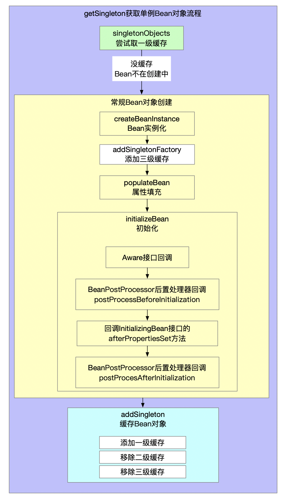
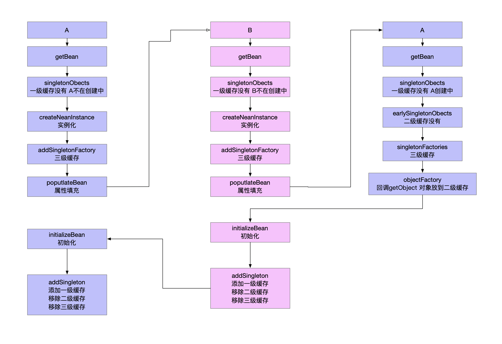

获取Bean实例。

## 1 getBean方法

```java
// AbstractBeanFactory.java
@Override
public Object getBean(String name) throws BeansException {
    return this.doGetBean(name, null, null, false);
}

@Override
public <T> T getBean(String name, Class<T> requiredType) throws BeansException {
    return doGetBean(name, requiredType, null, false);
}

@Override
public Object getBean(String name, Object... args) throws BeansException {
    return doGetBean(name, null, args, false);
}
```

## 2 doGetBean方法

```java
// AbstradtBeanFactory.java
protected <T> T doGetBean(
    String name, @Nullable Class<T> requiredType, @Nullable Object[] args, boolean typeCheckOnly)
    throws BeansException {

    /**
		 * beanName
		 *     - &开头的name标识FactoryBean 转换成beanName
		 *     - 别名转换成beanName
		 */
    String beanName = transformedBeanName(name);
    Object beanInstance;

    // Eagerly check singleton cache for manually registered singletons.
    /**
		 * 第一次调用 getSingleton方法多个重载版本
		 * 检查单例池是否缓存了Bean
		 *     - 可能通过手动方式先注册了单例Bean
		 * 尝试性获取单例Bean
		 *     - 要获取的目标Bean对象可能是单例
		 *         - 已经缓存过一级缓存就不需要再创建了 直接获取到
		 *         - 一级缓存还没有说明需要创建
		 *     - 也可能是原型的 原型Bean在一级缓存中肯定获取不到
		 * 根据获取结果决定是否要执行Bean创建流程 创建的时候再区分是单例还是原型
		 *     - 将单例Bean缓存
		 *     - 原型Bean每次请求创建一次
		 */
    Object sharedInstance = super.getSingleton(beanName);
    if (sharedInstance != null && args == null) { // Bean已经实例化过 但是不一定初始化过
        if (logger.isTraceEnabled()) {
            if (isSingletonCurrentlyInCreation(beanName)) {
                logger.trace("Returning eagerly cached instance of singleton bean '" + beanName +
                             "' that is not fully initialized yet - a consequence of a circular reference");
            }
            else {
                logger.trace("Returning cached instance of singleton bean '" + beanName + "'");
            }
        }
        /**
			 * Bean实例
			 *     - 普通Bean对象 sharedInstance就是Bean实例
			 *     - FactoryBean
			 *         - name标识需要获取的就是FactoryBean
			 *         - 需要获取的是普通Bean 通过FactoryBean的getObject创建Bean实例
			 */
        beanInstance = getObjectForBeanInstance(sharedInstance, name, beanName, null);
    }

    else {
        // Fail if we're already creating this bean instance:
        // We're assumably within a circular reference.
        if (this.isPrototypeCurrentlyInCreation(beanName)) {
            throw new BeanCurrentlyInCreationException(beanName);
        }

        // Check if bean definition exists in this factory.
        BeanFactory parentBeanFactory = getParentBeanFactory();
        if (parentBeanFactory != null && !containsBeanDefinition(beanName)) {
            // Not found -> check parent.
            String nameToLookup = originalBeanName(name);
            if (parentBeanFactory instanceof AbstractBeanFactory abf) {
                return abf.doGetBean(nameToLookup, requiredType, args, typeCheckOnly);
            }
            else if (args != null) {
                // Delegation to parent with explicit args.
                return (T) parentBeanFactory.getBean(nameToLookup, args);
            }
            else if (requiredType != null) {
                // No args -> delegate to standard getBean method.
                return parentBeanFactory.getBean(nameToLookup, requiredType);
            }
            else {
                return (T) parentBeanFactory.getBean(nameToLookup);
            }
        }

        if (!typeCheckOnly) {
            this.markBeanAsCreated(beanName); // 标识Bean开始创建
        }

        StartupStep beanCreation = this.applicationStartup.start("spring.beans.instantiate")
            .tag("beanName", name);
        try {
            if (requiredType != null) {
                beanCreation.tag("beanType", requiredType::toString);
            }
            RootBeanDefinition mbd = this.getMergedLocalBeanDefinition(beanName); // BeanDefinition可能有父类 合并父类属性
            checkMergedBeanDefinition(mbd, beanName, args); // 确保BeanDefinition的Class不是抽象的

            // Guarantee initialization of beans that the current bean depends on.
            String[] dependsOn = mbd.getDependsOn(); // 依赖的Bean先实例化
            if (dependsOn != null) {
                for (String dep : dependsOn) {
                    if (isDependent(beanName, dep)) {
                        throw new BeanCreationException(mbd.getResourceDescription(), beanName,
                                                        "Circular depends-on relationship between '" + beanName + "' and '" + dep + "'");
                    }
                    registerDependentBean(dep, beanName);
                    try {
                        this.getBean(dep); // 被依赖的Bean先实例化 递归调用
                    }
                    catch (NoSuchBeanDefinitionException ex) {
                        throw new BeanCreationException(mbd.getResourceDescription(), beanName,
                                                        "'" + beanName + "' depends on missing bean '" + dep + "'", ex);
                    }
                }
            }

            // Create bean instance.
            /**
				 * 真正开始创建Bean
				 *     - 单例Bean创建完成后要缓存起来
				 *     - 原型Bean创建完成后不需要缓存
				 */
            if (mbd.isSingleton()) { // 单例Bean
                /**
					 * 第二次调用 getSingleton方法多个重载版本
					 * 还没获取到缓存的单例Bean
					 *     - 先回调执行Bean的创建
					 *     - 负责将创建好的单例Bean缓存
					 *
					 * getSingleton获取单例Bean对象
					 *     - singletonObjects 取一级缓存
					 *     - 没有一级缓存 Bean正在创建中
					 *     - createBean方法创建Bean对象
					 *         - 代理Bean对象
					 *         - 常规Bean对象
					 *             - createBeanInstance方法 Bean的实例化
					 *                 - 工厂方法
					 *                 - 自动注册参数 有参构造方法
					 *                 - 默认构造器 无参构造方法
					 *             - addSingletonFactory方法 将Bean的objectFactory放到三级缓存
					 *             - populate方法 Bean属性填充
					 *             - initializeBean方法 Bean初始化
					 *                 - Aware接口回调
					 *                     - BeanNameAware 回调setBeanName方法
					 *                     - BeanClassLoaderAware 回调setBeanClassLoader方法
					 *                     - BeanFactoryAware 回调setBeanFactor方法
					 *                 - 回调BeanPostProcessor后置处理器postProcessBeforeInitialization方法
					 *                 - 回调InitializingBean的afterPropertiesSet方法
					 *                 - 执行init-method方法
					 *                 - 回调BeanPostProcessor后置处理器postProcessAfterInitialization方法
					 *     - addSingleton方法缓存单例Bean对象
					 *         - 添加一级缓存
					 *         - 移除二级缓存
					 *         - 移除三级缓存
					 */
                sharedInstance = getSingleton(beanName, () -> {
                    try {
                        return createBean(beanName, mbd, args); // Bean实例化 Bean初始化填充属性 Bean后置处理器
                    }
                    catch (BeansException ex) {
                        // Explicitly remove instance from singleton cache: It might have been put there
                        // eagerly by the creation process, to allow for circular reference resolution.
                        // Also remove any beans that received a temporary reference to the bean.
                        destroySingleton(beanName);
                        throw ex;
                    }
                });
                beanInstance = getObjectForBeanInstance(sharedInstance, name, beanName, mbd);
            }

            else if (mbd.isPrototype()) { // 原型Bean
                // It's a prototype -> create a new instance.
                Object prototypeInstance = null;
                try {
                    beforePrototypeCreation(beanName);
                    prototypeInstance = this.createBean(beanName, mbd, args); // 创建Bean
                }
                finally {
                    afterPrototypeCreation(beanName);
                }
                beanInstance = getObjectForBeanInstance(prototypeInstance, name, beanName, mbd);
            }

            else {
                String scopeName = mbd.getScope();
                if (!StringUtils.hasLength(scopeName)) {
                    throw new IllegalStateException("No scope name defined for bean '" + beanName + "'");
                }
                Scope scope = this.scopes.get(scopeName);
                if (scope == null) {
                    throw new IllegalStateException("No Scope registered for scope name '" + scopeName + "'");
                }
                try {
                    Object scopedInstance = scope.get(beanName, () -> {
                        beforePrototypeCreation(beanName);
                        try {
                            return createBean(beanName, mbd, args);
                        }
                        finally {
                            afterPrototypeCreation(beanName);
                        }
                    });
                    beanInstance = getObjectForBeanInstance(scopedInstance, name, beanName, mbd);
                }
                catch (IllegalStateException ex) {
                    throw new ScopeNotActiveException(beanName, scopeName, ex);
                }
            }
        }
        catch (BeansException ex) {
            beanCreation.tag("exception", ex.getClass().toString());
            beanCreation.tag("message", String.valueOf(ex.getMessage()));
            cleanupAfterBeanCreationFailure(beanName);
            throw ex;
        }
        finally {
            beanCreation.end();
        }
    }

    return adaptBeanInstance(name, beanInstance, requiredType);
}
```

### 2.1 getSingleton

```java
// DefaultSingletonBeanRegistry.java
/**
	 * 获取单例Bean对象
	 *     - 取一级缓存
	 *     - 没有一级缓存 Bean正在创建中
	 *     - createBean方法创建Bean对象
	 *         - 代理Bean对象
	 *         - 常规Bean对象
	 *             - createBeanInstance方法 Bean的实例化
	 *             - addSingletonFactory方法 将Bean的objectFactory放到三级缓存
	 *             - populate方法 Bean属性填充
	 *             - initializeBean方法 Bean初始化
	 *     - addSingleton方法缓存单例Bean对象
	 *         - 添加一级缓存
	 *         - 移除二级缓存
	 *         - 移除三级缓存
	 */
public Object getSingleton(String beanName, ObjectFactory<?> singletonFactory) { // 传进来的lambda是函数式接口的实现 用于回调执行 创建Bean实例
    Assert.notNull(beanName, "Bean name must not be null");
    synchronized (this.singletonObjects) {
        Object singletonObject = this.singletonObjects.get(beanName); // 一级缓存
        if (singletonObject == null) {
            if (this.singletonsCurrentlyInDestruction) {
                throw new BeanCreationNotAllowedException(beanName,
                                                          "Singleton bean creation not allowed while singletons of this factory are in destruction " +
                                                          "(Do not request a bean from a BeanFactory in a destroy method implementation!)");
            }
            if (logger.isDebugEnabled()) {
                logger.debug("Creating shared instance of singleton bean '" + beanName + "'");
            }
            this.beforeSingletonCreation(beanName); // 缓存起来标识正在创建Bean对象
            boolean newSingleton = false;
            boolean recordSuppressedExceptions = (this.suppressedExceptions == null);
            if (recordSuppressedExceptions) {
                this.suppressedExceptions = new LinkedHashSet<>();
            }
            try {
                singletonObject = singletonFactory.getObject(); // 回调lambda表达式 触发createBean(...)执行
                newSingleton = true;
            }
            catch (IllegalStateException ex) {
                // Has the singleton object implicitly appeared in the meantime ->
                // if yes, proceed with it since the exception indicates that state.
                singletonObject = this.singletonObjects.get(beanName);
                if (singletonObject == null) {
                    throw ex;
                }
            }
            catch (BeanCreationException ex) {
                if (recordSuppressedExceptions) {
                    for (Exception suppressedException : this.suppressedExceptions) {
                        ex.addRelatedCause(suppressedException);
                    }
                }
                throw ex;
            }
            finally {
                if (recordSuppressedExceptions) {
                    this.suppressedExceptions = null;
                }
                afterSingletonCreation(beanName);
            }
            /**
				 * 回调执行完成了单例Bean的创建
				 * 负责将单例Bean缓存
				 *     - 添加一级缓存
				 *     - 删除二级缓存
				 *     - 删除三级缓存
				 */
            if (newSingleton) {
                this.addSingleton(beanName, singletonObject); // 单例Bean缓存起来
            }
        }
        return singletonObject;
    }
}
```

### 2.2 createBean

```java
// AbstractAutowireCapableBeanFactory.java
/**
	 * Bean对象创建
	 *     - 代理Bean对象
	 *     - 常规Bean对象
	 *         - createBeanInstance方法 Bean的实例化
	 *             - 工厂方法
	 *             - 自动注册参数 有参构造方法
	 *             - 默认构造器 无参构造方法
	 *         - addSingletonFactory方法 将Bean的objectFactory放到三级缓存
	 *         - populate方法 Bean属性填充
	 *         - initializeBean方法 Bean初始化
	 *             - Aware接口回调
	 *                 - BeanNameAware 回调setBeanName方法
	 *                 - BeanClassLoaderAware 回调setBeanClassLoader方法
	 *                 - BeanFactoryAware 回调setBeanFactor方法
	 *             - 回调BeanPostProcessor后置处理器postProcessBeforeInitialization方法
	 *             - 回调InitializingBean的afterPropertiesSet方法
	 *             - 执行init-method方法
	 *             - 回调BeanPostProcessor后置处理器postProcessAfterInitialization方法
	 */
@Override
protected Object createBean(String beanName, RootBeanDefinition mbd, @Nullable Object[] args)
    throws BeanCreationException {

    if (logger.isTraceEnabled()) {
        logger.trace("Creating instance of bean '" + beanName + "'");
    }
    RootBeanDefinition mbdToUse = mbd;

    // Make sure bean class is actually resolved at this point, and
    // clone the bean definition in case of a dynamically resolved Class
    // which cannot be stored in the shared merged bean definition.
    Class<?> resolvedClass = resolveBeanClass(mbd, beanName);
    if (resolvedClass != null && !mbd.hasBeanClass() && mbd.getBeanClassName() != null) {
        mbdToUse = new RootBeanDefinition(mbd);
        mbdToUse.setBeanClass(resolvedClass);
    }

    // Prepare method overrides.
    try {
        /**
			 * override method
			 *     - loop-method
			 *     - replace-method
			 */
        mbdToUse.prepareMethodOverrides();
    }
    catch (BeanDefinitionValidationException ex) {
        throw new BeanDefinitionStoreException(mbdToUse.getResourceDescription(),
                                               beanName, "Validation of method overrides failed", ex);
    }

    try {
        // Give BeanPostProcessors a chance to return a proxy instead of the target bean instance.
        /**
			 * Spring常规单例Bean实例化前的预处理时机
			 *     - 如果有InstantiationAwareBeanPostProcessor类型的后置处理器为Bean创建出来了代理对象
			 *         - 就不需要Spring负责后续的生命周期了 将Spring创建Bean对象的流程短路终止掉
			 *         - 为Bean代理对象执行Bean后置处理器回调
			 *     - 不创建代理对象就由Spring托管常规Bean的创建流程
			 */
        Object bean = resolveBeforeInstantiation(beanName, mbdToUse);
        if (bean != null) {
            return bean;
        }
    }
    catch (Throwable ex) {
        throw new BeanCreationException(mbdToUse.getResourceDescription(), beanName,
                                        "BeanPostProcessor before instantiation of bean failed", ex);
    }

    try {
        /**
			 * 常规Bean的创建
			 *     - createBeanInstance方法 Bean的实例化
			 *         - 工厂方法
			 *         - 自动注册参数 有参构造方法
			 *         - 默认构造器 无参构造方法
			 *     - addSingletonFactory方法 将Bean的objectFactory放到三级缓存
			 *     - populate方法 Bean属性填充
			 *     - initializeBean方法 Bean初始化
			 *         - Aware接口回调
			 *             - BeanNameAware 回调setBeanName方法
			 *             - BeanClassLoaderAware 回调setBeanClassLoader方法
			 *             - BeanFactoryAware 回调setBeanFactor方法
			 *         - 回调BeanPostProcessor后置处理器postProcessBeforeInitialization方法
			 *         - 回调InitializingBean的afterPropertiesSet方法
			 *         - 执行init-method方法
			 *         - 回调BeanPostProcessor后置处理器postProcessAfterInitialization方法
			 */
        Object beanInstance = this.doCreateBean(beanName, mbdToUse, args);
        if (logger.isTraceEnabled()) {
            logger.trace("Finished creating instance of bean '" + beanName + "'");
        }
        return beanInstance;
    }
    catch (BeanCreationException | ImplicitlyAppearedSingletonException ex) {
        // A previously detected exception with proper bean creation context already,
        // or illegal singleton state to be communicated up to DefaultSingletonBeanRegistry.
        throw ex;
    }
    catch (Throwable ex) {
        throw new BeanCreationException(
            mbdToUse.getResourceDescription(), beanName, "Unexpected exception during bean creation", ex);
    }
}
```

```java
// AbstractAutowireCapableBeanFactory.java
/**
	 * 常规Bean的创建
	 *     - createBeanInstance方法 Bean的实例化
	 *         - 工厂方法
	 *         - 自动注册参数 有参构造方法
	 *         - 默认构造器 无参构造方法
	 *     - addSingletonFactory方法 将Bean的objectFactory放到三级缓存
	 *     - populate方法 Bean属性填充
	 *     - initializeBean方法 Bean初始化
	 *         - Aware接口回调
	 *             - BeanNameAware 回调setBeanName方法
	 *             - BeanClassLoaderAware 回调setBeanClassLoader方法
	 *             - BeanFactoryAware 回调setBeanFactor方法
	 *         - 回调BeanPostProcessor后置处理器postProcessBeforeInitialization方法
	 *         - 回调InitializingBean的afterPropertiesSet方法
	 *         - 执行init-method方法
	 *         - 回调BeanPostProcessor后置处理器postProcessAfterInitialization方法
	 */
protected Object doCreateBean(String beanName, RootBeanDefinition mbd, @Nullable Object[] args)
    throws BeanCreationException {

    // Instantiate the bean.
    BeanWrapper instanceWrapper = null;
    if (mbd.isSingleton()) {
        instanceWrapper = this.factoryBeanInstanceCache.remove(beanName);
    }
    if (instanceWrapper == null) {
        /**
			 * Bean实例化
			 *     - 工厂方法
			 *     - 提供了自动注入的参数 有参构造方法
			 *     - 默认构造器 无参构造方法
			 */
        instanceWrapper = this.createBeanInstance(beanName, mbd, args);
    }
    // Bean实例已经创建好了
    Object bean = instanceWrapper.getWrappedInstance();
    Class<?> beanType = instanceWrapper.getWrappedClass();
    if (beanType != NullBean.class) {
        mbd.resolvedTargetType = beanType;
    }

    // Allow post-processors to modify the merged bean definition.
    synchronized (mbd.postProcessingLock) {
        if (!mbd.postProcessed) {
            try {
                /**
					 * @Autowired
					 * @Value
					 */
                applyMergedBeanDefinitionPostProcessors(mbd, beanType, beanName);
            }
            catch (Throwable ex) {
                throw new BeanCreationException(mbd.getResourceDescription(), beanName,
                                                "Post-processing of merged bean definition failed", ex);
            }
            mbd.markAsPostProcessed();
        }
    }

    // Eagerly cache singletons to be able to resolve circular references
    // even when triggered by lifecycle interfaces like BeanFactoryAware.
    /**
		 * 解决循环依赖 返回值标识存在循环依赖
		 *     - 单例
		 *     - 允许循环依赖
		 *     - 正处在循环依赖的创建流程中
		 */
    boolean earlySingletonExposure = (mbd.isSingleton() && this.allowCircularReferences &&
                                      isSingletonCurrentlyInCreation(beanName));
    if (earlySingletonExposure) {
        if (logger.isTraceEnabled()) {
            logger.trace("Eagerly caching bean '" + beanName +
                         "' to allow for resolving potential circular references");
        }
        /**
			 * 将创建Bean的objectFactory缓存到三级缓存中
			 */
        addSingletonFactory(beanName, () -> getEarlyBeanReference(beanName, mbd, bean));
    }

    // Initialize the bean instance.
    Object exposedObject = bean;
    try {
        /**
			 * Bean属性填充
			 *     - 可能依赖其他的Bean
			 */
        populateBean(beanName, mbd, instanceWrapper);
        /**
			 * Bean初始化
			 *     - Aware接口回调
			 *         - BeanNameAware 回调setBeanName方法
			 *         - BeanClassLoaderAware 回调setBeanClassLoader方法
			 *         - BeanFactoryAware 回调setBeanFactor方法
			 *     - 回调BeanPostProcessor后置处理器postProcessBeforeInitialization方法
			 *     - 回调InitializingBean的afterPropertiesSet方法
			 *     - 执行init-method方法
			 *     - 回调BeanPostProcessor后置处理器postProcessAfterInitialization方法
			 */
        exposedObject = this.initializeBean(beanName, exposedObject, mbd);
    }
    catch (Throwable ex) {
        if (ex instanceof BeanCreationException bce && beanName.equals(bce.getBeanName())) {
            throw bce;
        }
        else {
            throw new BeanCreationException(mbd.getResourceDescription(), beanName, ex.getMessage(), ex);
        }
    }

    if (earlySingletonExposure) { // 存在循环依赖 已经将创建Bean的objectFactory放在了三级缓存了
        Object earlySingletonReference = getSingleton(beanName, false); // 通过三级缓存的objectFactory的getObject方法获取了实例对象
        if (earlySingletonReference != null) {
            if (exposedObject == bean) {
                exposedObject = earlySingletonReference;
            }
            else if (!this.allowRawInjectionDespiteWrapping && hasDependentBean(beanName)) {
                String[] dependentBeans = getDependentBeans(beanName);
                Set<String> actualDependentBeans = new LinkedHashSet<>(dependentBeans.length);
                for (String dependentBean : dependentBeans) {
                    if (!removeSingletonIfCreatedForTypeCheckOnly(dependentBean)) {
                        actualDependentBeans.add(dependentBean);
                    }
                }
                if (!actualDependentBeans.isEmpty()) {
                    throw new BeanCurrentlyInCreationException(beanName,
                                                               "Bean with name '" + beanName + "' has been injected into other beans [" +
                                                               StringUtils.collectionToCommaDelimitedString(actualDependentBeans) +
                                                               "] in its raw version as part of a circular reference, but has eventually been " +
                                                               "wrapped. This means that said other beans do not use the final version of the " +
                                                               "bean. This is often the result of over-eager type matching - consider using " +
                                                               "'getBeanNamesForType' with the 'allowEagerInit' flag turned off, for example.");
                }
            }
        }
    }

    // Register bean as disposable.
    try {
        registerDisposableBeanIfNecessary(beanName, bean, mbd); // 销毁时调用destroy-method
    }
    catch (BeanDefinitionValidationException ex) {
        throw new BeanCreationException(
            mbd.getResourceDescription(), beanName, "Invalid destruction signature", ex);
    }

    return exposedObject;
}
```

#### 2.2.1 实例化

```java
// AbstraceAutowireCapableBeanFactory.java
/**
	 * 不同策略创建Bean对象
	 *     - 工厂方法
	 *     - 有参构造方法
	 *     - 无参构造方法
	 */
protected BeanWrapper createBeanInstance(String beanName, RootBeanDefinition mbd, @Nullable Object[] args) {
    // Make sure bean class is actually resolved at this point.
    Class<?> beanClass = resolveBeanClass(mbd, beanName); // BeanDefinition中的Class对象

    if (beanClass != null && !Modifier.isPublic(beanClass.getModifiers()) && !mbd.isNonPublicAccessAllowed()) { // Class的访问权限
        throw new BeanCreationException(mbd.getResourceDescription(), beanName,
                                        "Bean class isn't public, and non-public access not allowed: " + beanClass.getName());
    }

    Supplier<?> instanceSupplier = mbd.getInstanceSupplier();
    if (instanceSupplier != null) {
        return obtainFromSupplier(instanceSupplier, beanName);
    }

    if (mbd.getFactoryMethodName() != null) { // 工厂方法创建Bean对象
        return this.instantiateUsingFactoryMethod(beanName, mbd, args);
    }

    // Shortcut when re-creating the same bean...
    boolean resolved = false;
    boolean autowireNecessary = false;
    if (args == null) {
        synchronized (mbd.constructorArgumentLock) {
            /**
				 * Class类有多个构造方法
				 * 调用前根据签名锁定要调用的构造方法或者工厂方法
				 */
            if (mbd.resolvedConstructorOrFactoryMethod != null) {
                resolved = true;
                autowireNecessary = mbd.constructorArgumentsResolved;
            }
        }
    }
    // 已经解析过 就使用解析好的构造函数进行实例化
    if (resolved) {
        if (autowireNecessary) {
            return this.autowireConstructor(beanName, mbd, null, null); // 构造函数自动注入
        }
        else {
            return instantiateBean(beanName, mbd); // 无参构造方法
        }
    }

    // Candidate constructors for autowiring?
    /**
		 * 选择出合适的构造方法
		 *     - 根据参数解析推断
		 */
    Constructor<?>[] ctors = determineConstructorsFromBeanPostProcessors(beanClass, beanName);
    if (ctors != null || mbd.getResolvedAutowireMode() == AUTOWIRE_CONSTRUCTOR ||
        mbd.hasConstructorArgumentValues() || !ObjectUtils.isEmpty(args)) {
        return autowireConstructor(beanName, mbd, ctors, args); // 构造函数自动注入
    }

    // Preferred constructors for default construction?
    ctors = mbd.getPreferredConstructors(); // 没有解析出合适的构造方法 看看有没有指定构造方法
    if (ctors != null) {
        return autowireConstructor(beanName, mbd, ctors, null);
    }

    // No special handling: simply use no-arg constructor.
    return instantiateBean(beanName, mbd); // 默认的构造器无参构造方法
}
```

#### 2.2.2 三级缓存

```java
// AbstractAutowireCapableBeanFactory.java
/**
			 * 将创建Bean的objectFactory缓存到三级缓存中
			 */
addSingletonFactory(beanName, () -> getEarlyBeanReference(beanName, mbd, bean));
```

```java
// DefaultSingletonBeanRegistry.java
protected void addSingletonFactory(String beanName, ObjectFactory<?> singletonFactory) {
    Assert.notNull(singletonFactory, "Singleton factory must not be null");
    synchronized (this.singletonObjects) {
        if (!this.singletonObjects.containsKey(beanName)) {
            this.singletonFactories.put(beanName, singletonFactory); // 三级缓存
            this.earlySingletonObjects.remove(beanName); // 二级缓存
            this.registeredSingletons.add(beanName);
        }
    }
}
```

#### 2.2.3 属性填充

```java
// AbstractAutowireCapableBeanFactory.java
/**
			 * Bean属性填充
			 *     - 可能依赖其他的Bean
			 */
populateBean(beanName, mbd, instanceWrapper);
```

#### 2.2.4 初始化

```java
// AbstractAutowireCapableBeanFactory.java
protected Object initializeBean(String beanName, Object bean, @Nullable RootBeanDefinition mbd) {
    /**
		 * Aware接口回调
		 *     - BeanNameAware 回调setBeanName方法
		 *     - BeanClassLoaderAware 回调setBeanClassLoader方法
		 *     - BeanFactoryAware 回调setBeanFactor方法
		 */
    this.invokeAwareMethods(beanName, bean);

    Object wrappedBean = bean; // 已经实例化好的Bean对象
    if (mbd == null || !mbd.isSynthetic()) { // 不是Spring合成Bean
        /**
			 * BeanPostProcessor后置处理器回调postProcessBeforeInitialization方法
			 */
        wrappedBean = this.applyBeanPostProcessorsBeforeInitialization(wrappedBean, beanName);
    }

    try {
        /**
			 * init方法执行
			 *     - 回调InitializingBean的afterPropertiesSet方法
			 *     - 执行init-method方法
			 */
        this.invokeInitMethods(beanName, wrappedBean, mbd);
    }
    catch (Throwable ex) {
        throw new BeanCreationException(
            (mbd != null ? mbd.getResourceDescription() : null), beanName, ex.getMessage(), ex);
    }
    if (mbd == null || !mbd.isSynthetic()) { // 不是Spring合成的Bean
        /**
			 * BeanPostProcessor后置处理器回调postProcessAfterInitialization方法
			 */
        wrappedBean = applyBeanPostProcessorsAfterInitialization(wrappedBean, beanName);
    }

    return wrappedBean;
}
```

## 3 流程图



## 4 Bean创建过程中循环依赖示意图

两个单例Bean，A和B，A依赖B，B依赖A，先创建A。


