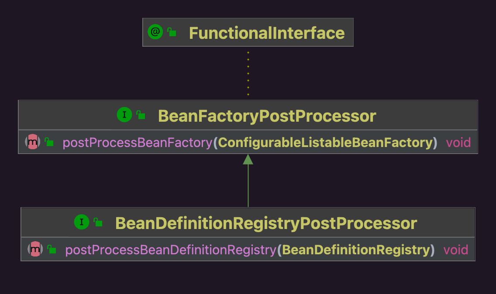

提供了对Bean工厂中BeanDefinition的修改能力。

## 1 类图

交互对象都是BeanDefinition，只是入口介质不同

* BeanFactoryPostProcessor是通过ConfigurableListableBeanFactory实例操作BeanDefinition
* BeanDefinitionRegistryPostProcessor是通过BeanDefinitionRegistry实例操作BeanDefinition

## 2 实现

| 实现                            | BeanFactoryPostProcessor抽象 | BeanDefinitionRegistryPostProcessor抽象 |
| ------------------------------- | ---------------------------- | --------------------------------------- |
| ConfigurationClassPostProcessor | &#10003;                     | &#10003;                                |
| EventListenerMethodProcessor    | &#10003;                     | &#10005;                                |

