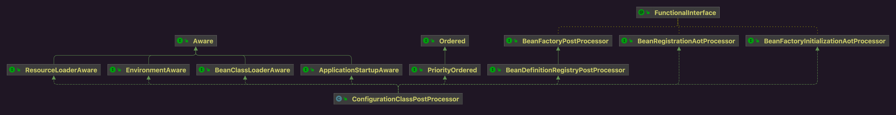

Bean工厂后置处理器。

## 1 类图



## 2 Demo

```java
// MyTest00.java
public class MyTest00 {

    public static void main(String[] args) {
        DefaultListableBeanFactory beanFactory = new DefaultListableBeanFactory();
        beanFactory.registerBeanDefinition("myCfg00", new RootBeanDefinition(MyCfg00.class));
        ConfigurationClassPostProcessor postProcessor = new ConfigurationClassPostProcessor();
        postProcessor.postProcessBeanDefinitionRegistry(beanFactory);
    }
}
```

```java
// MyCfg00.java
@Configuration
public class MyCfg00 {
}
```

## 3 BeanDefinitionRegistryPostProcessor抽象回调

```java
// ConfigurationClassPostProcessor.java
@Override
public void postProcessBeanDefinitionRegistry(BeanDefinitionRegistry registry) {
    int registryId = System.identityHashCode(registry);
    if (this.registriesPostProcessed.contains(registryId)) {
        throw new IllegalStateException(
            "postProcessBeanDefinitionRegistry already called on this post-processor against " + registry);
    }
    if (this.factoriesPostProcessed.contains(registryId)) {
        throw new IllegalStateException(
            "postProcessBeanFactory already called on this post-processor against " + registry);
    }
    this.registriesPostProcessed.add(registryId);

    this.processConfigBeanDefinitions(registry);
}
```

```java
// ConfigurationClassPostProcessor.java
public void processConfigBeanDefinitions(BeanDefinitionRegistry registry) {
    /**
		 * 把配置类缓存起来
		 * 配置类区分为
		 *     - full型
		 *         - @Configuration注解的proxyBeanMethods属性是true
		 *     - lite型
		 *         - @Configuration注解的proxyBeanMethods属性是false
		 *         - 类上还有其他注解
		 *             - @Component
		 * 			   - @ComponentScan
		 * 			   - @Import
		 * 			   - @ImportResource
		 *         - 类有@Bean标识的方法
		 */
    List<BeanDefinitionHolder> configCandidates = new ArrayList<>();
    String[] candidateNames = registry.getBeanDefinitionNames(); // 缓存在beanDefinitionNames中的名称

    for (String beanName : candidateNames) {
        BeanDefinition beanDef = registry.getBeanDefinition(beanName); // 缓存在beanDefinitionMap中的BeanDefinition
        if (beanDef.getAttribute(ConfigurationClassUtils.CONFIGURATION_CLASS_ATTRIBUTE) != null) {
            if (logger.isDebugEnabled()) {
                logger.debug("Bean definition has already been processed as a configuration class: " + beanDef);
            }
        }
        else if (ConfigurationClassUtils.checkConfigurationClassCandidate(beanDef, this.metadataReaderFactory)) { // 判定是full型配置类还是lite型配置类
            configCandidates.add(new BeanDefinitionHolder(beanDef, beanName));
        }
    }

    // Return immediately if no @Configuration classes were found
    if (configCandidates.isEmpty()) {
        return;
    }

    // Sort by previously determined @Order value, if applicable
    // 配置类按照@Order标识的优先级升序
    configCandidates.sort((bd1, bd2) -> {
        int i1 = ConfigurationClassUtils.getOrder(bd1.getBeanDefinition());
        int i2 = ConfigurationClassUtils.getOrder(bd2.getBeanDefinition());
        return Integer.compare(i1, i2);
    });

    // Detect any custom bean name generation strategy supplied through the enclosing application context
    SingletonBeanRegistry sbr = null;
    if (registry instanceof SingletonBeanRegistry) {
        sbr = (SingletonBeanRegistry) registry;
        if (!this.localBeanNameGeneratorSet) {
            BeanNameGenerator generator = (BeanNameGenerator) sbr.getSingleton(
                AnnotationConfigUtils.CONFIGURATION_BEAN_NAME_GENERATOR); // Bean名称生成器 配置类即将被封装成BeanDefinition放到Bean工厂 注册BeanDefinition时要指定名称
            if (generator != null) {
                this.componentScanBeanNameGenerator = generator;
                this.importBeanNameGenerator = generator;
            }
        }
    }

    if (this.environment == null) {
        this.environment = new StandardEnvironment();
    }

    // Parse each @Configuration class
    ConfigurationClassParser parser = new ConfigurationClassParser(
        this.metadataReaderFactory, this.problemReporter, this.environment,
        this.resourceLoader, this.componentScanBeanNameGenerator, registry);

    Set<BeanDefinitionHolder> candidates = new LinkedHashSet<>(configCandidates); // 配置类(full型和lite型)
    Set<ConfigurationClass> alreadyParsed = new HashSet<>(configCandidates.size());
    do {
        StartupStep processConfig = this.applicationStartup.start("spring.context.config-classes.parse");
        /**
			 * 解析配置类
			 *     - @Configuration标识的类封装成BeanDefinition注册到BeanFactory
			 *     - @ComponentScan扫描的类封装成BeanDefinition注册到BeanFactory
			 * @Import和@Bean注解的类不会封装成BeanDefinition
			 */
        parser.parse(candidates);
        parser.validate();

        Set<ConfigurationClass> configClasses = new LinkedHashSet<>(parser.getConfigurationClasses());
        configClasses.removeAll(alreadyParsed);

        // Read the model and create bean definitions based on its content
        if (this.reader == null) {
            this.reader = new ConfigurationClassBeanDefinitionReader(
                registry, this.sourceExtractor, this.resourceLoader, this.environment,
                this.importBeanNameGenerator, parser.getImportRegistry());
        }
        /**
			 * 将解析出来的配置类封装成BeanDefinition注册进BeanFactory
			 * @Import和@Bean注册的Bean在这一步被解析成BeanDefinition注册到Bean工厂
			 */
        this.reader.loadBeanDefinitions(configClasses);
        alreadyParsed.addAll(configClasses);
        processConfig.tag("classCount", () -> String.valueOf(configClasses.size())).end();

        candidates.clear();
        if (registry.getBeanDefinitionCount() > candidateNames.length) {
            String[] newCandidateNames = registry.getBeanDefinitionNames();
            Set<String> oldCandidateNames = Set.of(candidateNames);
            Set<String> alreadyParsedClasses = new HashSet<>();
            for (ConfigurationClass configurationClass : alreadyParsed) {
                alreadyParsedClasses.add(configurationClass.getMetadata().getClassName());
            }
            for (String candidateName : newCandidateNames) {
                if (!oldCandidateNames.contains(candidateName)) {
                    BeanDefinition bd = registry.getBeanDefinition(candidateName);
                    if (ConfigurationClassUtils.checkConfigurationClassCandidate(bd, this.metadataReaderFactory) &&
                        !alreadyParsedClasses.contains(bd.getBeanClassName())) {
                        // 还没解析的类加到集合中轮询到下一个loop中
                        candidates.add(new BeanDefinitionHolder(bd, candidateName));
                    }
                }
            }
            candidateNames = newCandidateNames;
        }
    }
    while (!candidates.isEmpty());

    // Register the ImportRegistry as a bean in order to support ImportAware @Configuration classes
    if (sbr != null && !sbr.containsSingleton(IMPORT_REGISTRY_BEAN_NAME)) {
        sbr.registerSingleton(IMPORT_REGISTRY_BEAN_NAME, parser.getImportRegistry());
    }

    // Store the PropertySourceDescriptors to contribute them Ahead-of-time if necessary
    this.propertySourceDescriptors = parser.getPropertySourceDescriptors();

    if (this.metadataReaderFactory instanceof CachingMetadataReaderFactory cachingMetadataReaderFactory) {
        // Clear cache in externally provided MetadataReaderFactory; this is a no-op
        // for a shared cache since it'll be cleared by the ApplicationContext.
        cachingMetadataReaderFactory.clearCache();
    }
}
```

### 3.1 配置类解析



### 3.2 BeanDefinition注册Bean工厂

上面parse(...)阶段

* 可能发生BeanDefinition注册Bean工厂

 * 可能在配置类中缓存了
   * importBeanDefinitionRegistrars
     * @Import注解导入了实现了ImportBeanDefinitionRegistrar的类
   * imports
     * @Import注解导入的类(没有实现ImportSelector接口和ImportBeanDefinitionRegistrar接口)
   * importedResources
     * @ImportResource导入的配置文件
   * beanMethods
     * @Bean标识的方法

```java
// ConfigurationClassPostProcessor.java
/**
			 * 上面parse(...)阶段
			 *     - 可能发生BeanDefinition注册Bean工厂
			 *     - 可能在配置类中缓存了
			 *         - importBeanDefinitionRegistrars
			 *             - @Import注解导入了实现了ImportBeanDefinitionRegistrar的类
			 *         - imports
			 *             - @Import注解导入的类(没有实现ImportSelector接口和ImportBeanDefinitionRegistrar接口)
			 *         - importedResources
			 *             - @ImportResource导入的配置文件
			 *         - beanMethods
			 *             - @Bean标识的方法
			 *
			 */
this.reader.loadBeanDefinitions(configClasses);
```

```java
// ConfigurationClassBeanDefinitionReader.java
public void loadBeanDefinitions(Set<ConfigurationClass> configurationModel) {
    TrackedConditionEvaluator trackedConditionEvaluator = new TrackedConditionEvaluator();
    for (ConfigurationClass configClass : configurationModel) {
        loadBeanDefinitionsForConfigurationClass(configClass, trackedConditionEvaluator);
    }
}
```

```java
// ConfigurationClassBeanDefinitionReader.java
private void loadBeanDefinitionsForConfigurationClass(
    ConfigurationClass configClass, TrackedConditionEvaluator trackedConditionEvaluator) {

    if (trackedConditionEvaluator.shouldSkip(configClass)) {
        String beanName = configClass.getBeanName();
        if (StringUtils.hasLength(beanName) && this.registry.containsBeanDefinition(beanName)) {
            this.registry.removeBeanDefinition(beanName);
        }
        this.importRegistry.removeImportingClass(configClass.getMetadata().getClassName());
        return;
    }

    if (configClass.isImported()) { // 配置类是被@Import进来的
        registerBeanDefinitionForImportedConfigurationClass(configClass); // 导入进来的类是个配置类 封装成BeanDefinition注册Bean工厂
    }
    for (BeanMethod beanMethod : configClass.getBeanMethods()) { // 缓存着@Bean方法
        loadBeanDefinitionsForBeanMethod(beanMethod); // @Bean注解的方法 方法返回值类型的类封装成BeanDefinition注册Bean工厂
    }

    loadBeanDefinitionsFromImportedResources(configClass.getImportedResources()); // @ImportResource导入的配置文件
    // @Import注册的Bean实现了ImportBeanDefinitionRegistrar 回调这个接口的registerBeanDefinitions方法
    loadBeanDefinitionsFromRegistrars(configClass.getImportBeanDefinitionRegistrars());
}
```

## 4 BeanFactoryPostProcessor抽象回调

```java
// ConfigurationClassPostProcessor.java
@Override
public void postProcessBeanFactory(ConfigurableListableBeanFactory beanFactory) {
    int factoryId = System.identityHashCode(beanFactory);
    if (this.factoriesPostProcessed.contains(factoryId)) {
        throw new IllegalStateException(
            "postProcessBeanFactory already called on this post-processor against " + beanFactory);
    }
    /**
		 * Bean工厂后置处理器
		 *     - 超类 BeanFactoryPostProcessor回调postProcessBeanFactory方法
		 *     - 子类 BeanDefinitionRegistryPostProcessor回调postProcessBeanDefinitionRegistry
		 * 两个两调中都会处理配置类
		 * 避免重复执行通过id进行标识后置处理器是否已经处理过配置类
		 */
    this.factoriesPostProcessed.add(factoryId);
    if (!this.registriesPostProcessed.contains(factoryId)) {
        // BeanDefinitionRegistryPostProcessor hook apparently not supported...
        // Simply call processConfigurationClasses lazily at this point then.
        processConfigBeanDefinitions((BeanDefinitionRegistry) beanFactory);
    }

    /**
		 * beanFactory实现是DefaultListableBeanFactory
		 * @Configuration(proxyBeanMethods=true)标识的full型配置类的Bean类进行增强
		 *     - 这个时候还没发生Bean实例化/初始化
		 *     - 仅仅是将BeanDefinition已经注册在了Bean工厂中
		 *     - 此时将BeanDefinition中Bean的Class进行增强
		 *     - 将来进行实例化时回调
		 */
    this.enhanceConfigurationClasses(beanFactory);
    // 向Bean工厂注册一个Bean后置处理器
    beanFactory.addBeanPostProcessor(new ImportAwareBeanPostProcessor(beanFactory));
}
```

### 4.1 full型配置类增强

### 4.2 Bean后置处理器注册



### 4.3 Bean后置处理器ImportAwareBeanPostProcessor

