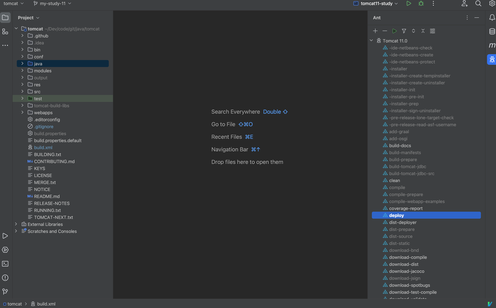
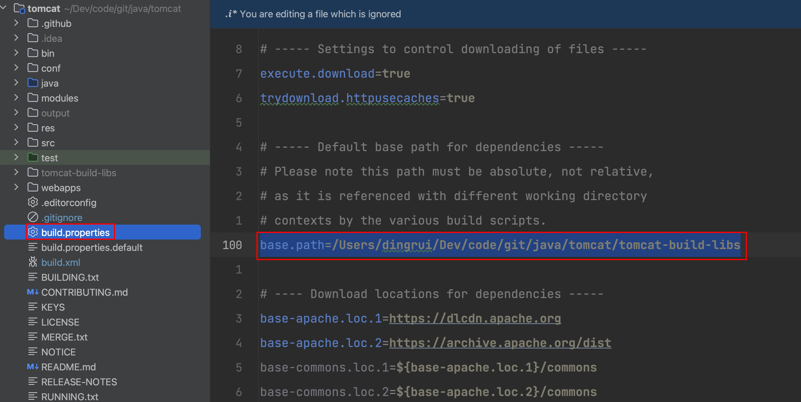

### 1 环境准备

| Name  | Version |
| ----- | ------- |
| macOS | 11.5.2  |
| Git   | 2.40.0  |
| Ant   | 1.10.13 |
| IDEA  | 2023.1  |

### 2 源码

#### 2.1 fork

https://github.com/apache/tomcat

#### 2.2 clone

```shell
git clone git@github.com:Bannirui/tomcat.git
```

#### 2.3 checkout

新切一个分支my-study-11，此后学习过程中的笔记也会同步记录在这个分支上。

```shell
git checkout -b my-study-11
git push origin my-study-11:my-study-11

git remote add upstream https://github.com/apache/tomcat.git
git remote set-url --push upstream no_push
```


### 3 IDEA导入



#### 3.1 根目录新建文件夹tomcat-build-libs


#### 3.2 build.properties

复制build.properties.default为build.properties，并修改如下配置项`base.path`为上面一步新建的文件夹。



#### 3.3 build.xml

注释如图3个file配置项，仅保留`build.properties`，也就是上面一步复制出来的文件。


#### 3.4 ignore


#### 3.5 Ant download-compile


### 4 项目设置

#### 4.1 SDK


#### 4.2 Modules


#### 4.3 Library

将3.5中download compile的添加到项目的library。


### 5 调试

#### 5.1 打包


#### 5.2 启动

* 启动类为org.apache.catalina.startup.Bootstrap
* 2个VM参数
  * -Dcatalina.home=/Users/dingrui/Dev/code/git/java/tomcat/output/build
  * -Dcatalina.base=/Users/dingrui/Dev/code/git/java/tomcat/output/build


#### 5.3 访问服务


