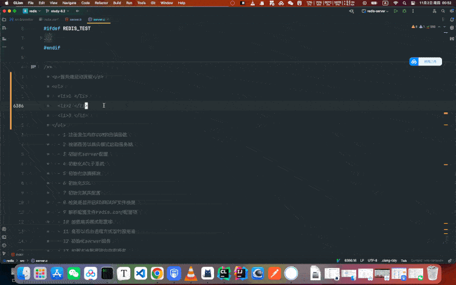

私以为，VIM的强大在于模式的多样，其灵魂在于递归，从指令操作角度来看就是终端用户告诉VIM程序一个动作执行几次。

* Normal Mode
* Insert Mode
* Recording Mode
* Command Mode

1 Recording mode
---

<mark>录制宏指令</mark>

- 在Normal模式下按`q`键进入Recording模式，比如`qa`即进入Recording模式，准备开始录制宏，并将其命名为`a`

- 宏指令内容

- 按键`q`退出Recording模式

- `{n}`+@a即可执行n次

以下为实际使用场景

2 Insert mode
---

- i - Insert
- I - Insert(Before Line)
- a - Append text
- A - Append(After Line)
- o - New Line Below
- O - New Line Above

3 Normal mode
---

- r - Replace

- w - Jump To Next Word

- W - Next WORD

- b - Jump To Previous Word

- B - Previous WORD

- r - Replace Letter

- R - Replace Mode

- cw - Change Word

- 8w - Jump 8 Words

- c7w - Change 7 Words

- 4j - Move 4 Lines Down

- C  - Delete Rest of Line

- Dw - Delete Word

- D - Delete Rest of Line

- d4w - Delete 4 Words

- dd - Delete Line

- 4dd - Delete 4 Lines

- cc - Change Line

- 8cc - Change 8 Lines

- u - Undo

- 5u - Undo Last 5 Changes

- CTRL+R - Redo

- 7 CTRL+R - Redo 7 Last Things

- ciw - Change Inner Word

  - ci)
  - ci(
  - ci[
  - ci]
  - ci}
  - ci{

- diw - Delete Inner Word

- % - Jump To Bracket

- c% - Change Until Bracket

- gg - Beginning Of File

- G - End Of File

- 17G - Go To Line 17

- :19 - Go To Line 19

- $ - End Of Line

- 0 - Beginning Of Line

- p - Paste After

- P - Paste Before

- yy - Yank Line

- 5yy - Yank 5 Lines

- 9p - Paste 9 Times

- y5w - Yank 5 Words

- yi) - Yank Inner Brackets

- yiw - Yank Inner Word

- <mark>Shift+v</mark> - Visual Line

- <mark>Ctrl+v</mark> - Visual Block

- . - Repeat Last Operation

- \> - Shift Right 

- < - Shift Left

- = - Indent

- \>> - Shift Line

- << - Shift Line

- == - Indent Line

- gg=G - Indent Whole File

- ggdG - Delete Whole File

- 次数+f+字符- 移动到指定字符上

- 次数+t+字符 - 移动到指定字符前面

- c+t+字符 - 变更当前光标到字符前一个位置

4 Command mode
---

- /word - Search For Word
  n - Next Occurrence
  N - Previous Occurrence

  \# - Previous Token Occurrence

  \+ - Next Token Occurrence

- :s/old/new/g - Replace

- :%s/old/new/g - Replace Everywhere

