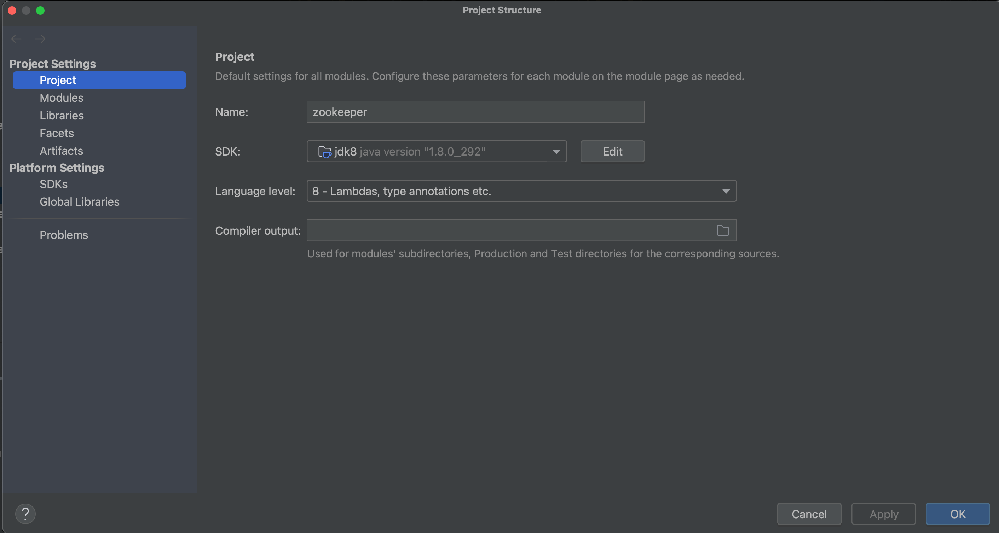
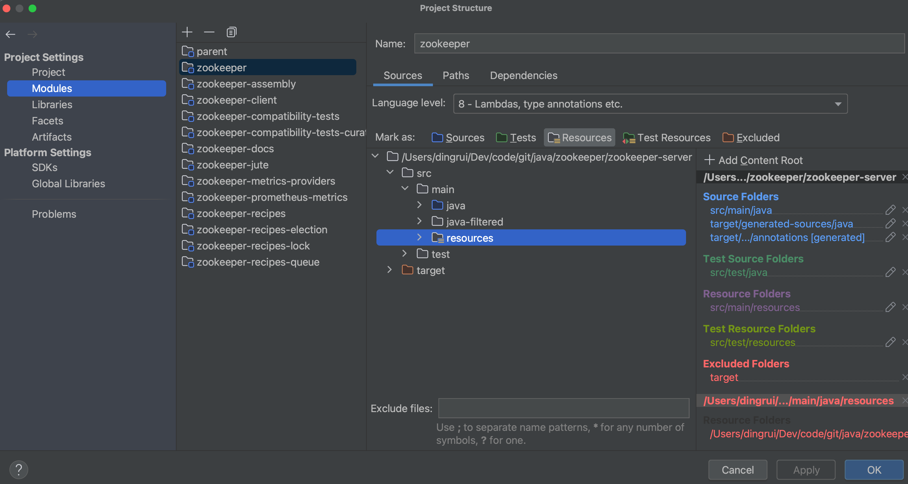
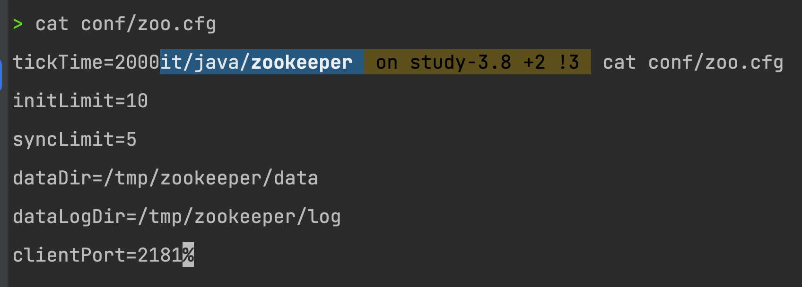
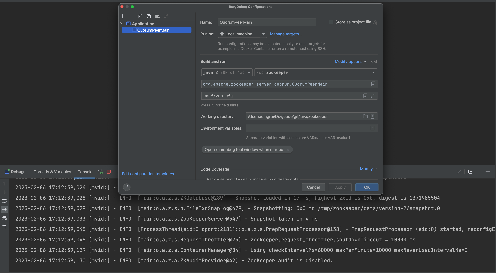

## 1 源码

可以从[官网](https://github.com/apache/zookeeper.git)或者[我的笔记](https://github.com/Bannirui/zookeeper.git)上clone，使用的分支是branch-3.8，我的笔记在study-3.8分支上。

## 2 调试工具

| 工具 | 版本     |
| ---- | -------- |
| IDE  | 2022.3.2 |
| JDK  | 1.8      |

## 3 IDE设置

### 3.1 JRE



### 3.2 Resources



## 4 文件准备

### 4.1 配置文件

拷贝conf/zoo_sample.cfg为conf/zoo.cfg，内容如下



### 4.2 日志配置

拷贝conf/logback.xml到zookeeper-server/src/main/resources/logback.xml

## 5 gitignore更新

新增如下内容

```shell
# debug conf
conf/zoo.cfg
conf/zoo*.cfg
zookeeper-server/src/main/resources/logback.xml
```

## 6 zk服务端启动

### 6.1 pom更新

6.1.1 jetty-server

```xml
<dependency>
    <groupId>org.eclipse.jetty</groupId>
    <artifactId>jetty-server</artifactId>
    <!-- <scope>provided</scope> -->
</dependency>
```

6.1.2 jetty-servlet

```xml
<dependency>
    <groupId>org.eclipse.jetty</groupId>
    <artifactId>jetty-servlet</artifactId>
    <!-- <scope>provided</scope> -->
</dependency>
```

6.1.3 jetty-client

```xml
<dependency>
    <groupId>org.eclipse.jetty</groupId>
    <artifactId>jetty-client</artifactId>
    <!-- <scope>provided</scope> -->
</dependency>
```

6.1.4 metrics-core

```xml
<dependency>
    <groupId>io.dropwizard.metrics</groupId>
    <artifactId>metrics-core</artifactId>
    <scope>compile</scope>
</dependency>
```

6.1.5 metrics-graphite

```xml
<dependency>
    <groupId>io.dropwizard.metrics</groupId>
    <artifactId>metrics-graphite</artifactId>
    <version>4.1.12.1</version>
</dependency>
```

6.1.6 snappy-java

```xml
<dependency>
    <groupId>org.xerial.snappy</groupId>
    <artifactId>snappy-java</artifactId>
    <!-- <scope>provided</scope> -->
</dependency>
```

### 6.2 启动配置



## 7 zk客户端启动

### 7.1 pom更新

commons-cli

```xml
<dependency>
    <groupId>commons-cli</groupId>
    <artifactId>commons-cli</artifactId>
    <!-- <scope>provided</scope> -->
</dependency>
```

### 7.2 脚本启动

```shell
 bin/zkCli.sh -server 127.0.0.1:2181
```

