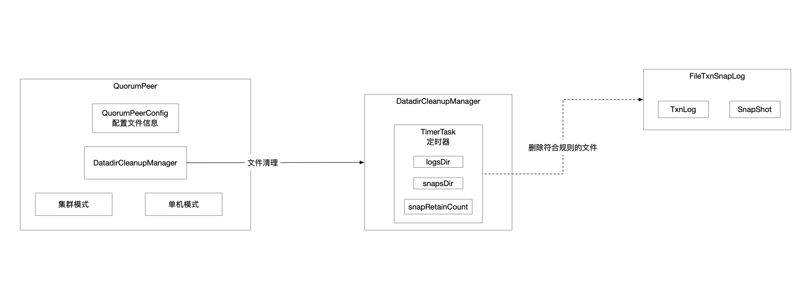

## 1 启动流程图




## 2 配置解析

QuorumPeerConfig是配置类，cfg文件里指定的配置项都会解析到该配置类的实例上。

主要流程就是两步：

* 将文件配置内容加载到Properties
* 将Properties配置内容拷贝到QuorumPeerConfg

### 2.1 配置文件加载

```java
Properties cfg = new Properties();
try (FileInputStream in = new FileInputStream(configFile)) {
    cfg.load(in); // 配置文件内容读取到Java的Properties里
    configFileStr = path;
}
```

### 2.2 解析Properties

```java
parseProperties(cfg); // Java Properties里面的配置内容解析到zk配置类
```

## 3 文件清理器

DatadirCleanupManager

```java
DatadirCleanupManager purgeMgr = new DatadirCleanupManager(
    config.getDataDir(), // 内存数据快照
    config.getDataLogDir(), // 事务日志
    config.getSnapRetainCount(), // 默认保存3个快照
    config.getPurgeInterval()); // 设置n小时清理一次 0标识不用定时清理
purgeMgr.start(); // 文件清理器 定时任务
```

### 3.1 定时器

Timer

```java
public void start() {
    if (PurgeTaskStatus.STARTED == purgeTaskStatus) { // 清理任务执行过就不要再启动
        LOG.warn("Purge task is already running.");
        return;
    }
    // Don't schedule the purge task with zero or negative purge interval.
    if (purgeInterval <= 0) { // 标识不启动定时任务
        LOG.info("Purge task is not scheduled.");
        return;
    }

    timer = new Timer("PurgeTask", true); // 创建定时器
    TimerTask task = new PurgeTask(dataLogDir, snapDir, snapRetainCount); // 文件清理任务
    timer.scheduleAtFixedRate(task, 0, TimeUnit.HOURS.toMillis(purgeInterval)); // 定时任务

    purgeTaskStatus = PurgeTaskStatus.STARTED; // 标识定时清理文件任务已经启动
}
```

该定时器实现原理是通过单个守护线程轮询监听优先级队列中任务方式，根据任务的执行时机决定是否执行任务。

### 3.2 定时任务

PurgeTask负责清理文件

```java
@Override
public void run() {
    LOG.info("Purge task started.");
    try {
        PurgeTxnLog.purge(logsDir, snapsDir, snapRetainCount);
    } catch (Exception e) {
        LOG.error("Error occurred while purging.", e);
    }
    LOG.info("Purge task completed.");
}
```

文件删除的工具方法

```java
public static void purge(File dataDir, File snapDir, int num) throws IOException {
    if (num < 3) {
        throw new IllegalArgumentException(COUNT_ERR_MSG);
    }

    FileTxnSnapLog txnLog = new FileTxnSnapLog(dataDir, snapDir); // 文件处理器

    // zxid最大的num个快照文件 这些文件按照zxid降序排序好了
    List<File> snaps = txnLog.findNValidSnapshots(num);
    int numSnaps = snaps.size();
    if (numSnaps > 0) {
        /**
             * 要保留的快照文件中zxid最小的那个zxid为参考基准 设为x
             *   - 快照文件
             *     - zxid<x的删除
             *     - zxid>=x的保留
             *   - 事务日志 zxid比x小的评选为参考基准 设为y
             *     - zxid<y的删除
             *     - zxid>=y的保留
             */
        purgeOlderSnapshots(txnLog, snaps.get(numSnaps - 1));
    }
}
```

#### 3.2.1 判定zxid基准

根据配置文件中配置项`autopurge.snapRetainCount=3`找到保留\删除对应的zxid的分水岭，也就是由最终要保留文件的数量，得到要保留的最小zxid，再倒推删除标准。

```java
protected List<File> findNValidSnapshots(int n) {
    /**
         * 内存快照存放目录下所有文件按照字典序排序
         * 筛选文件前缀是snapshot
         * 文件名称后缀zxid降序
         * 也就意味着筛选出n个最大zxid的内存快照文件
         */
    List<File> files = Util.sortDataDir(snapDir.listFiles(), SNAPSHOT_FILE_PREFIX, false);
    int count = 0;
    List<File> list = new ArrayList<File>();
    for (File f : files) {
        // we should catch the exceptions
        // from the valid snapshot and continue
        // until we find a valid one
        try {
            if (SnapStream.isValidSnapshot(f)) { // snapshot文件校验合法性
                list.add(f);
                count++;
                if (count == n) {
                    break;
                }
            }
        } catch (IOException e) {
            LOG.warn("invalid snapshot {}", f, e);
        }
    }
    return list;
}
```

#### 3.2.2 筛选要删除的文件

根据上一步判定的zxid规则，针对事务日志和快照两种不同的文件，分别使用各自的规则，筛选出要删除的文件执行删除操作。

```java
/**
     * snapShot这个快照文件用来提供一个删除文件的基准 假设这个参考的基准的zxid为x
     * 要保留的快照文件中zxid最小的那个
     *   - 快照文件
     *     - zxid<x的删除
     *     - zxid>=x的保留
     *   - 事务日志 zxid比x小的评选为参考基准 设为y
     *     - zxid<y的删除
     *     - zxid>=y的保留
     */
static void purgeOlderSnapshots(FileTxnSnapLog txnLog, File snapShot) {
    /**
         * 删除文件的参考zxid
         * 小于这个zxid的删除
         * 大于等于这个zxid的保留
         */
    final long leastZxidToBeRetain = Util.getZxidFromName(snapShot.getName(), PREFIX_SNAPSHOT); // 从snapshot文件名中解析出zxid

    // 要保留的事务日志
    final Set<File> retainedTxnLogs = new HashSet<File>();
    /**
         * 并不是所有<snapshotZxid的事务日志都要删除
         * 对于事务日志而言 向前多兼容一个zxid版本
         * 找到删除基准前一个zxid作为新的基准
         * <新基准的事务日志都筛选出来删除
         * >=新基准的事务日志保留
         */
    retainedTxnLogs.addAll(Arrays.asList(txnLog.getSnapshotLogs(leastZxidToBeRetain))); // 根据zxid找出要保留的所有事务日志

    /**
         * Finds all candidates for deletion, which are files with a zxid in their name that is less
         * than leastZxidToBeRetain.  There's an exception to this rule, as noted above.
         */
    class MyFileFilter implements FileFilter { // 文件过滤器 过来出来的文件是要清理的

        private final String prefix;
        MyFileFilter(String prefix) {
            this.prefix = prefix;
        }
        public boolean accept(File f) {
            if (!f.getName().startsWith(prefix + ".")) { // 要清理的文件的前缀
                return false;
            }
            if (retainedTxnLogs.contains(f)) { // 看看是已经判定要保留
                return false;
            }
            long fZxid = Util.getZxidFromName(f.getName(), prefix);
            return fZxid < leastZxidToBeRetain; // zxid保留阈值 在此之前的才能清理
        }

    }
    // add all non-excluded log files
    File[] logs = txnLog.getDataDir().listFiles(new MyFileFilter(PREFIX_LOG)); // 过滤出所有要删除的事务日志文件
    List<File> files = new ArrayList<>();
    if (logs != null) {
        files.addAll(Arrays.asList(logs));
    }

    // add all non-excluded snapshot files to the deletion list
    File[] snapshots = txnLog.getSnapDir().listFiles(new MyFileFilter(PREFIX_SNAPSHOT)); // 过滤出所有要删除的快照文件
    if (snapshots != null) {
        files.addAll(Arrays.asList(snapshots));
    }

    // remove the old files
    for (File f : files) {
        final String msg = String.format(
            "Removing file: %s\t%s",
            DateFormat.getDateTimeInstance().format(f.lastModified()),
            f.getPath());

        LOG.info(msg);
        System.out.println(msg);

        if (!f.delete()) { // 删除文件
            System.err.println("Failed to remove " + f.getPath());
        }
    }

}
```

## 4 zk服务启动

### 4.1 JMX注册

### 4.2 FileTxnSnaplog

文件处理器

### 4.3 ZooKeeperServer

zk服务实例

### 4.4 ServerCnxnFactory

服务端底层通信实现
