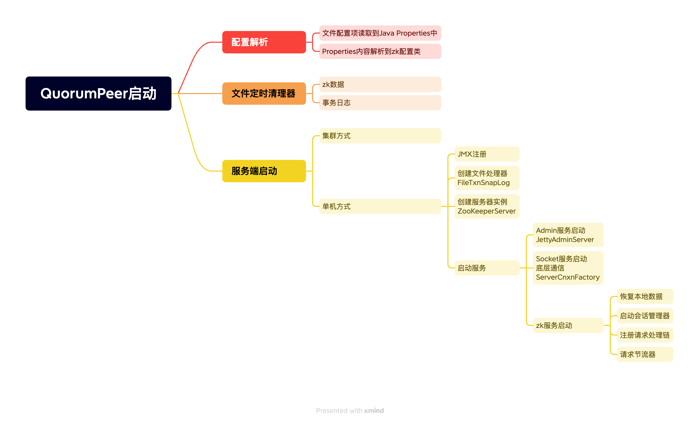
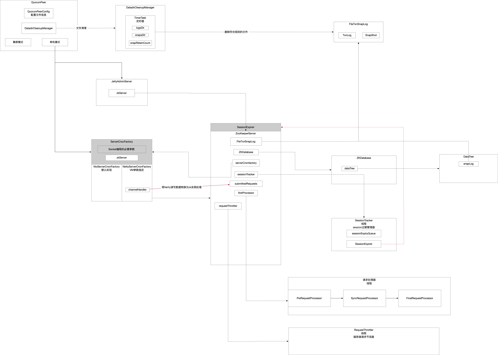

## 1 启动流程图






## 2 配置解析

QuorumPeerConfig是配置类，cfg文件里指定的配置项都会解析到该配置类的实例上。

主要流程就是两步：

* 将文件配置内容加载到Properties
* 将Properties配置内容拷贝到QuorumPeerConfg

### 2.1 配置文件加载

```java
Properties cfg = new Properties();
try (FileInputStream in = new FileInputStream(configFile)) {
    cfg.load(in); // 配置文件内容读取到Java的Properties里
    configFileStr = path;
}
```

### 2.2 解析Properties

```java
parseProperties(cfg); // Java Properties里面的配置内容解析到zk配置类
```

## 3 文件清理器

DatadirCleanupManager

```java
DatadirCleanupManager purgeMgr = new DatadirCleanupManager(
    config.getDataDir(), // 内存数据快照
    config.getDataLogDir(), // 事务日志
    config.getSnapRetainCount(), // 默认保存3个快照
    config.getPurgeInterval()); // 设置n小时清理一次 0标识不用定时清理
purgeMgr.start(); // 文件清理器 定时任务
```

### 3.1 定时器

[Timer](Java源码-Timer.md)，该定时器实现原理是通过单个守护线程轮询监听优先级队列中任务方式，根据任务的执行时机决定是否执行任务。

```java
public void start() {
    if (PurgeTaskStatus.STARTED == purgeTaskStatus) { // 清理任务执行过就不要再启动
        LOG.warn("Purge task is already running.");
        return;
    }
    // Don't schedule the purge task with zero or negative purge interval.
    if (purgeInterval <= 0) { // 标识不启动定时任务
        LOG.info("Purge task is not scheduled.");
        return;
    }

    timer = new Timer("PurgeTask", true); // 创建定时器
    TimerTask task = new PurgeTask(dataLogDir, snapDir, snapRetainCount); // 文件清理任务
    timer.scheduleAtFixedRate(task, 0, TimeUnit.HOURS.toMillis(purgeInterval)); // 定时任务

    purgeTaskStatus = PurgeTaskStatus.STARTED; // 标识定时清理文件任务已经启动
}
```

### 3.2 定时任务

PurgeTask负责清理文件。

```java
@Override
public void run() {
    LOG.info("Purge task started.");
    try {
        PurgeTxnLog.purge(logsDir, snapsDir, snapRetainCount);
    } catch (Exception e) {
        LOG.error("Error occurred while purging.", e);
    }
    LOG.info("Purge task completed.");
}
```

文件删除的工具方法。

```java
public static void purge(File dataDir, File snapDir, int num) throws IOException {
    if (num < 3) {
        throw new IllegalArgumentException(COUNT_ERR_MSG);
    }

    FileTxnSnapLog txnLog = new FileTxnSnapLog(dataDir, snapDir); // 文件处理器

    // zxid最大的num个快照文件 这些文件按照zxid降序排序好了
    List<File> snaps = txnLog.findNValidSnapshots(num);
    int numSnaps = snaps.size();
    if (numSnaps > 0) {
        /**
             * 要保留的快照文件中zxid最小的那个zxid为参考基准 设为x
             *   - 快照文件
             *     - zxid<x的删除
             *     - zxid>=x的保留
             *   - 事务日志 zxid比x小的评选为参考基准 设为y
             *     - zxid<y的删除
             *     - zxid>=y的保留
             */
        purgeOlderSnapshots(txnLog, snaps.get(numSnaps - 1));
    }
}
```

#### 3.2.1 判定zxid基准

根据配置文件中配置项`autopurge.snapRetainCount=3`找到保留\删除对应的zxid的分水岭，也就是由最终要保留文件的数量，得到要保留的最小zxid，再倒推删除标准。

```java
protected List<File> findNValidSnapshots(int n) {
    /**
         * 内存快照存放目录下所有文件按照字典序排序
         * 筛选文件前缀是snapshot
         * 文件名称后缀zxid降序
         * 也就意味着筛选出n个最大zxid的内存快照文件
         */
    List<File> files = Util.sortDataDir(snapDir.listFiles(), SNAPSHOT_FILE_PREFIX, false);
    int count = 0;
    List<File> list = new ArrayList<File>();
    for (File f : files) {
        // we should catch the exceptions
        // from the valid snapshot and continue
        // until we find a valid one
        try {
            if (SnapStream.isValidSnapshot(f)) { // snapshot文件校验合法性
                list.add(f);
                count++;
                if (count == n) {
                    break;
                }
            }
        } catch (IOException e) {
            LOG.warn("invalid snapshot {}", f, e);
        }
    }
    return list;
}
```

#### 3.2.2 筛选要删除的文件

根据上一步判定的zxid规则，针对事务日志和快照两种不同的文件，分别使用各自的规则，筛选出要删除的文件执行删除操作。

```java
/**
     * snapShot这个快照文件用来提供一个删除文件的基准 假设这个参考的基准的zxid为x
     * 要保留的快照文件中zxid最小的那个
     *   - 快照文件
     *     - zxid<x的删除
     *     - zxid>=x的保留
     *   - 事务日志 zxid比x小的评选为参考基准 设为y
     *     - zxid<y的删除
     *     - zxid>=y的保留
     */
static void purgeOlderSnapshots(FileTxnSnapLog txnLog, File snapShot) {
    /**
         * 删除文件的参考zxid
         * 小于这个zxid的删除
         * 大于等于这个zxid的保留
         */
    final long leastZxidToBeRetain = Util.getZxidFromName(snapShot.getName(), PREFIX_SNAPSHOT); // 从snapshot文件名中解析出zxid

    // 要保留的事务日志
    final Set<File> retainedTxnLogs = new HashSet<File>();
    /**
         * 并不是所有<snapshotZxid的事务日志都要删除
         * 对于事务日志而言 向前多兼容一个zxid版本
         * 找到删除基准前一个zxid作为新的基准
         * <新基准的事务日志都筛选出来删除
         * >=新基准的事务日志保留
         */
    retainedTxnLogs.addAll(Arrays.asList(txnLog.getSnapshotLogs(leastZxidToBeRetain))); // 根据zxid找出要保留的所有事务日志

    /**
         * Finds all candidates for deletion, which are files with a zxid in their name that is less
         * than leastZxidToBeRetain.  There's an exception to this rule, as noted above.
         */
    class MyFileFilter implements FileFilter { // 文件过滤器 过来出来的文件是要清理的

        private final String prefix;
        MyFileFilter(String prefix) {
            this.prefix = prefix;
        }
        public boolean accept(File f) {
            if (!f.getName().startsWith(prefix + ".")) { // 要清理的文件的前缀
                return false;
            }
            if (retainedTxnLogs.contains(f)) { // 看看是已经判定要保留
                return false;
            }
            long fZxid = Util.getZxidFromName(f.getName(), prefix);
            return fZxid < leastZxidToBeRetain; // zxid保留阈值 在此之前的才能清理
        }

    }
    // add all non-excluded log files
    File[] logs = txnLog.getDataDir().listFiles(new MyFileFilter(PREFIX_LOG)); // 过滤出所有要删除的事务日志文件
    List<File> files = new ArrayList<>();
    if (logs != null) {
        files.addAll(Arrays.asList(logs));
    }

    // add all non-excluded snapshot files to the deletion list
    File[] snapshots = txnLog.getSnapDir().listFiles(new MyFileFilter(PREFIX_SNAPSHOT)); // 过滤出所有要删除的快照文件
    if (snapshots != null) {
        files.addAll(Arrays.asList(snapshots));
    }

    // remove the old files
    for (File f : files) {
        final String msg = String.format(
            "Removing file: %s\t%s",
            DateFormat.getDateTimeInstance().format(f.lastModified()),
            f.getPath());

        LOG.info(msg);
        System.out.println(msg);

        if (!f.delete()) { // 删除文件
            System.err.println("Failed to remove " + f.getPath());
        }
    }

}
```

## 4 zk服务启动

### 4.1 JMX注册

### 4.2 FileTxnSnaplog

[文件处理器，事务日志和内存数据映射的文件工具类。](ZK-3-8源码-05-FileTxnSnaplog.md)

### 4.3 JettyAdminServer

Admin服务。

基于Jetty容器实现的web服务。

```java
Class<?> jettyAdminServerC = Class.forName("org.apache.zookeeper.server.admin.JettyAdminServer");
Object adminServer = jettyAdminServerC.getConstructor().newInstance();
return (AdminServer) adminServer;
```

#### 4.3.1 反射创建JettyAdminServer

推断无参构造方法进行调用。

```java
public JettyAdminServer() throws AdminServerException, IOException, GeneralSecurityException {
    this(
        System.getProperty("zookeeper.admin.serverAddress", DEFAULT_ADDRESS),
        Integer.getInteger("zookeeper.admin.serverPort", DEFAULT_PORT),
        Integer.getInteger("zookeeper.admin.idleTimeout", DEFAULT_IDLE_TIMEOUT),
        System.getProperty("zookeeper.admin.commandURL", DEFAULT_COMMAND_URL),
        Integer.getInteger("zookeeper.admin.httpVersion", DEFAULT_HTTP_VERSION),
        Boolean.getBoolean("zookeeper.admin.portUnification"),
        Boolean.getBoolean("zookeeper.admin.forceHttps"));
}
```

最终调用的是全参构造方法。

```java
public JettyAdminServer(
    String address, // 0.0.0.0
    int port, // 8080
    int timeout, // 30_000
    String commandUrl, // /commands
    int httpVersion, // 11
    boolean portUnification,
    boolean forceHttps) throws IOException, GeneralSecurityException { // jetty初始化

    this.port = port;
    this.idleTimeout = timeout;
    this.commandUrl = commandUrl;
    this.address = address;

    server = new Server();
    ServerConnector connector = null;

    if (!portUnification && !forceHttps) {
        connector = new ServerConnector(server);
    } else {
        // ...
    }

    connector.setHost(address);
    connector.setPort(port);
    connector.setIdleTimeout(idleTimeout);

    server.addConnector(connector);

    ServletContextHandler context = new ServletContextHandler(ServletContextHandler.SESSIONS);
    context.setContextPath("/*");
    constrainTraceMethod(context);
    server.setHandler(context);

    context.addServlet(new ServletHolder(new CommandServlet()), commandUrl + "/*"); // 业务Servlet
}
```

#### 4.3.2 指令处理器

CommandServlet采用策略模式方式，每个请求指令对应一个处理器，映射关系缓存起来，每次进来请求，通过映射到的处理器进行响应。

```java
static {
    registerCommand(new CnxnStatResetCommand());
    registerCommand(new ConfCommand());
    registerCommand(new ConsCommand());
    registerCommand(new DigestCommand());
    registerCommand(new DirsCommand());
    registerCommand(new DumpCommand());
    registerCommand(new EnvCommand());
    registerCommand(new GetTraceMaskCommand());
    registerCommand(new InitialConfigurationCommand());
    registerCommand(new IsroCommand());
    registerCommand(new LastSnapshotCommand());
    registerCommand(new LeaderCommand());
    registerCommand(new MonitorCommand());
    registerCommand(new ObserverCnxnStatResetCommand());
    registerCommand(new RuokCommand());
    registerCommand(new SetTraceMaskCommand());
    registerCommand(new SrvrCommand());
    registerCommand(new StatCommand());
    registerCommand(new StatResetCommand());
    registerCommand(new SyncedObserverConsCommand());
    registerCommand(new SystemPropertiesCommand());
    registerCommand(new VotingViewCommand());
    registerCommand(new WatchCommand());
    registerCommand(new WatchesByPathCommand());
    registerCommand(new WatchSummaryCommand());
    registerCommand(new ZabStateCommand());
}
```

```java
public static void registerCommand(Command command) {
    for (String name : command.getNames()) {
        Command prev = commands.put(name, command);
        if (prev != null) {
            LOG.warn("Re-registering command {} (primary name = {})", name, command.getPrimaryName());
        }
    }
    primaryNames.add(command.getPrimaryName());
}
```

### 4.4 ServerCnxnFactory

服务端底层通信实现，Socket通信，服务端启动监听客户端请求。

zk提供了两种网络通信的实现：

* 默认的是自己实现的
* 另一种是Netty框架

通过指定VM参数可以使用Netty网络通信`-Dzookeeper.serverCnxnFactory=org.apache.zookeeper.server.NettyServerCnxnFactory`。

```java
public static ServerCnxnFactory createFactory() throws IOException {
    // 通过VM参数指定网络通信的实现-Dzookeeper.serverCnxnFactory
    String serverCnxnFactoryName = System.getProperty(ZOOKEEPER_SERVER_CNXN_FACTORY);
    if (serverCnxnFactoryName == null) {
        serverCnxnFactoryName = NIOServerCnxnFactory.class.getName(); // 默认的实现是zk自己提供的NioServerCnxnFactory
    }
    try {
        // 反射创建实例
        ServerCnxnFactory serverCnxnFactory = (ServerCnxnFactory) Class.forName(serverCnxnFactoryName)
            .getDeclaredConstructor()
            .newInstance();
        LOG.info("Using {} as server connection factory", serverCnxnFactoryName);
        return serverCnxnFactory;
    } catch (Exception e) {
        IOException ioe = new IOException("Couldn't instantiate " + serverCnxnFactoryName, e);
        throw ioe;
    }
}
```

#### 4.4.1 NioServerCnxnFactory

zk默认实现的网络通信实现。

#### 4.4.2 NettyServerCnxnFactory

netty框架实现的网络通信。

###### 4.4.2.1 反射创建通信工厂实例

该类提供了无参构造方法，反射推断的就是无参构造方法，因此只要关注该构造方法中对Netty组件初始化过程中，自定义的Handler是怎么处理消息的即可。

```java
NettyServerCnxnFactory() {
    x509Util = new ClientX509Util();

    boolean usePortUnification = Boolean.getBoolean(PORT_UNIFICATION_KEY);

    LOG.info("{}={}", PORT_UNIFICATION_KEY, usePortUnification);
    if (usePortUnification) {
        try {
            QuorumPeerConfig.configureSSLAuth();
        } catch (QuorumPeerConfig.ConfigException e) {
            LOG.error("unable to set up SslAuthProvider, turning off client port unification", e);
            usePortUnification = false;
        }
    }
    this.shouldUsePortUnification = usePortUnification;

    this.advancedFlowControlEnabled = Boolean.getBoolean(NETTY_ADVANCED_FLOW_CONTROL);
    LOG.info("{} = {}", NETTY_ADVANCED_FLOW_CONTROL, this.advancedFlowControlEnabled);

    setOutstandingHandshakeLimit(Integer.getInteger(OUTSTANDING_HANDSHAKE_LIMIT, -1));

    /**
         * 标准的Netty服务端编程
         */
    EventLoopGroup bossGroup = NettyUtils.newNioOrEpollEventLoopGroup(NettyUtils.getClientReachableLocalInetAddressCount());
    EventLoopGroup workerGroup = NettyUtils.newNioOrEpollEventLoopGroup();
    ServerBootstrap bootstrap = new ServerBootstrap().group(bossGroup, workerGroup)
        .channel(NettyUtils.nioOrEpollServerSocketChannel())
        // parent channel options
        .option(ChannelOption.SO_REUSEADDR, true)
        // child channels options
        .childOption(ChannelOption.TCP_NODELAY, true)
        .childOption(ChannelOption.SO_LINGER, -1)
        .childHandler(new ChannelInitializer<SocketChannel>() {
            @Override
            protected void initChannel(SocketChannel ch) throws Exception {
                ChannelPipeline pipeline = ch.pipeline();
                if (advancedFlowControlEnabled) {
                    pipeline.addLast(readIssuedTrackingHandler);
                }
                if (secure) {
                    initSSL(pipeline, false);
                } else if (shouldUsePortUnification) {
                    initSSL(pipeline, true);
                }
                pipeline.addLast("servercnxnfactory", channelHandler); // 关注这个Handler即可
            }
        });
    this.bootstrap = configureBootstrapAllocator(bootstrap);
    this.bootstrap.validate();
}
```

###### 4.4.2.2 CnxnChannelHandler

[该处理器负责Netty数据的读写，将Socket的数据读写和zk线程关联起来。](ZK-3-8源码-02-CnxnChannelHandler.md)

###### 4.4.2.2 Socket设置一些必要的参数

```java
public void configure(InetSocketAddress addr, int maxClientCnxns, int backlog, boolean secure) throws IOException {
    configureSaslLogin();
    initMaxCnxns();
    localAddress = addr; // 服务端监听的Socket
    this.maxClientCnxns = maxClientCnxns; // 限制单台客户端与单个zk服务器连接数
    this.secure = secure;
    this.listenBacklog = backlog; // Socket listen队列
    LOG.info("configure {} secure: {} on addr {}", this, secure, addr);
}
```
服务启动，语义包含着两个服务的启动

* netty服务端启动
* zk实例启动

zk实例启动负责三件事情

* 恢复本地数据
* 启动会话管理
* 注册请求处理链
* 启动请求节流器

```java
public void startup(ZooKeeperServer zks, boolean startServer) throws IOException, InterruptedException {
    // 启动netty 监听2181端口 等待客户端请求
    start();
    setZooKeeperServer(zks);
    if (startServer) { // 启动zk实例
        // 恢复本地数据
        zks.startdata();
        // 启动会话管理器\注册请求处理链
        zks.startup();
    }
}
```

### 4.5 ZooKeeperServer

zk服务实例。

在单机启动过程中，zk实例负责三件事情

* 借助FileTxnSnaplog文件管理器恢复本地数据
* 启动会话管理器
* 注册请求处理链
* 启动请求节流器

#### 4.5.1 恢复本地数据

本地快照文件反序列化加载到内存。

[借助FileTxnSnapshot文件管理器将已经持久化的文件加载到内存中。](ZK-3-8源码-05-FileTxnSnaplog.md)

```java
public long loadDataBase() throws IOException {
    long startTime = Time.currentElapsedTime();
    /**
         * dataTree就是内存中的内容 要对它打快照
         */
    long zxid = snapLog.restore(dataTree, sessionsWithTimeouts, commitProposalPlaybackListener);
    initialized = true;
    long loadTime = Time.currentElapsedTime() - startTime;
    ServerMetrics.getMetrics().DB_INIT_TIME.add(loadTime);
    LOG.info("Snapshot loaded in {} ms, highest zxid is 0x{}, digest is {}",
             loadTime, Long.toHexString(zxid), dataTree.getTreeDigest());
    return zxid;
}
```

#### 4.5.2 [SessionTracker](ZK-3-8源码-03-SessionTrackerImpl.md)

zk提供了基于session会话的能力，因此在服务端需要对session进行管理，session管理器也就是管理过期会话。

```java
// 启动session追踪器 就是启动一个线程
startSessionTracker();
```

```java
protected void startSessionTracker() {
    ((SessionTrackerImpl) sessionTracker).start();
}
```

SessionTrackerImpl是Thread的派生类，会话追踪器本质就是个Java线程，因此只要关注它的`run()`方法就行了。

```java
public void run() {
    try {
        while (running) {
            long waitTime = sessionExpiryQueue.getWaitTime();
            if (waitTime > 0) {
                Thread.sleep(waitTime);
                continue;
            }

            for (SessionImpl s : sessionExpiryQueue.poll()) {
                ServerMetrics.getMetrics().STALE_SESSIONS_EXPIRED.add(1);
                setSessionClosing(s.sessionId);
                expirer.expire(s); // 过期管理器负责处理过期的会话 expirer指向的就是ZooKeeperServer实现
            }
        }
    } catch (InterruptedException e) {
        handleException(this.getName(), e);
    }
    LOG.info("SessionTrackerImpl exited loop!");
}
```
ZooKeeperServer实现了SessionExpirer接口，zk实例本身也是一个过期会话管理器，该管理器的职责是关闭已经过期的会话。

```java
public void expire(Session session) {
    long sessionId = session.getSessionId();
    LOG.info(
        "Expiring session 0x{}, timeout of {}ms exceeded",
        Long.toHexString(sessionId),
        session.getTimeout());
    close(sessionId); // 关闭会话
}
```

#### 4.5.3 [RequestProcessor](ZK-3-8源码-06-RequestProcessor.md)

zk请求处理责任链，zk将客户端请求以RequestProcessor进行封装，不同的请求处理器有不同的实现：

* PreRequestProcessor
  * 做认证 生成txn事务对象
  * 将请求转交给SyncRP
* SyncRequestProcessor
  * 事务对象持久化 生成事务日志文件
  * 打快照
  * 将请求转交给FinalRP
* FinalRequestProcessor
  * 内存更改
  * 处理事件响应
  * 将响应返回给客户端

初始化上述3个处理器，串成一条单链表PreRP->SyncRP->FinalRP，并将firProcessor指针指向链表头。

```java
/**
     * zk请求责任链
     * PreRP->SyncRP->FinalRP
     */
protected void setupRequestProcessors() {
    /**
         * FinalRequestProcessor
         *   - 内存更改
         *   - 处理事件响应
         *   - 返回客户端响应
         */
    RequestProcessor finalProcessor = new FinalRequestProcessor(this);
    /**
         * SyncRequestProcessor
         *   - 事务对象持久化 生成事务文件
         *   - 打快照
         *   - 将请求转交给FinalRP
         */
    RequestProcessor syncProcessor = new SyncRequestProcessor(this, finalProcessor);
    ((SyncRequestProcessor) syncProcessor).start();
    /**
         * PreRequestProcessor请求处理器
         *   - 做认证 生成txn事务对象
         *   - 请求转交给SyncRP
         */
    firstProcessor = new PrepRequestProcessor(this, syncProcessor);
    /**
         * 责任链设计模式
         * 每个请求处理器都是一个单链表的节点 将3个处理器串起来就是一条链表
         * 请求从链表头依次被处理
         * PreRP->SyncRP->FinalRP
         */
    ((PrepRequestProcessor) firstProcessor).start(); // RequestProcessor是Thread的派生类
}
```

#### 4.5.4 [RequestThrottler](ZK-3-8源码-04-RequestThrottler.md)

服务端请求节流器。
