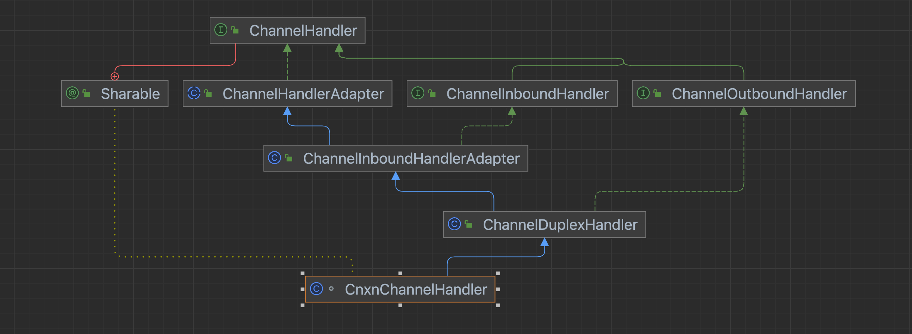

上节梳理了zk单机启动流程，`NettyServerCnxnFactory`提供了标准的Netty服务端开发模板，`ZooKeeperServer`定义了请求处理责任链。现在两个独立的线程，如何将Socket的数据映射成zk请求，`CnxnChannelHandler`成为了将Netty和ZK连接起来的枢纽。

## 1 类图关系

从类图继承可以看出来这个Handler负责读写。

当前为服务端，我们先只关注客户端连接成功以及客户端发送数据过来这两个流程，所以只要关注这个Handler的两个方法即可：

* channelActive
* channelRead



## 2 channelActive方法

引入了组件，跟Channel绑定起来，也就是说NettyServerCnxn将负责整个IO的生命周期之间的处理：

* 连接管理
* 会话管理
* 数据管理

那么NettyServerCnxn就相当于Netty和ZK之间的连接组件，只要在组件中持有ZK实例，便可以将Netty请求转交给ZK，在此过程中还可以随心所欲进行拦截处理。

```java
NettyServerCnxn cnxn = new NettyServerCnxn(channel, zkServer, NettyServerCnxnFactory.this);
ctx.channel().attr(CONNECTION_ATTRIBUTE).set(cnxn); // 服务端Channel跟zk实例绑定起来 数据的读写依赖Channel 将来读写的时候将权利转移给zk实例
```

## 3 channelRead方法

```java
// 读数据 客户端连接服务端的时候就已经给每个Channel绑定上了一个NettyServerCnxn实例
NettyServerCnxn cnxn = ctx.channel().attr(CONNECTION_ATTRIBUTE).get();
if (cnxn == null) {
    LOG.error("channelRead() on a closed or closing NettyServerCnxn");
} else {
    cnxn.processMessage((ByteBuf) msg); // 数据的拥有权就从Netty转移到了NettyServerCnxn组件上了
}
```

