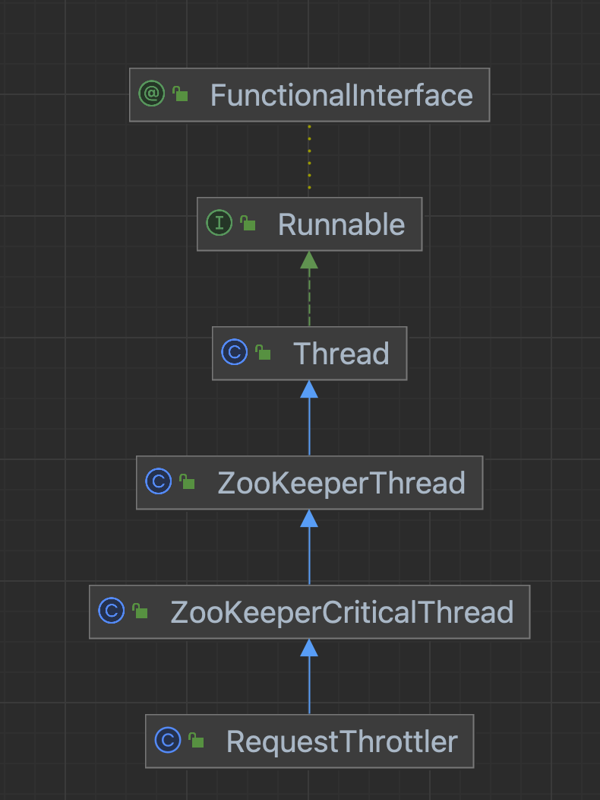
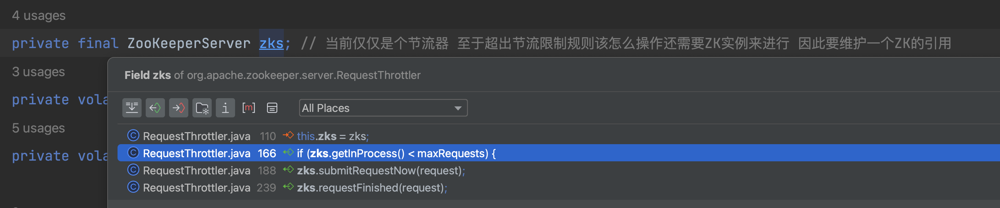
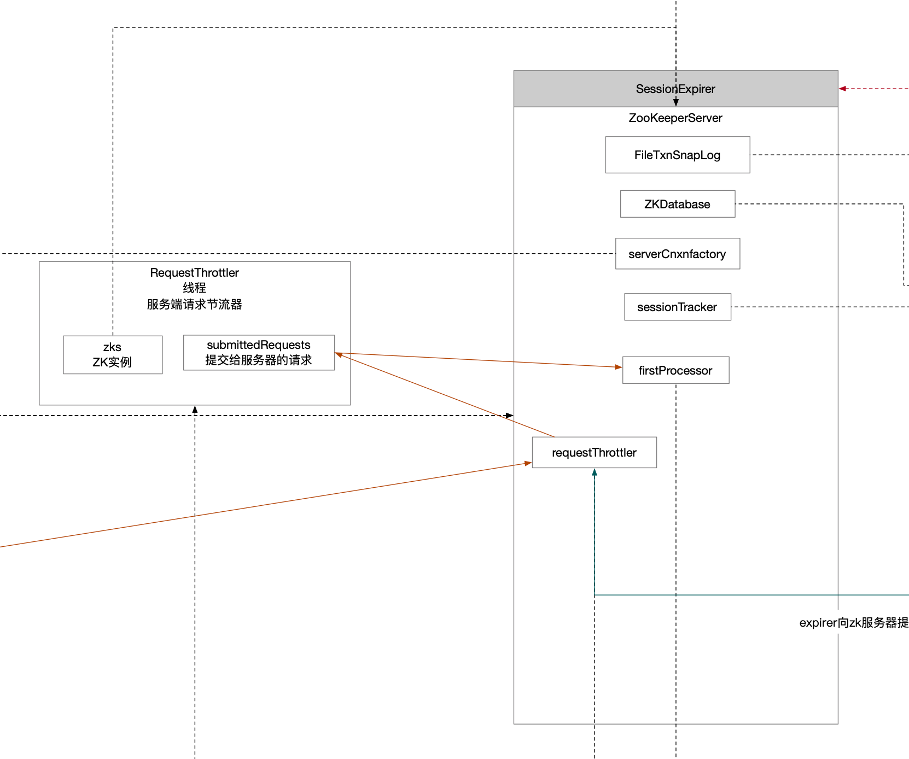

回顾一下创建时机，在ZK单机服务启动流程中启动节流器。

```java
/**
         * 请求节流器
         */
startRequestThrottler();
```


启动节流器的时候对节流器进行了实例话和启动，并将节流器指针维护在ZK实例中。

```java
protected void startRequestThrottler() {
    requestThrottler = new RequestThrottler(this);
    requestThrottler.start();

}
```

## 1 类图

继承关系很简单，就是一个线程，因此核心就是关注它的`run()`方法是怎么实现的。



## 2 构造方法

构造方法的作用是在节流器内维护ZK实例的指针。

```java
public RequestThrottler(ZooKeeperServer zks) {
    super("RequestThrottler", zks.getZooKeeperServerListener());
    this.zks = zks;
    this.stopping = false;
    this.killed = false;
}
```

至于为什么要在节流器内持有ZK实例，从代码架构设计来讲，讲究一个职责清晰，每个组件只关注自己的事情，那么将来对请求的处理还是要交给ZK服务器。

从源码上还可以看到一点之前提过的，就是EDA事件驱动，ZK服务都是用Request消息驱动。



## 3 run()方法

```java
/**
                 * 节流机制的体现
                 *   - 要么丢掉请求，不处理该请求了
                 *   - 要么等待服务端入口流量下来了，再提交该请求
                 * submitRequestNow这个方法是将请求转发给ZK实例，让其执行
                 * 也就是在submitRequestNow这个方法之前多一层过滤机制
                 */
if (maxRequests > 0) {
    while (!killed) {
        if (dropStaleRequests && request.isStale()) {
            // Note: this will close the connection
            dropRequest(request);
            ServerMetrics.getMetrics().STALE_REQUESTS_DROPPED.add(1);
            request = null;
            break;
        }
        if (zks.getInProcess() < maxRequests) {
            break;
        }
        throttleSleep(stallTime);
    }
}
```


ZK服务真正处理请求，而ZK实例又将请求派发给`firstProcessor`指向的。

```java
zks.submitRequestNow(request); // 真正立马要执行的请求控制权给到ZK服务 让其执行
```


## 4 组件流程图


