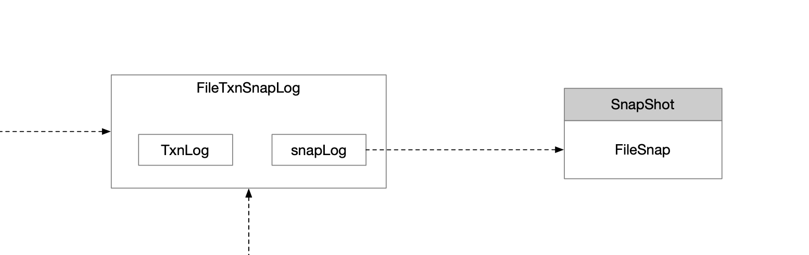
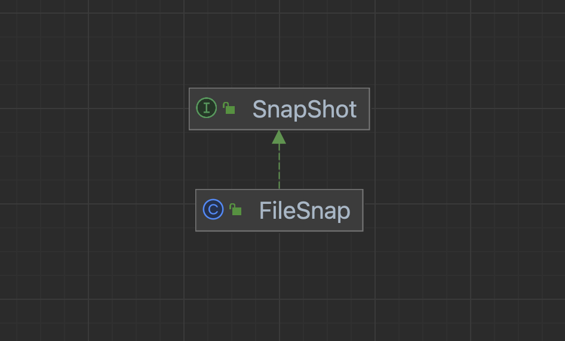

文件处理器，事务日志和内存数据映射的文件工具类。`ZooKeeperServer`中持有该实例的引用。

## 1 内存数据序列化至文件

save()方法

```java
// 将内存数据dataTree和sessions序列化到snapshotFile中
snapLog.serialize(dataTree, sessionsWithTimeouts, snapshotFile, syncSnap);
```

## 2 磁盘数据反序列化至内存

restore()方法

```java
/**
         * 把快照文件snapLog反序列化恢复到ZKDatabase中
         *   - DataTree
         *   - sessions
         * 返回出来最新的zxid
         * -1标识没有找到快照文件
         */
long deserializeResult = snapLog.deserialize(dt, sessions);
```


```java
public long deserialize(DataTree dt, Map<Long, Integer> sessions) throws IOException {
    // we run through 100 snapshots (not all of them)
    // if we cannot get it running within 100 snapshots
    // we should  give up
    // 上限100个有效的快照文件 按照zxid降序
    List<File> snapList = findNValidSnapshots(100);
    if (snapList.size() == 0) { // 没有快照文件 返回-1标识
        return -1L;
    }
    File snap = null;
    long snapZxid = -1;
    boolean foundValid = false;
    for (int i = 0, snapListSize = snapList.size(); i < snapListSize; i++) { // 轮询找到的快照文件 反序列化出来zxid最大的有效文件内容
        snap = snapList.get(i);
        LOG.info("Reading snapshot {}", snap);
        snapZxid = Util.getZxidFromName(snap.getName(), SNAPSHOT_FILE_PREFIX); // /tmp/zookeeper/data/version-2/snap.8
        try (CheckedInputStream snapIS = SnapStream.getInputStream(snap)) {
            InputArchive ia = BinaryInputArchive.getArchive(snapIS);
            deserialize(dt, sessions, ia); // 快照文件反序列到内存
            SnapStream.checkSealIntegrity(snapIS, ia);

            // Digest feature was added after the CRC to make it backward
            // compatible, the older code can still read snapshots which
            // includes digest.
            //
            // To check the intact, after adding digest we added another
            // CRC check.
            if (dt.deserializeZxidDigest(ia, snapZxid)) {
                SnapStream.checkSealIntegrity(snapIS, ia);
            }

            foundValid = true;
            break;
        } catch (IOException e) {
            LOG.warn("problem reading snap file {}", snap, e);
        }
    }
    if (!foundValid) {
        throw new IOException("Not able to find valid snapshots in " + snapDir);
    }
    dt.lastProcessedZxid = snapZxid;
    lastSnapshotInfo = new SnapshotInfo(dt.lastProcessedZxid, snap.lastModified() / 1000);

    // compare the digest if this is not a fuzzy snapshot, we want to compare
    // and find inconsistent asap.
    if (dt.getDigestFromLoadedSnapshot() != null) {
        dt.compareSnapshotDigests(dt.lastProcessedZxid);
    }
    return dt.lastProcessedZxid;
}
```

## 3 FileSnap

序列化与反序列是一对操作，声明在SnapShot接口中，而上述的序列化与反序列实现都在`FileSnap`中。




