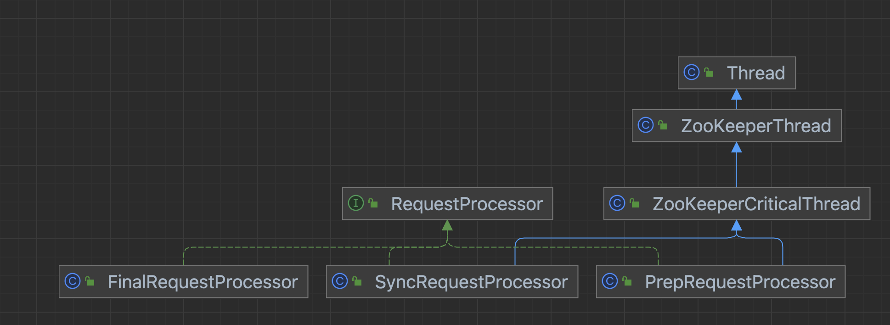
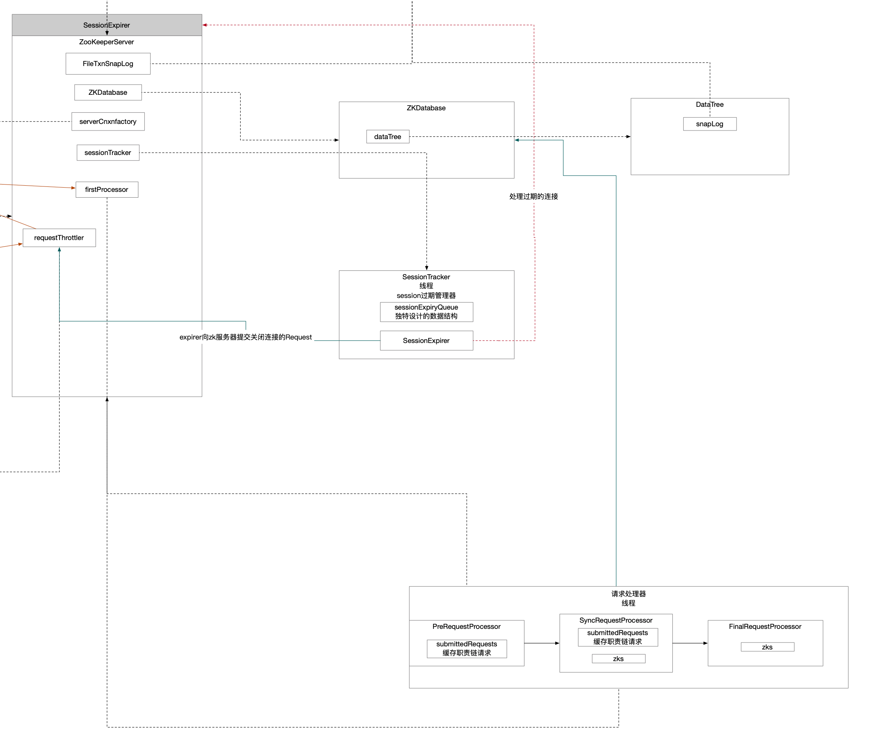

ZK请求处理责任链，ZK服务器要处理的请求都要经过这个职责链，该链表通过ZK实例中的`firstProcessor`维护着。

## 1 职责链创建时机

回顾一下。

```java
/**
         * zk请求责任链
         * PreRP->SyncRP->FinalRP
         */
setupRequestProcessors();
```


创建了三个处理器，并将这三个处理器按照一定顺序作为但链表节点串起来，将链表头指针维护在ZK实例中，也就是`firstProcessor`。

以后所有的请求都交给`firstProcessor`，由其按照职责链设计模式进行执行。

```java
/**
     * zk请求责任链
     * PreRP->SyncRP->FinalRP
     */
protected void setupRequestProcessors() {
    /**
         * FinalRequestProcessor
         *   - 内存更改
         *   - 处理事件响应
         *   - 返回客户端响应
         */
    RequestProcessor finalProcessor = new FinalRequestProcessor(this);
    /**
         * SyncRequestProcessor
         *   - 事务对象持久化 生成事务文件
         *   - 打快照
         *   - 将请求转交给FinalRP
         */
    RequestProcessor syncProcessor = new SyncRequestProcessor(this, finalProcessor);
    ((SyncRequestProcessor) syncProcessor).start();
    /**
         * PreRequestProcessor请求处理器
         *   - 做认证 生成txn事务对象
         *   - 请求转交给SyncRP
         */
    firstProcessor = new PrepRequestProcessor(this, syncProcessor);
    /**
         * 责任链设计模式
         * 每个请求处理器都是一个单链表的节点 将3个处理器串起来就是一条链表
         * 请求从链表头依次被处理
         * PreRP->SyncRP->FinalRP
         */
    ((PrepRequestProcessor) firstProcessor).start(); // RequestProcessor是Thread的派生类
}
```

## 2 类图

从类图中可以得到两个信息：

* 三个处理器都是RequestProcessor的派生类，因此要关注接口中声明的方法`processRequest`。
* `PreRequestProcessor`和`SyncRequestProcessor`同时又是`Thread`的派生类，也就是说这两个处理器本质是线程，因此其运行模型就是线程执行，关注其`run()`方法就行。



## 3 PreRequestProcessor

### 3.1 processRequest()方法

```java
public void processRequest(Request request) {
    request.prepQueueStartTime = Time.currentElapsedTime();
    submittedRequests.add(request); // 将请求缓存起来 供线程轮询
    ServerMetrics.getMetrics().PREP_PROCESSOR_QUEUED.add(1);
}
```

### 3.2 run()方法

```java
@Override
public void run() {
    LOG.info(String.format("PrepRequestProcessor (sid:%d) started, reconfigEnabled=%s", zks.getServerId(), zks.reconfigEnabled));
    try {
        while (true) {
            ServerMetrics.getMetrics().PREP_PROCESSOR_QUEUE_SIZE.add(submittedRequests.size());
            Request request = submittedRequests.take(); // 缓存取任务 该缓存实现是阻塞队列 take()方法可以永久性阻塞
            ServerMetrics.getMetrics().PREP_PROCESSOR_QUEUE_TIME
                .add(Time.currentElapsedTime() - request.prepQueueStartTime);
            if (Request.requestOfDeath == request) {
                break;
            }

            request.prepStartTime = Time.currentElapsedTime();
            pRequest(request); // PreRequestProcessor处理器关注的核心
        }
    } catch (Exception e) {
        handleException(this.getName(), e);
    }
    LOG.info("PrepRequestProcessor exited loop!");
}
```


PreRequestProcessor的处理逻辑，该处理器完成两个步骤：

* PreRequestProcessor要完成的定制化处理逻辑
* 将请求转发给下一个处理器SyncRequestProcessor

```java
protected void pRequest(Request request) throws RequestProcessorException {
    // LOG.info("Prep>>> cxid = " + request.cxid + " type = " +
    // request.type + " id = 0x" + Long.toHexString(request.sessionId));
    request.setHdr(null);
    request.setTxn(null);

    if (!request.isThrottled()) {
        pRequestHelper(request); // PreRequestProcessor定制处理逻辑
    }

    request.zxid = zks.getZxid();
    long timeFinishedPrepare = Time.currentElapsedTime();
    ServerMetrics.getMetrics().PREP_PROCESS_TIME.add(timeFinishedPrepare - request.prepStartTime);
    nextProcessor.processRequest(request); // PreRequestProcessor将请求交给SyncRequestProcessor
    ServerMetrics.getMetrics().PROPOSAL_PROCESS_TIME.add(Time.currentElapsedTime() - timeFinishedPrepare);
}
```

## 4 SyncRequestProcessor

### 4.1 构造方法

因为SyncRequestProcessor要对数据进行持久化，而自己没有这个能力，因此要借助其他组件，在构造方法的时候就显式指定。

```java
public SyncRequestProcessor(ZooKeeperServer zks, RequestProcessor nextProcessor) {
    super("SyncThread:" + zks.getServerId(), zks.getZooKeeperServerListener());
    /**
         * SyncRequestProcessor需要持有ZK实例的原因在于
         *   - 需要委托ZK持有的ZKDatabase组件进行事务日志记录
         *   - 需要委托ZK对内存数据打快照
         */
    this.zks = zks;
    this.nextProcessor = nextProcessor; // 需要将请求继续下发给FinalRequestProcessor
    this.toFlush = new ArrayDeque<>(zks.getMaxBatchSize());
}
```

### 4.1 processRequest()方法

跟`PreRequestProcessor`基本一致，都是将请求缓存到阻塞队列中，给线程去轮询。

```java
public void processRequest(final Request request) {
    Objects.requireNonNull(request, "Request cannot be null");

    request.syncQueueStartTime = Time.currentElapsedTime();
    queuedRequests.add(request); // 缓存起来 给线程轮询
    ServerMetrics.getMetrics().SYNC_PROCESSOR_QUEUED.add(1);
}
```

### 4.2 run()方法

逻辑复杂，但是流程简单。SyncRequestProcessor主要就负责两件事情：

* 对请求创建事务日志记下来，这部分需要组件完成。
* 可能对内存数据打快照，这部分需要组件完成。

```java
/**
     * 对请求的处理逻辑
     *   - 记录对应的事务日志 委托给ZK实例 ZK实例再委托给ZKDatabase组件
     *   - 内存数据打快照 委托为ZK实例 ZK实例再委托为FileTxnSnaplog组件
     */
@Override
public void run() {
    try {
        // we do this in an attempt to ensure that not all of the servers
        // in the ensemble take a snapshot at the same time
        resetSnapshotStats();
        lastFlushTime = Time.currentElapsedTime();
        while (true) {
            ServerMetrics.getMetrics().SYNC_PROCESSOR_QUEUE_SIZE.add(queuedRequests.size());

            long pollTime = Math.min(zks.getMaxWriteQueuePollTime(), getRemainingDelay());
            Request si = queuedRequests.poll(pollTime, TimeUnit.MILLISECONDS); // 提交在服务端的一个请求 已经经过了PreRequestProcessor处理 当前要处理的请求
            if (si == null) { // 其实这个防御使NPE没必要 因为在processRequest()方法中入队前的先决条件就是非null
                /* We timed out looking for more writes to batch, go ahead and flush immediately */
                flush();
                si = queuedRequests.take(); // 继续阻塞式从缓存中拿请求
            }

            if (si == REQUEST_OF_DEATH) {
                break;
            }

            long startProcessTime = Time.currentElapsedTime();
            ServerMetrics.getMetrics().SYNC_PROCESSOR_QUEUE_TIME.add(startProcessTime - si.syncQueueStartTime);

            // track the number of records written to the log
            if (!si.isThrottled() && zks.getZKDatabase().append(si)) { // 写事务日志
                if (shouldSnapshot()) { // 内存数据打快照
                    resetSnapshotStats();
                    // roll the log
                    zks.getZKDatabase().rollLog();
                    // take a snapshot
                    if (!snapThreadMutex.tryAcquire()) {
                        LOG.warn("Too busy to snap, skipping");
                    } else {
                        new ZooKeeperThread("Snapshot Thread") {
                            public void run() {
                                try {
                                    zks.takeSnapshot(); // 内存快照
                                } catch (Exception e) {
                                    LOG.warn("Unexpected exception", e);
                                } finally {
                                    snapThreadMutex.release();
                                }
                            }
                        }.start();
                    }
                }
            } else if (toFlush.isEmpty()) {
                // optimization for read heavy workloads
                // iff this is a read or a throttled request(which doesn't need to be written to the disk),
                // and there are no pending flushes (writes), then just pass this to the next processor
                if (nextProcessor != null) {
                    nextProcessor.processRequest(si);
                    if (nextProcessor instanceof Flushable) {
                        ((Flushable) nextProcessor).flush();
                    }
                }
                continue;
            }
            toFlush.add(si);
            if (shouldFlush()) {
                flush();
            }
            ServerMetrics.getMetrics().SYNC_PROCESS_TIME.add(Time.currentElapsedTime() - startProcessTime);
        }
    } catch (Throwable t) {
        handleException(this.getName(), t);
    }
    LOG.info("SyncRequestProcessor exited!");
}
```

## 5 FinalRequestProcessor

### 5.1 构造方法

```java
public FinalRequestProcessor(ZooKeeperServer zks) {
    /**
         * FinalRequest需要将请求作用于ZK内存数据上 因此要委托ZK实例进行内存更新
         */
    this.zks = zks;
    this.requestPathMetricsCollector = zks.getRequestPathMetricsCollector();
}
```

### 5.2 processRequest()方法方法

该方法内部处理包括：

* 根据请求对内存进行更新
* 将请求对应的响应发回给客户端

```java
rc = applyRequest(request); // 对内存数据进行更新

ServerCnxn cnxn = request.cnxn; // 请求中携带着NettyServerCnxn也就是连接管理器 每个连接管理器绑定着一个Channel 这样就知道该把响应发送给哪个客户端
```

## 6 组件流程图

