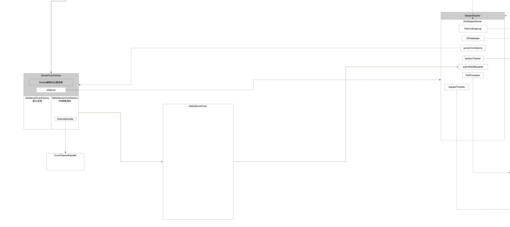
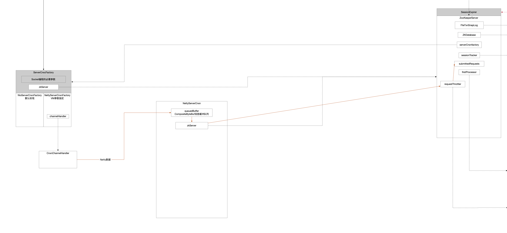

经过处理器的关联，目前Netty和ZK之间的关系如下：



下面就要分析`NettyServerCnxn`这个组件如何将数据读取出来封装成Request交给ZK的。

## 1 从Netty读取数据

Netty有数据可读的时候数据流开始来到NettyServerCnxn中。

```java
cnxn.processMessage((ByteBuf) msg); // 数据的拥有权就从Netty转移到了NettyServerCnxn组件上了
```


Netty中的数据放入缓存队列，这样的设计可以有效增加系统吞吐，不管数据从queuedBuffer出口，还是直接从Channel作为直接出口，最终都要调用函数`receiveMessage`。

在这个方法中，已经由`ZK`实例来处理`queuedBuffer`中拿出来的整包数据了。

```java
void processMessage(ByteBuf buf) {
    checkIsInEventLoop("processMessage");

    /**
         * 开启了节流机制 queuedBuffer缓冲队列就会被实例话
         */
    if (throttled.get()) { // 节流的场景下把数据放到队列里
        // we are throttled, so we need to queue
        if (queuedBuffer == null) {
            LOG.debug("allocating queue");
            queuedBuffer = channel.alloc().compositeBuffer();
        }
        appendToQueuedBuffer(buf.retainedDuplicate());
    } else { // 不节流直接对数据进行读取
        if (queuedBuffer != null) {
            appendToQueuedBuffer(buf.retainedDuplicate());
            processQueuedBuffer(); // 调用->receiveMessage方法
        } else {
            receiveMessage(buf);
            // Have to check !closingChannel, because an error in
            // receiveMessage() could have led to close() being called.
            if (!closingChannel && buf.isReadable()) {
                if (queuedBuffer == null) {
                    queuedBuffer = channel.alloc().compositeBuffer();
                }
                appendToQueuedBuffer(buf.retainedSlice(buf.readerIndex(), buf.readableBytes()));
            }
        }
    }
}
```


`receiveMesage`这个方法设计得有点绕，注释写的比较清楚了，设计的复杂的根本原因还是为了兼容上面`processMessage`方法使用`queuedBuffer`缓存队列的场景。

```java
private void receiveMessage(ByteBuf message) {
    checkIsInEventLoop("receiveMessage");
    /**
     * 为啥这个方法要设计这么麻烦
     *   - 直观上看就是将message拷贝到bb缓冲区上 然后处理的是bb缓冲区
     *   - 为什么不直接处理message消息
     * 如果这个方法的入口只有Netty read(...)来触发那是完全没必要进行数据拷贝的 可以直接处理mesage
     * 但是这个方法的入口还有queuedBuffer 队列里面数据被聚合过 没有消息边界 需要手工处理判定真实数据多长
     * 而这个方法的启用条件是使用节流机制
     * 也就是说这个方法完全是为了兼容节流+缓冲队列这个场景
     *
     * 方法逻辑很清晰
     * 轮询读取数据包 直到数据包被读完
     *   - 数据包首次进入这个方法时 还没有给数据包分配过缓冲区bb
     *     - 数据包前4字节标识这个数据包中有多长数据要接收 读出来这个长度
     *     - 按照数据包中真实数据长度分配一个长度刚好的缓冲区bb
     *   - 上一轮仅仅读走了数据包前4个字节
     *     - 现在面对的就是真实数据了
     *     - 并且缓冲区bb已经在上一轮中分配好
     *     - 把真实数据一次性全部读走到缓冲区
     */
    try {
        while (message.isReadable() && !throttled.get()) {
            if (bb != null) {
                // 调整缓冲区大小
                if (bb.remaining() > message.readableBytes()) {
                    int newLimit = bb.position() + message.readableBytes();
                    bb.limit(newLimit);
                }
                // 从数据包中读取长度为bb的ByteBuffer
                message.readBytes(bb);
                bb.limit(bb.capacity());

                if (bb.remaining() == 0) { // 读完了一个完整的message数据包了
                    bb.flip();
                    packetReceived(4 + bb.remaining());

                    ZooKeeperServer zks = this.zkServer;
                    if (zks == null || !zks.isRunning()) {
                        throw new IOException("ZK down");
                    }
                    if (initialized) {
                        // TODO: if zks.processPacket() is changed to take a ByteBuffer[],
                        // we could implement zero-copy queueing.
                        zks.processPacket(this, bb); // 处理数据包中的实际数据
                    } else {
                        zks.processConnectRequest(this, bb); // 连接请求
                        initialized = true;
                    }
                    bb = null; // 又置为null 等待下一个新的数据包进来重新根据数据包前4字节指示的大小分配
                }
            } else {
                if (message.readableBytes() < bbLen.remaining()) {
                    bbLen.limit(bbLen.position() + message.readableBytes());
                }
                message.readBytes(bbLen); // 读取数据包中前4字节记录的数据包中实际数据长度
                bbLen.limit(bbLen.capacity()); // 重置bbLen的limit
                if (bbLen.remaining() == 0) { // 保证bbLen至多读取了message的前4字节内容
                    bbLen.flip();

                    int len = bbLen.getInt(); // 前4字节代表的值 就是数据长度

                    bbLen.clear(); // bbLen使命完成
                    if (!initialized) {
                        if (checkFourLetterWord(channel, message, len)) { // 是否是4字母指令
                            return;
                        }
                    }
                    if (len < 0 || len > BinaryInputArchive.maxBuffer) {
                        throw new IOException("Len error " + len);
                    }
                    ZooKeeperServer zks = this.zkServer;
                    if (zks == null || !zks.isRunning()) {
                        close(DisconnectReason.IO_EXCEPTION);
                        return;
                    }
                    // checkRequestSize will throw IOException if request is rejected
                    zks.checkRequestSizeWhenReceivingMessage(len); // 根据len重新分配缓冲以便接收内容
                    bb = ByteBuffer.allocate(len); // 分配缓冲准备用来接收实际数据
                }
            }
        }
    } catch (IOException e) {
        LOG.warn("Closing connection to {}", getRemoteSocketAddress(), e);
        close(DisconnectReason.IO_EXCEPTION);
    } catch (ClientCnxnLimitException e) {
        // Common case exception, print at debug level
        ServerMetrics.getMetrics().CONNECTION_REJECTED.add(1);

        LOG.debug("Closing connection to {}", getRemoteSocketAddress(), e);
        close(DisconnectReason.CLIENT_RATE_LIMIT);
    }
}
```

## 2 ZK封装请求

上面`NettyServerCnxn`组件处理的数据还是字节类型，现在数据的所有权已经到了ZK上，开始对数据进行业务封装，方便整个系统件流转，以及后面请求责任链进行处理。

```java
public void processPacket(ServerCnxn cnxn, ByteBuffer incomingBuffer) throws IOException {
    // We have the request, now process and setup for next
    InputStream bais = new ByteBufferInputStream(incomingBuffer); // 接到的请求数据
    BinaryInputArchive bia = BinaryInputArchive.getArchive(bais);
    RequestHeader h = new RequestHeader();
    h.deserialize(bia, "header"); // 反序列化请求头

    // Need to increase the outstanding request count first, otherwise
    // there might be a race condition that it enabled recv after
    // processing request and then disabled when check throttling.
    //
    // Be aware that we're actually checking the global outstanding
    // request before this request.
    //
    // It's fine if the IOException thrown before we decrease the count
    // in cnxn, since it will close the cnxn anyway.
    cnxn.incrOutstandingAndCheckThrottle(h);

    // Through the magic of byte buffers, txn will not be
    // pointing
    // to the start of the txn
    incomingBuffer = incomingBuffer.slice();
    if (h.getType() == OpCode.auth) { // 请求类型是授权
        LOG.info("got auth packet {}", cnxn.getRemoteSocketAddress());
        AuthPacket authPacket = new AuthPacket();
        ByteBufferInputStream.byteBuffer2Record(incomingBuffer, authPacket);
        String scheme = authPacket.getScheme();
        ServerAuthenticationProvider ap = ProviderRegistry.getServerProvider(scheme);
        Code authReturn = KeeperException.Code.AUTHFAILED;
        if (ap != null) {
            try {
                // handleAuthentication may close the connection, to allow the client to choose
                // a different server to connect to.
                authReturn = ap.handleAuthentication(
                    new ServerAuthenticationProvider.ServerObjs(this, cnxn),
                    authPacket.getAuth());
            } catch (RuntimeException e) {
                LOG.warn("Caught runtime exception from AuthenticationProvider: {}", scheme, e);
                authReturn = KeeperException.Code.AUTHFAILED;
            }
        }
        if (authReturn == KeeperException.Code.OK) {
            LOG.info("Session 0x{}: auth success for scheme {} and address {}",
                     Long.toHexString(cnxn.getSessionId()), scheme,
                     cnxn.getRemoteSocketAddress());
            ReplyHeader rh = new ReplyHeader(h.getXid(), 0, KeeperException.Code.OK.intValue());
            cnxn.sendResponse(rh, null, null);
        } else {
            if (ap == null) {
                LOG.warn(
                    "No authentication provider for scheme: {} has {}",
                    scheme,
                    ProviderRegistry.listProviders());
            } else {
                LOG.warn("Authentication failed for scheme: {}", scheme);
            }
            // send a response...
            ReplyHeader rh = new ReplyHeader(h.getXid(), 0, KeeperException.Code.AUTHFAILED.intValue());
            cnxn.sendResponse(rh, null, null);
            // ... and close connection
            cnxn.sendBuffer(ServerCnxnFactory.closeConn);
            cnxn.disableRecv();
        }
        return;
    } else if (h.getType() == OpCode.sasl) {
        processSasl(incomingBuffer, cnxn, h);
    } else { // 其他类型的请求
        if (!authHelper.enforceAuthentication(cnxn, h.getXid())) {
            // Authentication enforcement is failed
            // Already sent response to user about failure and closed the session, lets return
            return;
        } else {
            /**
                 * 创建Request对象 放进队列
                 * 意味着三点
                 *   - 客户端进来的请求数 对数据的控制权已经从Netty转移到了ZK上
                 *   - 数据格式已经从字节封装成业务格式
                 *   - 服务端不再直接面向请求个体 而是面向队列轮询
                 */
            Request si = new Request(cnxn, cnxn.getSessionId(), h.getXid(), h.getType(), incomingBuffer, cnxn.getAuthInfo());
            int length = incomingBuffer.limit();
            if (isLargeRequest(length)) {
                // checkRequestSize will throw IOException if request is rejected
                checkRequestSizeWhenMessageReceived(length);
                si.setLargeRequestSize(length);
            }
            si.setOwner(ServerCnxn.me);
            submitRequest(si);
        }
    }
}
```

## 3 请求入队

```java
public void submitRequest(Request si) {
    enqueueRequest(si);
}
```


下面数据所有权来到ZK的节流器，由节流器判定是否能够入队。

```java
public void enqueueRequest(Request si) {
    /**
         * 回忆一下zk初始化过程
         *   - 先启动的Netty
         *   - 再启动的zk
         *     - 恢复本地数据
         *     - 注册请求处理责任链
         *     - 启动节流器
         * 也就是说 zk中所有的请求必须要走请求责任链 但是netty启动时机早 可能过早接到了数据
         * 所以要等待zk初始化完成
         *
         * 这里边的语义也就意味着 当节流器实例都已经创建好了 zk服务器肯定初始化完成了
         */
    if (requestThrottler == null) {
        synchronized (this) {
            try {
                // Since all requests are passed to the request
                // processor it should wait for setting up the request
                // processor chain. The state will be updated to RUNNING
                // after the setup.
                while (state == State.INITIAL) {
                    wait(1000);
                }
            } catch (InterruptedException e) {
                LOG.warn("Unexpected interruption", e);
            }
            if (requestThrottler == null) {
                throw new RuntimeException("Not started");
            }
        }
    }
    requestThrottler.submitRequest(si); // 请求交给节流器判定能否入队
}
```

## 4 数据流转流程图

咖啡红这个线指向的就是数据如何从Netty到ZK的。


