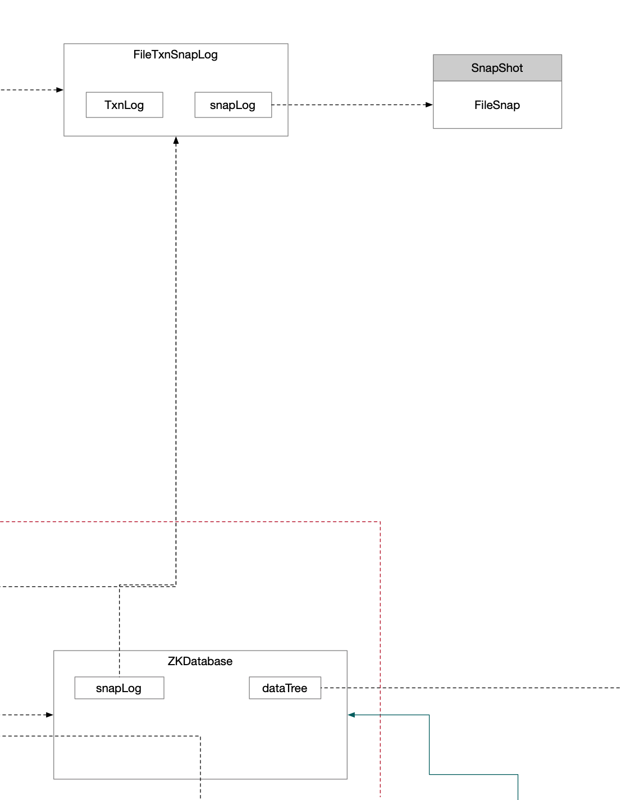

`ZKDatabase`是ZK实现的内存数据库，DataTree是内存数据结构模型，对数据库的CURD最终都会通过dataTree进行操作节点。

组件流程图如下：



## 1 processTxn()方法

```java
public ProcessTxnResult processTxn(TxnHeader hdr, Record txn, TxnDigest digest) {
    return dataTree.processTxn(hdr, txn, digest); // ZK服务实例中FinalRequestProcessor对内存修改调用到这
}
```


```java
public ProcessTxnResult processTxn(TxnHeader header, Record txn, TxnDigest digest) {
    ProcessTxnResult result = processTxn(header, txn);
    compareDigest(header, txn, digest);
    return result;
}
```


```java
public ProcessTxnResult processTxn(TxnHeader header, Record txn) {
    return this.processTxn(header, txn, false);
}
```


```java
public ProcessTxnResult processTxn(TxnHeader header, Record txn, boolean isSubTxn) {
    ProcessTxnResult rc = new ProcessTxnResult();

    try {
        rc.clientId = header.getClientId();
        rc.cxid = header.getCxid();
        rc.zxid = header.getZxid();
        rc.type = header.getType();
        rc.err = 0;
        rc.multiResult = null;
        switch (header.getType()) {
            case OpCode.create:
                CreateTxn createTxn = (CreateTxn) txn;
                rc.path = createTxn.getPath();
                createNode(
                    createTxn.getPath(),
                    createTxn.getData(),
                    createTxn.getAcl(),
                    createTxn.getEphemeral() ? header.getClientId() : 0,
                    createTxn.getParentCVersion(),
                    header.getZxid(),
                    header.getTime(),
                    null);
                break;
                // ...
        }
```

## 2 rollLog()方法

```java
public void rollLog() throws IOException {
    /**
         * 滚动事务日志
         * 将内存buffer刷到fos中 write到文件系统 但是不保证刷盘
         */
    this.snapLog.rollLog();
    resetTxnCount();
}
```


```java
public void rollLog() throws IOException { // 滚动事务日志
    txnLog.rollLog(); // 将内存buffer刷到fos中 write到文件系统 但是不保证刷盘
}
```


```java
public synchronized void rollLog() throws IOException { // 将内存buffer刷到fos中 write到文件系统 但是不保证刷盘
    if (logStream != null) {
        this.logStream.flush();
        prevLogsRunningTotal += getCurrentLogSize();
        this.logStream = null;
        oa = null;

        // Roll over the current log file into the running total
    }
}
```

## 3 append()方法

```java
public boolean append(Request si) throws IOException { // 将事务头和事务数据写入应用内存buffer
    if (this.snapLog.append(si)) {
        txnCount.incrementAndGet();
        return true;
    }
    return false;
}
```


```java
public boolean append(Request si) throws IOException {
    return txnLog.append(si.getHdr(), si.getTxn(), si.getTxnDigest());
}
```


```java
@Override
public synchronized boolean append(TxnHeader hdr, Record txn, TxnDigest digest) throws IOException {
    if (hdr == null) {
        return false;
    }
    if (hdr.getZxid() <= lastZxidSeen) {
        LOG.warn(
            "Current zxid {} is <= {} for {}",
            hdr.getZxid(),
            lastZxidSeen,
            Request.op2String(hdr.getType()));
    } else {
        lastZxidSeen = hdr.getZxid();
    }
    if (logStream == null) {
        LOG.info("Creating new log file: {}", Util.makeLogName(hdr.getZxid()));

        // 创建log文件 比如=/tmp/zookeeper/log/version-2/log.9
        logFileWrite = new File(logDir, Util.makeLogName(hdr.getZxid()));
        fos = new FileOutputStream(logFileWrite);
        logStream = new BufferedOutputStream(fos);
        oa = BinaryOutputArchive.getArchive(logStream);
        FileHeader fhdr = new FileHeader(TXNLOG_MAGIC, VERSION, dbId);
        fhdr.serialize(oa, "fileheader"); // 魔数刷盘
        // Make sure that the magic number is written before padding.
        logStream.flush();
        filePadding.setCurrentSize(fos.getChannel().position());
        streamsToFlush.add(fos);
    }
    filePadding.padFile(fos.getChannel());
    // 事务头和事务数据
    byte[] buf = Util.marshallTxnEntry(hdr, txn, digest);
    if (buf == null || buf.length == 0) {
        throw new IOException("Faulty serialization for header " + "and txn");
    }
    // crc校验
    Checksum crc = makeChecksumAlgorithm();
    crc.update(buf, 0, buf.length);
    oa.writeLong(crc.getValue(), "txnEntryCRC");
    // 写入内存buffer
    Util.writeTxnBytes(oa, buf);

    return true;
}
```

