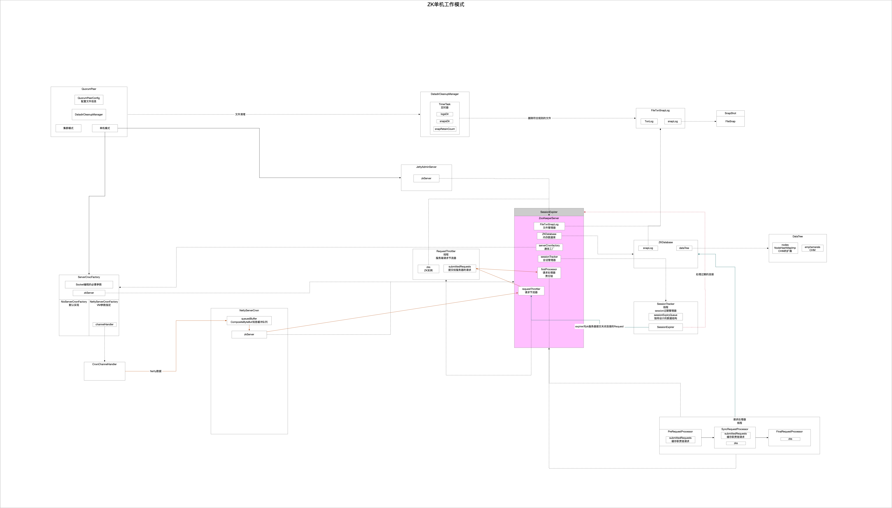
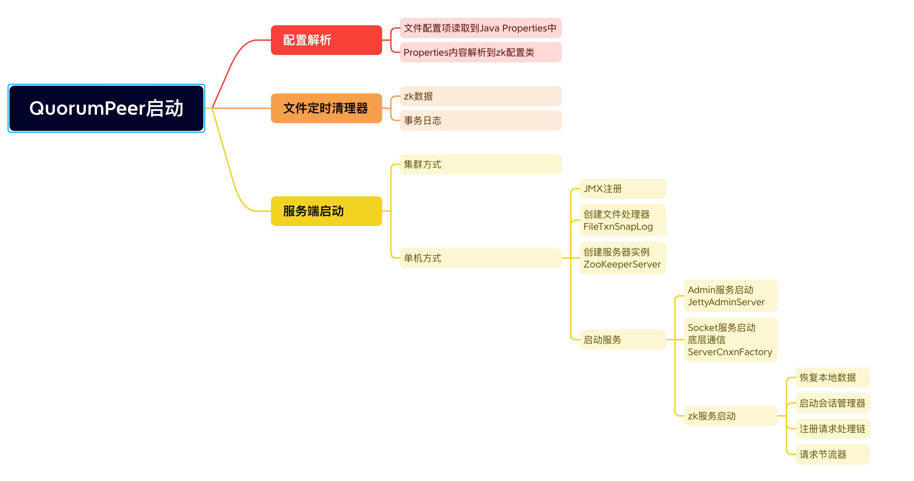

本章节起到起承转合作用，有两个目的：

* 从宏观上回顾ZK单机启动流程以及涉及到的重要组件
* 为后续集群模式做铺垫

## 1 全局流程图

## 2 核心组件

只列举服务核心部分

* ZooKeeperServer
  * ZK单机服务实例
  * 组件的外层容器，负责协调各个组件进行配合工作
* FileTxnSnapLog
  * 文件管理器
  * 管理着快照文件和日志文件
  * 负责内存和磁盘之间的交互

* ZKDatabase
  * 内存数据库
  * 保存着ZK数据
* ServerCnxnFactory
  * 通信工厂
  * 负责创建具体的网络通信实现
  * 两种实现方式
    * NioServerCnxnFactory
    * NettyServerCnxnFactory
* SessionTracker
  * 会话管理器
  * 管理着连接
  * 配合过期机制实现会话管理
  * 负责清理过期会话
* RequestProcessor
  * 请求执行器
  * 负责客户端提交给服务端的请求
  * 采用责任链设计模式
* RequestThrottler
  * 请求节流器
  * 负责对请求管理
  * 适配服务端处理能力进行限流机制实现

## 3 启动流程

上述提到的组件在启动过程中都会进行创建和启动。

## 4 处理请求流程

当ZK启动完成，如何受理一个客户端的请求，以整合Netty实现为例：

* 首先，客户端请求通过网络传输，请求通过Netty进入服务端的NettyServerCnxn，此刻数据都还是字节数据，按照协议反序列化为ZK抽象的Request。
* 然后，请求被投递到RequestThrottler组件，根据当前服务端负载情况进行限流。
* 于此同时，在SessionTracker中登记，对这些连接进行管理，超时了需要进行关闭。
* 之后，请求被交给RequestProcessor正式进行处理，按照定义好的责任链顺序进行依次处理：
  * PreRequestProcessor
  * SyncRequestProcessor
    * 借助FileTxnSnapLog对事务日志和数据进行写文件存盘。
  * FinalRequestProcessor
    * 将数据更新到内存数据库ZKDatabase上
    * 将本次请求的处理结果封装成约定的响应投递给NettyServerCnxn，再通过Netty将数据通过网络传输给客户端。

至此，请求流程结束。
