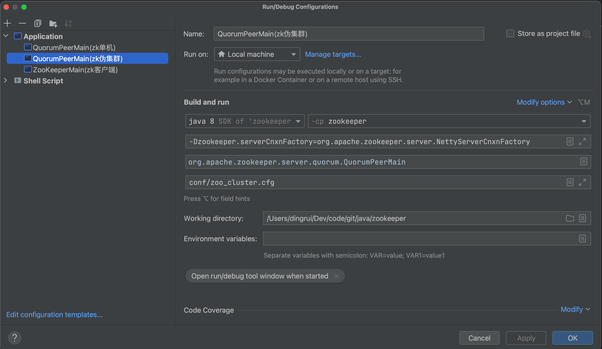
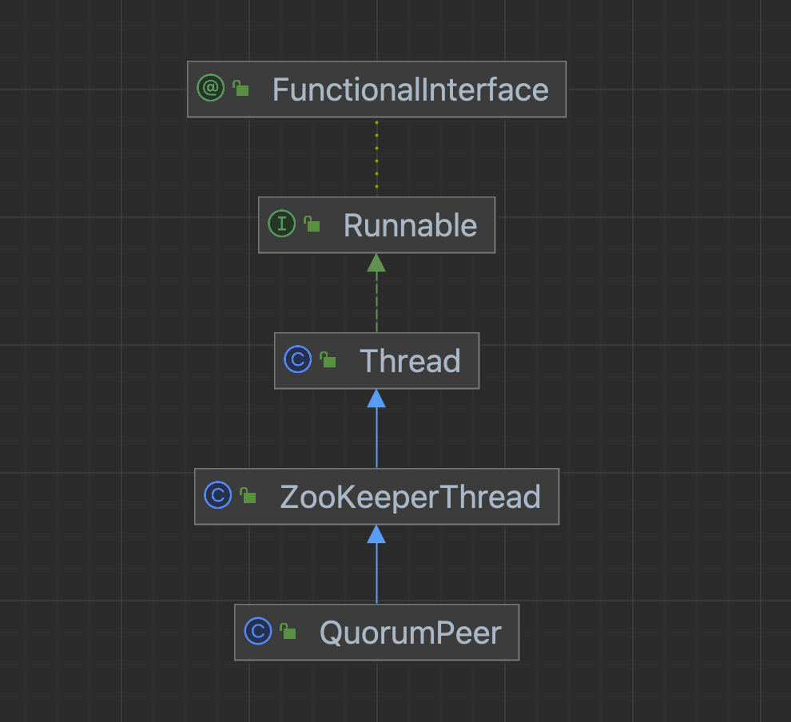

## 1 调试配置

为了调试方便，先配置集群启动的调试面板。

### 1.1 调试面板



### 1.2 配置文件

配置文件内容如下：

```cfg
tickTime=2000
initLimit=10
syncLimit=5
# zk数据
dataDir=/tmp/zookeeper/data
# 事务日志
dataLogDir=/tmp/zookeeper/log
clientPort=2181
# 定时任务清理文件 1小时执行一次
autopurge.purgeInterval=1

# 伪集群  主机:心跳端口:数据端口
server.0=127.0.0.1:2008:6008
server.1=127.0.0.1:2007:6007
server.2=127.0.0.1:2006:6006
```

## 2 入口

```java
/**
             * 启动集群节点
             */
quorumPeer.start();
```

## 3 QuorumPeer组件

### 3.1 类图

从类图可以看出QuorumPeer很纯粹，就是一个Java线程，上面也分析过会在start()方法的最后调用父类的start()，最终当线程被CPU调度之后回调到当前类的`run()`方法，因此先看start()方法再看run()方法。



### 3.2 start()方法

首先，集群是单机的集合，因此之前看过的那些组件核心作用还是不会变的，这是相同点。

不同点在于：

* 集群如何选主对外提供服务
* 集群间数据如何同步
* 集群Master崩溃了如何恢复

其实也就是ZAB协议是如何实现的：

* 崩溃恢复
* 原子广播

```java
@Override
public synchronized void start() {
    if (!getView().containsKey(myid)) {
        throw new RuntimeException("My id " + myid + " not in the peer list");
    }
    /**
         * 恢复本地数据 并对数据一致性做本地校验
         * 比较单机启动和集群启动
         *   - 单机启动
         *     - 恢复本地数据
         *   - 集群启动
         *     - 恢复本地数据
         *     - 校验currentEpoch
         *     - 校验acceptedEpoch
         */
    loadDataBase();
    /**
         * 这个地方和单机启动是一样的
         * 通过通信工厂创建网络通信具体实现
         *   - NioServerCnxnFactory->创建NioServerCnxn实例
         *   - NettyServerCnxnFactory->创建NettyServerCnxn实例
         */
    startServerCnxnFactory();
    try {
        adminServer.start();
    } catch (AdminServerException e) {
        LOG.warn("Problem starting AdminServer", e);
    }
    // 选主
    startLeaderElection();
    startJvmPauseMonitor();
    // 该类是Thread的派生 调用父类的start方法 再回调run()方法的实现
    super.start();
}
```

带着这些问题重点关注集群启动过程。

从代码可以看出：

* 集群模式中核心类是QuorumPeer，不再是ZooKeeperServer
* 依然要先加载恢复内存数据
  * 额外多了一些校验
  * epoch是配合集群Master角色出现的机制
* 对外客户端提供服务都是走网络，因此要前置化启动网络通信，网络通信组件依然以Netty的实现NettyServerCnxn为例，这儿监听的是2181对外暴露的端口，不是给内部节点使用的
* 选主

这些组件的使用几乎与之前分析过的一样，不一样的地方也可以直接跳过，不是重点，下面开始跟进`startLeaderElection()`方法。

### 3.3 startLeaderElection()方法

```java
/**
     * 2个作用
     *   - 制作了一个投票 投自己为Leader
     *   - 启动了FastLeaderElection投票算法
     */
public synchronized void startLeaderElection() {
    try {
        /**
             * 当前服务器处于寻主状态 就制作一个投票票
             * 集群节点初始化就是寻主状态
             */
        if (getPeerState() == ServerState.LOOKING) {
            /**
                 * 制作一个投票
                 * 投票的语义是选举谁当集群的Leader
                 * 每个节点肯定都会先给自己来一票
                 * 然后交叉比较
                 *   - 留着自己拿着这个投票和别人的pk
                 *   - 给别人让他们拿着自己的和这个pk
                 */
            currentVote = new Vote(myid, getLastLoggedZxid(), getCurrentEpoch());
        }
    } catch (IOException e) {
        RuntimeException re = new RuntimeException(e.getMessage());
        re.setStackTrace(e.getStackTrace());
        throw re;
    }
    // electionTpe这个值只能是3 给定的默认值是3 即使在配置文件中配置了其他的值 也会在配置解析阶段抛出异常
    this.electionAlg = createElectionAlgorithm(electionType);
}
```


```java
/**
             * 网络通信组件
             * 负责选主投票通信
             */
QuorumCnxManager qcm = createCnxnManager();
QuorumCnxManager oldQcm = qcmRef.getAndSet(qcm); // 已经在选举中了停止之前的选举
if (oldQcm != null) {
    LOG.warn("Clobbering already-set QuorumCnxManager (restarting leader election?)");
    oldQcm.halt(); // 停止选举
}
QuorumCnxManager.Listener listener = qcm.listener; // QuorumCnxManager构造时候实例化了listener线程
if (listener != null) {
    /**
                 * 监听在投票端口
                 * 负责接收投票
                 */
    listener.start();
    // 快速选举算法
    FastLeaderElection fle = new FastLeaderElection(this, qcm);

    /**
                 * 启动messenger中的两个线程
                 *   - ws
                 *   - wr
                 */
    fle.start(); // 启动选举
```

这个地方出现了3个组件：

* 
  * 核心组件
  * 负责整个选主过程的网络通信
* 
  * 是Thread的派生，本质是个线程
  * 在run()方法中负责监听投票端口
* 
  * 选主算法
  * 启动开始进行投票选主
  * 上面Listener组件已经监听等待Socket的连接和发送，这边负责启动Socket的连接和发送

### 3.4 run()方法

先只关注集群启动时候，当前服务器还是LOOKING状态，触发上面组件`FastLeaderElection`进行选主。

```java
case LOOKING: // 寻主状态
                    LOG.info("LOOKING");
                    ServerMetrics.getMetrics().LOOKING_COUNT.add(1);
                    // ....
                        try {
                            reconfigFlagClear();
                            if (shuttingDownLE) {
                                shuttingDownLE = false;
                                startLeaderElection();
                            }
                            // 设置当前投票 进行新一轮的选举
                            setCurrentVote(makeLEStrategy().lookForLeader());
                        } catch (Exception e) {
                            LOG.warn("Unexpected exception", e);
                            setPeerState(ServerState.LOOKING);
                        }
                    
                    break;
```

