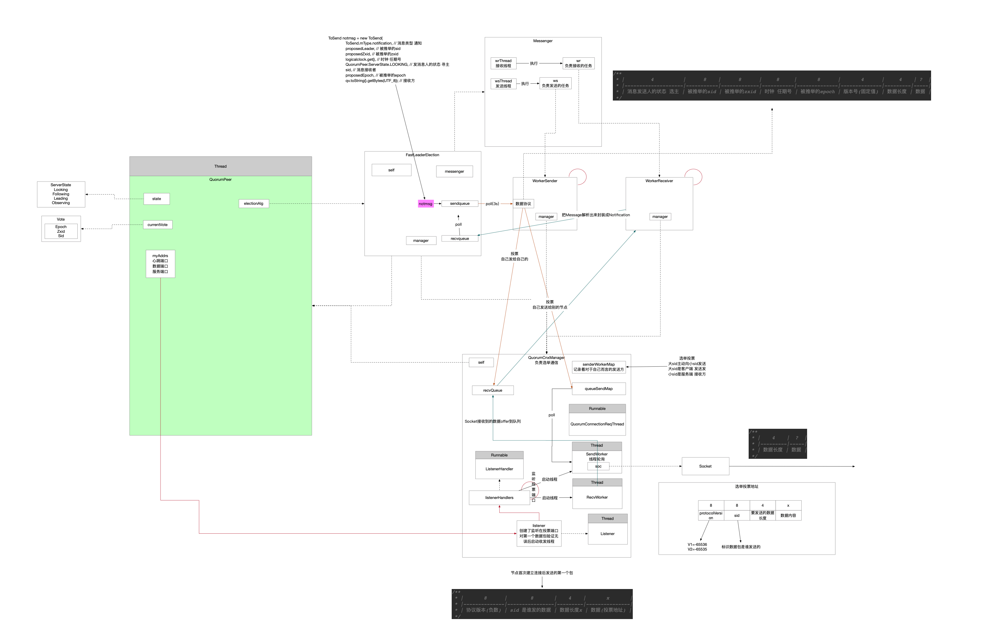
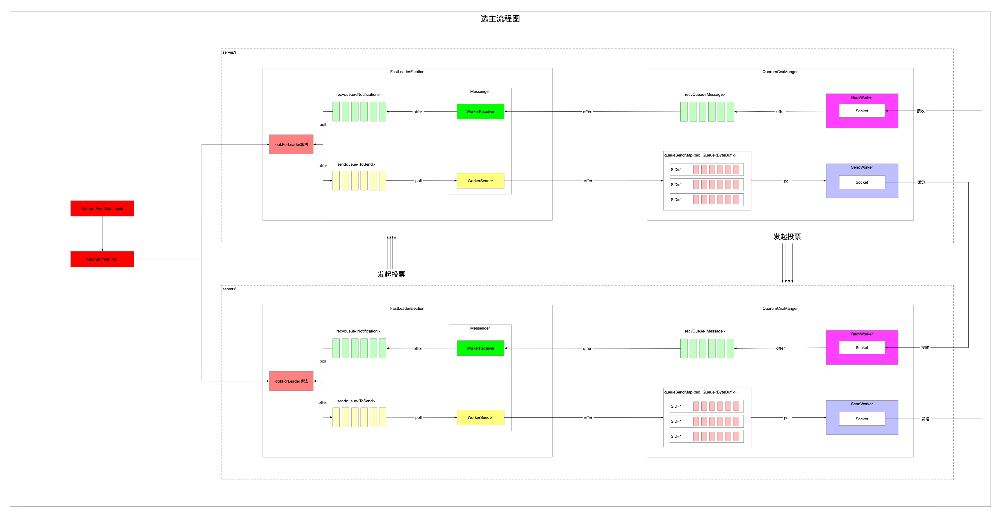

我们一贯的套路是先总览框架，然后细看每个组件，最后再梳理整个流程。

## 1 组件图

在选主算法中，涉及到的组件有：

* QuorumPeer 负责入口的驱动
* QuorumCnxManager 负责网络通信 对接的数据协议是字节和Message
  * ListenerHandler 负责通信连接和验证
  * RecvWorker 负责网络数据接收的线程
  * SenderWorker 负责网络数据发送的线程
* FastLeaderElection 选主算法实现
  * Messenger 负责承接通信的数据和算法主体 对接的数据协议是Message和Notification
    * WorkerReceiver 负责将QCM收的Message转换成Notification给FLE
    * WorkerSender 负责将QCM创建的投票Notification转换成Message发送
  * 算法本体
    * 负责选主实现

前面已经看过了和。

现在虽然每个组件功能已经分析过，但是比较孤立，不知道组件之间如何协调工作，下面我将以数据驱动的方式梳理全流程。



## 2 流程图

整个选主流程可以分为两块：

* 通信 这个通信是泛指
  * 可以是跨机器的网络通信
  * 也可以是伪集群方式的本机跨进程
* 投票算法



## 3 一个例子驱动流程

为了兼顾下面两块内容，参与的节点越少网络模块越简单，所以假设配置ZK集群模式，共配置了两个节点，没有Observer。

配置如下：

```cfg
server.1=xxx:1997:1998
server.2=xxx:1997:1998
```

约定：

* 先启动1
* 再启动2

### 3.1 网络通信

#### 3.1.1 server1监听投票端口

##### 时机发生在QuorumCnxManager::Listener::ListenerHandler::run()

创建QCM组件的时候会触发投票端口的监听，现在没有线程阻塞在accept上，等待别人连接。

```java
acceptConnections(); // 负责接收投票端口的数据
```

#### 3.1.2 server1启动Messenger中两个线程

##### 时机发生在QuorumPeer::createAlgoritm()

```java
/**
                 * 启动messenger中的两个线程
                 *   - wsThread发送线程 负责执行ws发送任务
                 *   - wrThread接收线程 负责执行wr接收任务
                 * 这两个线程是使用QuorumCnxManager网络通信处理网络IO数据包的
                 */
fle.start(); // 启动选举
```

启动两个线程

* wrThread
* wsThread

线程被CPU调度起来之后回调线程里面的任务，任务本质是两个任务线程

* WorkerReceiver
* WorkerSender

此刻这两个任务线程都在空轮询着。

#### 3.1.3 server1启动FLE选举算法寻主流程

##### 启动时机发生在QuorumPeer::run()

```java
setCurrentVote(makeLEStrategy().lookForLeader()); // 选举出leader 触发FLE寻主
```

此刻FLE算法会先给自己投上一票，FLE把这一票放到sendqueue中。

#### 3.1.4 server1发起对投票端口的连接

##### 时机在FlastLeaderElection::Messenger::WorkerSender::run()

```java
// FLE算法的投票都在sendqueue中
ToSend m = sendqueue.poll(3000, TimeUnit.MILLISECONDS);
if (m == null) {
    continue;
}
```

上面WorkerSender线程一直监听在sendqueue队列上，发现有数据了，WorkerSender把数据从发送队列取出来

准备向集群中参与选主的节点都发送一下

* server1给自己发送信息直接放到FLE的recvqueue中
* server1发给server2节点的准备走网络，WorkerSender把消息放到QCM的queueSendMap中
* WorkerSender尝试从senderWorkerMap中取SenderWorker，让它来负责Socket发送

此刻，WorkerSender发现还没有server1跟server2的Socket连接，就触发Socket向ServerSocket的主动连接。

BTW，投票协议如下：

```java
/**
                 * state->消息发送人的状态 寻主
                 * leader->被推举的sid
                 * zxid->被推举的zxid
                 * electionEpoch->时钟 任期号
                 * peerEpoch->被推举的epoch
                 * configData->序列化出来的消息接收方
                 */
/**
                 * |         4          |      8    |      8      |     8     |       8      |       4      |     4    | ?  |
                 * |--------------------|-----------|-------------|-----------|--------------|--------------|---------|-----|
                 * | 消息发送人的状态 选主 | 被推举的sid | 被推举的zxid | 时钟 任期号 | 被推举的epoch | 版本号(固定值) | 数据长度 | 数据 |
                 */
```

##### 时机在QuorumCnxManager::toSend()

```java
/**
             * 要给sid发送数据 要发的数据都在queueSendMap中缓存着呢
             * 这个地方就是首次建立客户端跟服务端连接的时机
             * 如果已经建立了连接 那么连接信息缓存在senderWorkerMap中
             * 如果还没建立连接 刚好借着这个时机把连接建立好然后放在senderWorkerMap中
             */
connectOne(sid);
```

但是现在并没有server2还没启动，因此会一直报错server1跟server2没有Socket连接。

#### 3.1.5 server2监听投票端口

这时候上面3.1.4的server1就可以向server2在通信端口上发起连接了。

并且一旦server2 accept了server1的连接之后他们就可以通信了，server1向server2发送的第一个数据包如下：

```java
/**
             * |       8      |        8       |    4     |           x           |
             * |--------------|----------------|----------|-----------------------|
             * | 协议版本(负数) | sid 是谁发的数据 | 数据长度x | 数据(sid的选举投票地址) |
             */
```

这样的一个约定格式主要是为了验证彼此双方接下来都是只用这个端口通信投票内容，而不是其他无关内容。

比如有别的机器误连了server2投票端口，或者恶意攻击，server2都可以通过如上协议的数据确认对方身份，不符合验证的直接就关闭Socket了。

#### 3.1.6 server2接收server1连接后的第一个包

##### 时机在QuorumCnxManager::Listener::ListenerHandler::run()

```java
acceptConnections(); // 负责接收投票端口的数据
```

###### 3.1.6.1 读取到了server1发来的验证数据包之后需要先做一下验证

```java
/**
             * 新建连接后的第一个包
             * |       8      |        8       |    4     |           x           |
             * |--------------|----------------|----------|-----------------------|
             * | 协议版本(负数) | sid 是谁发的数据 | 数据长度x | 数据(sid的选举投票地址) |
             */
```

###### 3.1.6.2 Socket连接建立方向不对

时机在QuorumCnxManager::handleConnection()

只能大sid主动向小sid发起连接请求，方向不对的先关闭连接然后如同3.1.4一样正确方向发起连接建立并发送验证包。

此刻上面3.1.4环节中server1向server2发过来的验证包，那条Socket连接已经被关闭了。

并且于此同时，server1会按照下面3.1.6.3环节收到server2向server1发送的连接验证包。然后server1通过了对连接验证包的验证，并且把server1在通信端口收到的Socket缓存起来了，以后server1和server2就用这条连接发送投票。

现在3.1.4中server1的那个投票信息就通过连接发给了server2。

```java
/**
         * 比如现在有3台机器
         *   - 节点1
         *   - 节点2
         *   - 节点3
         * 两两之间可以通信 组合方式就是3x2=6种
         *   - 节点1->节点2
         *   - 节点1->节点3
         *   - 节点2->节点1
         *   - 节点2->节点3
         *   - 节点3->节点1
         *   - 节点3->节点2
         * ZK中通信使用的是TCP协议的Socket方式 Socket工作模式是全双工的
         * 因此上面类似节点1->节点2和节点2->节点1是重复的 没有必要的
         * 通信只要维护如下即可
         * 节点1->节点2
         * 节点1->节点3
         * 节点2->节点3
         * ZK通过约定一个规则实现这样机制
         *   - 不允许小的sid向大的sid主动发起连接
         */
if (sid < self.getId()) { // 收到的数据来自比自己小的sid 是不允许的 关闭已经建立的连接
    /*
             * This replica might still believe that the connection to sid is
             * up, so we have to shut down the workers before trying to open a
             * new connection.
             */
    /**
             * 当前节点作为接收方
             * 收到了来自sid的数据
             * 对方的sid比自己小 这种场景是不允许的
             * 在每个节点上都维护了缓存记录彼此通信的Socket 用各自的sid映射
             * 现在sid这个连接被判定不合法 我要看看自己有没有跟对方之间的连接 如果有的话就关闭
             */
    SendWorker sw = senderWorkerMap.get(sid); // 发送方sid->跟发送方通信的Socket
    if (sw != null) {
        /**
                 * 关闭Socket
                 * 删除缓存
                 */
        sw.finish();
    }

    /*
             * Now we start a new connection
             */
    LOG.debug("Create new connection to server: {}", sid);
    closeSocket(sock);

    // 明确知道了当前节点是比对方sid大的 正确的通信发起方是自己->对方
    if (electionAddr != null) { // 刚才对方发过来的数据里面有它开放的选举投票端口 向它发起连接
        /**
                 * 向谁发起连接
                 *   - sid指向的是对方
                 *   - electionAddr指向的对方开放的端口
                 */
        connectOne(sid, electionAddr);
    } else {
        connectOne(sid);
    }

}
```

###### 3.1.6.3 连接合法的就把Socket缓存在QCM的SenderWorker和RecvWorker里面，用于投票通信

时机在QuorumCnxManager::handleConnection()

```java
else { // Otherwise start worker threads to receive data. // 大sid向小sid的一次通信 合法的 自己是服务端小sid 对方是客户端大sid
    /**
             * 此刻双方使用Socket的连接方向是正确的
             * 也就是说以后的投票通信就用这个Socket了
             * 将Socket缓存到SenderWorker线程和RecvWorker线程里面 以后专门负责双方的投票通信
             */
    SendWorker sw = new SendWorker(sock, sid);
    RecvWorker rw = new RecvWorker(sock, din, sid, sw);
    sw.setRecv(rw);

    SendWorker vsw = senderWorkerMap.get(sid);

    if (vsw != null) {
        vsw.finish();
    }

    senderWorkerMap.put(sid, sw); // 维护着跟对方sid通信使用的Socket

    queueSendMap.putIfAbsent(sid, new CircularBlockingQueue<>(SEND_CAPACITY));

    /**
             * 启动两个线程
             * 为什么没有直接启动线程 让负责接收消息的线程直接轮询监听这投票端口的数据
             * 而是前面做了一堆工作
             * 原因相当于是在正式使用投票端口之前先对通信方 或者说使用这个端口的连接进行验证 保证使用这个端口的都是真正进行投票的ZK节点
             */
    sw.start();
    rw.start();
}
```

#### 3.1.7 server2收到了server1的投票

RecvWorker将Socket上收到的投票放到recvQueue中

时机在QuorunCnxManager::RecvWorker::run()

```java
while (running && !shutdown && sock != null) {
    /**
                     * Reads the first int to determine the length of the
                     * message
                     *
                     * 持续接收Socket上发来的投票
                     */
    int length = din.readInt();
    if (length <= 0 || length > PACKETMAXSIZE) {
        throw new IOException("Received packet with invalid packet: " + length);
    }
    /**
                     * Allocates a new ByteBuffer to receive the message
                     */
    final byte[] msgArray = new byte[length];
    din.readFully(msgArray, 0, length);
    // 收到的数据缓存到队列
    addToRecvQueue(new Message(ByteBuffer.wrap(msgArray), sid));
}
```

#### 3.1.8 server2的WorkerReceiver轮询监听recvQueue中投票

时机FastLeaderElection::Messenger::WorkerReceiver::run()

```java
/**
                         * 从QuorumCnxManager的recvQueue超时取接收到的数据 这些数据是Socket接收到的
                         * 也就是其他节点的投票信息
                         */
response = manager.pollRecvQueue(3000, TimeUnit.MILLISECONDS);
if (response == null) {
    continue;
}

final int capacity = response.buffer.capacity();

// The current protocol and two previous generations all send at least 28 bytes
if (capacity < 28) {
    LOG.error("Got a short response from server {}: {}", response.sid, capacity);
    continue;
}

// this is the backwardCompatibility mode in place before ZK-107
// It is for a version of the protocol in which we didn't send peer epoch
// With peer epoch and version the message became 40 bytes
boolean backCompatibility28 = (capacity == 28);

// this is the backwardCompatibility mode for no version information
boolean backCompatibility40 = (capacity == 40);

response.buffer.clear(); // 这个地方不是清空buffer 准备读取buffer里面内容 具体看源码

// Instantiate Notification and set its attributes
Notification n = new Notification();

/**
                         * FLE中的sendWorker线程负责处理要发送的投票
                         * 现在FLE的Messenger的wrThread负责接收投票
                         *
                         * |         4          |      8    |      8      |     8     |       8      |       4      |     4    | ?  |
                         * |--------------------|-----------|-------------|-----------|--------------|--------------|---------|-----|
                         * | 消息发送人的状态 选主 | 被推举的sid | 被推举的zxid | 时钟 任期号 | 被推举的epoch | 版本号(固定值) | 数据长度 | 数据 |
                         * 投票里面数据是接收方的序列化
                         */
int rstate = response.buffer.getInt(); // 发送投票人的状态 选主
long rleader = response.buffer.getLong(); // 被推举的sid
long rzxid = response.buffer.getLong(); // 被推举的zxid
long relectionEpoch = response.buffer.getLong(); // 时钟 任期号
```

#### 3.1.9 server2的WorkerReceiver将经过验证有效的投票投递给recvqueue

时机FastLeaderElection::Messenger::WorkerReceiver::run()

```java
ToSend notmsg = new ToSend(
    ToSend.mType.notification,
    v.getId(),
    v.getZxid(),
    logicalclock.get(), // 我的机器时钟
    self.getPeerState(), // 我的状态 选主
    response.sid, // 这不就是我自己吗
    v.getPeerEpoch(),
    qv.toString().getBytes());
sendqueue.offer(notmsg);
```

#### 3.1.10 server2的FLE算法工作

时机FastLeaderElection::lookForLeader()

```java
/**
                 * FLE算法收到的投票
                 *   - 自己投自己的那一票
                 *   - 别的节点的投票(投谁不知道)
                 */
Notification n = recvqueue.poll(notTimeout, TimeUnit.MILLISECONDS);
```

到此为止，选主过程中网络流向已经基本结束了，上面是从server1到server2方向的，反向的从server2到server1的通信也是一样的。

### 3.2 投票算法

为什么没有把投票算法原理也放在上面3.1，我觉得按照单独讲解算法原理比较清晰。

还是沿用上面3.1的例子，这个地方我就不贴源码了，源码看。

约定一下：

* FLE proposed是每次FLE收到投票后都会根据PK进行更新
  * PK参与方一是投票
  * PK参与方二是proposed

* revset是展示最新投票的投票箱
* getVoteTracker是汇总投票计数

投票我们这样记x-[j,k,l]：

* x表示谁发起的投票
* j表示被推举的leader的epoch
* k表示被推举的leader的zxid
* l表示被推举的leader的sid

#### 3.2.1 server1启动

server1投[0,1,0]

|                | server1     | server2 |
| -------------- | ----------- | ------- |
| FLE proposed   | [0,1,0]     |         |
| recvset        | 1-[0,1,0]   |         |
| getVoteTracker | [0,1,0] 1票 |         |

#### 3.2.2 server2启动

server2投[0,2,0]

|                | server1                      | server2     |
| -------------- | ---------------------------- | ----------- |
| FLE proposed   | [0,2,0]                      | [0,2,0]     |
| recvset        | 1-[0,1,0]<br />2-[0,2,0]     | 2-[0,2,0]   |
| getVoteTracker | [0,1,0] 1票<br />[0,2,0] 1票 | [0,2,0] 1票 |

#### 3.2.2 server1改票

server1投[0,2,0]

|                | server1                  | server2                  |
| -------------- | ------------------------ | ------------------------ |
| FLE proposed   | [0,2,0]                  | [0,2,0]                  |
| recvset        | 2-[0,2,0]<br />1-[0,2,0] | 2-[0,2,0]<br />1-[0,2,0] |
| getVoteTracker | [0,2,0] 2票              | [0,2,0] 2票              |

至此[0,2,0]当选leader获选2票，过半了，被推举为leader。
