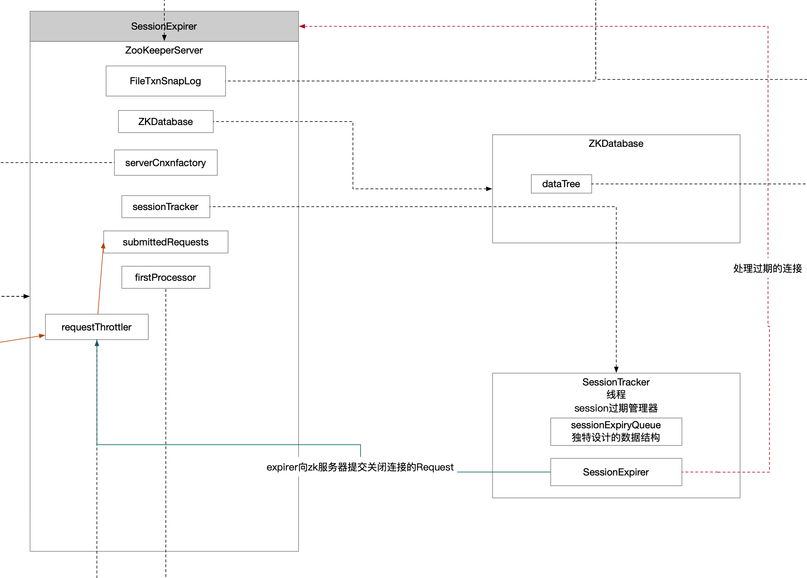

在`ZooKeeperServe`中维护这一个`sessionTracker`，负责对session会话的管理，主要是针对过期的会话进行关闭。`SessionTrackerImpl`就是这个会话管理器的实现。

## 1 类图关系

通过继承关系，可以明确知道两点：

* SessionTracker定义了一个会话跟踪器。
* ZK初始化中使用的线程跟踪器`SessionTrackerImpl`其本质是线程。因此启动线程跟踪器的核心逻辑就应该在`run()`方法中。


## 2 run()方法

```java
@Override
public void run() {
    try {
        while (running) {
            /**
                 * ExpiryQueue中expirationInterval设计的好处之一
                 *   - 保证了过期时间相对集中 不会绝对离散 那么这边可能要等待的时间waitTime就不会密集且多 一定程度上让出了cpu执行权
                 * 考虑个场景
                 *   - 过期时间没有归一 所有连接间隔1ms依次过期 那么这边一直处于轮询中 cpu打满
                 */
            long waitTime = sessionExpiryQueue.getWaitTime(); // 还有多久就到了队列中维护的过期时间了
            if (waitTime > 0) {
                Thread.sleep(waitTime);
                continue;
            }

            for (SessionImpl s : sessionExpiryQueue.poll()) { // 出队的这一拨连接全部过期
                ServerMetrics.getMetrics().STALE_SESSIONS_EXPIRED.add(1);
                setSessionClosing(s.sessionId);
                expirer.expire(s); // 过期管理器负责处理过期的会话 expirer指向的就是ZooKeeperServer实现
            }
        }
    } catch (InterruptedException e) {
        handleException(this.getName(), e);
    }
    LOG.info("SessionTrackerImpl exited loop!");
}
```

### 2.1 sessionExpiryQueue这个队列以一定机制维护连接的过期信息

这个就得看`ExpiryQueue`数据结构的具体设计了。

```java
long waitTime = sessionExpiryQueue.getWaitTime(); // 还有多久就到了队列中维护的过期时间了
```


过期的连接需要通过过期管理器进行处理

```java
expirer.expire(s); // 过期管理器负责处理过期的会话 expirer指向的就是ZooKeeperServer实现
```

### 2.2 ZooKeeperServer作为连接管理器的职责

```java
public void expire(Session session) {
    long sessionId = session.getSessionId();
    LOG.info(
        "Expiring session 0x{}, timeout of {}ms exceeded",
        Long.toHexString(sessionId),
        session.getTimeout());
    close(sessionId); // 关闭会话
}
```


看到了熟悉的代码，想服务端提交请求，管中窥豹，可以猜测整个ZK系统交互也是有点想EDA设计，都是基于消息驱动的。这样的设计可以有效解耦业务，统一入口。

```java
private void close(long sessionId) {
    Request si = new Request(null, sessionId, 0, OpCode.closeSession, null, null);
    submitRequest(si); // 关联连接也是通过消息驱动
}
```

## 3 ExpireQueue数据结构

维护了以下阈值，巧妙的使用expirationInterval，这个设计的收益在于：

* 加少了hash表中数组大小
* 过期机制通过时间判定永远都会存在误差，在可接受的范围内，尽量将连接的过期时间归一化，减少离散，容易管理庞大的连接请求
* 一次性可以处理多个连接
* 不至于让cpu负担过重，配置sleep机制可以让出cpu执行权

```java
/**
     * key->会话对象
     * value->归一化后的超时时间
     */
private final ConcurrentHashMap<E, Long> elemMap = new ConcurrentHashMap<E, Long>();
/**
     * The maximum number of buckets is equal to max timeout/expirationInterval,
     * so the expirationInterval should not be too small compared to the
     * max timeout that this expiry queue needs to maintain.
     *
     * 以超时时间为key的缓存
     * key->归一化超时时间
     * value->在该时间过期的会话集合
     */
private final ConcurrentHashMap<Long, Set<E>> expiryMap = new ConcurrentHashMap<Long, Set<E>>();

private final AtomicLong nextExpirationTime = new AtomicLong(); // 迭代维护下一个过期时间 这样就可以拿着过期时间直接去hash表去这个过期时间映射的连接

/**
     * 相当于是基数
     * 假定expirationInterval = 10000，
     * connection_1_timeout_point = 1599715479084
     * connection_2_timeout_point =  1599715479184
     * connection_3_timeout_point =  1599715479384
     * 那么通过归一化计算他们三个的超时时间点都变成了1599715480000
     */
private final int expirationInterval;
```

## 4 连接过期管理流程图

绿色实线标识的就是SessionTracker组件委托持有的SessionExpirer组件提交关闭连接的一个请求。

