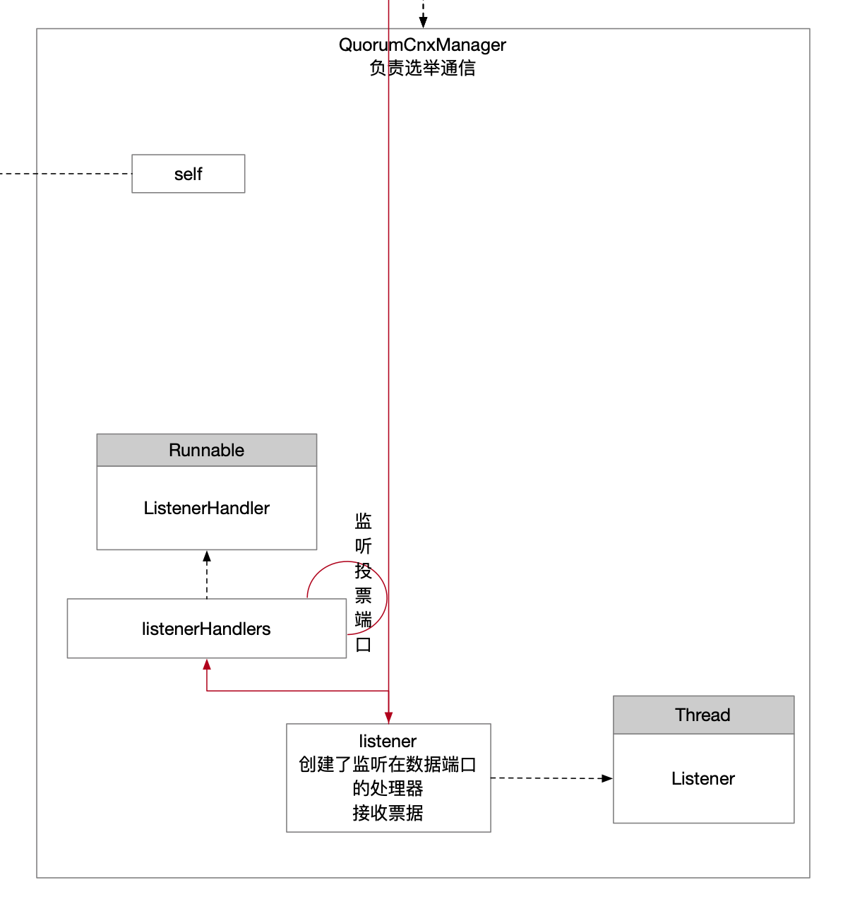

## 1 QuorumCnxManager实例化

通过构造方法创建了QuorumCnxManager组件，并且Listener是QuorumCnxManger中的一个组件，也在构造方法中创建出来了。

```java
/**
             * 网络通信组件
             * 负责选主投票通信
             */
QuorumCnxManager qcm = createCnxnManager();
```


```java
public QuorumCnxManager createCnxnManager() {
    int timeout = quorumCnxnTimeoutMs > 0 ? quorumCnxnTimeoutMs : this.tickTime * this.syncLimit;
    LOG.info("Using {}ms as the quorum cnxn socket timeout", timeout);
    return new QuorumCnxManager(
        this,
        this.getId(), // 节点的sid
        this.getView(), // 配置的集群 所有服务器信息 ip:心跳端口:同步端口
        this.authServer,
        this.authLearner,
        timeout,
        this.getQuorumListenOnAllIPs(),
        this.quorumCnxnThreadsSize,
        this.isQuorumSaslAuthEnabled());
}
```


```java
public QuorumCnxManager(QuorumPeer self, final long mySid, Map<Long, QuorumPeer.QuorumServer> view,
                        QuorumAuthServer authServer, QuorumAuthLearner authLearner, int socketTimeout, boolean listenOnAllIPs,
                        int quorumCnxnThreadsSize, boolean quorumSaslAuthEnabled) {

    this.recvQueue = new CircularBlockingQueue<>(RECV_CAPACITY);
    this.queueSendMap = new ConcurrentHashMap<>();
    this.senderWorkerMap = new ConcurrentHashMap<>();
    this.lastMessageSent = new ConcurrentHashMap<>();

    String cnxToValue = System.getProperty("zookeeper.cnxTimeout");
    if (cnxToValue != null) {
        this.cnxTO = Integer.parseInt(cnxToValue);
    }

    this.self = self; // QuorumPeer实例

    this.mySid = mySid;
    this.socketTimeout = socketTimeout;
    this.view = view;
    this.listenOnAllIPs = listenOnAllIPs;
    this.authServer = authServer;
    this.authLearner = authLearner;
    this.quorumSaslAuthEnabled = quorumSaslAuthEnabled;

    initializeConnectionExecutor(mySid, quorumCnxnThreadsSize);

    // Starts listener thread that waits for connection requests
    listener = new Listener(); // 初始化线程
    listener.setName("QuorumPeerListener");
}
```

## 2 Listener实例化

并没有什么特别之处，简单地进行一些赋值操作。

```java
public Listener() {
    // During startup of thread, thread name will be overridden to
    // specific election address
    super("ListenerThread");

    socketException = new AtomicBoolean(false);

    // maximum retry count while trying to bind to election port
    // see ZOOKEEPER-3320 for more details
    final Integer maxRetry = Integer.getInteger(ELECTION_PORT_BIND_RETRY,
                                                DEFAULT_PORT_BIND_MAX_RETRY);
    if (maxRetry >= 0) {
        LOG.info("Election port bind maximum retries is {}", maxRetry == 0 ? "infinite" : maxRetry);
        portBindMaxRetry = maxRetry;
    } else {
        LOG.info(
            "'{}' contains invalid value: {}(must be >= 0). Use default value of {} instead.",
            ELECTION_PORT_BIND_RETRY,
            maxRetry,
            DEFAULT_PORT_BIND_MAX_RETRY);
        portBindMaxRetry = DEFAULT_PORT_BIND_MAX_RETRY;
    }
}
```

## 3 组件图

至此，QuorunCnxManager组件模型如下，Listener是个线程，必要start()线程使其处于就绪状态，等到CPU调度之后回调run()方法的。

有了这个思路，下面就直接看Listener的这两个方法：

* start()
* run()



## 4 Listener的核心方法

### 4.1 start()

Listener没有重写父类start()，那么直接关注run()方法中的回调逻辑即可。

### 4.2 run()

简单而言就是启动监听器专门监听在投票端口上，既然是服务端Socket，必然会有Accept事件和Read事件，这些逻辑就由这个监听处理器去负责。

```java
@Override
public void run() {
    if (!shutdown) {
        LOG.debug("Listener thread started, myId: {}", self.getId());
        /**
                 * 投票端口
                 * 在配置文件中有服务器的通信信息 ip:事务端口:心跳端口:投票端口
                 * 当前要监听在投票端口等投票数据
                 */
        Set<InetSocketAddress> addresses;

        // self就是QuorumPeer实例
        if (self.getQuorumListenOnAllIPs()) { // 默认值false
            addresses = self.getElectionAddress().getWildcardAddresses();
        } else {
            /**
                     * 当前节点的投票端口
                     * 以下面这个配置而言
                     * # 伪集群  主机:心跳端口:数据端口
                     * server.0=127.0.0.1:2008:6008
                     * server.1=127.0.0.1:2007:6007
                     * server.2=127.0.0.1:2006:6006
                     * 对于每个节点而言 各自要监听的投票端口为
                     *   - 节点0 监听6008端口
                     *   - 节点1 监听6007端口
                     *   - 节点2 监听6006端口
                     */
            addresses = self.getElectionAddress().getAllAddresses();
        }

        /**
                 * 不知道为啥会有单个节点配置多个投票端口的场景
                 * 以我自己的配置文件而言 仅仅有一个投票端口 忽略CountDownLatch的作用
                 */
        CountDownLatch latch = new CountDownLatch(addresses.size());
        /**
                 * 监听在投票端口上 负责接收其他节点的投票
                 * 既然是服务端Socket 必然是要ListenerHandler这个处理器负责Socket事件的
                 *   - Accept事件
                 *   - Read事件
                 * ListenerHandler是Runnable任务被丢在线程池异步执行 只要关注它的run()方法就行了
                 */
        listenerHandlers = addresses.stream().map(address ->
                                                  new ListenerHandler(address, self.shouldUsePortUnification(), self.isSslQuorum(), latch))
            .collect(Collectors.toList());

        final ExecutorService executor = Executors.newFixedThreadPool(addresses.size());
        try {
            listenerHandlers.forEach(executor::submit);
        } finally {
            // prevent executor's threads to leak after ListenerHandler tasks complete
            executor.shutdown();
        }

        try {
            latch.await();
        } catch (InterruptedException ie) {
            LOG.error("Interrupted while sleeping. Ignoring exception", ie);
        } finally {
            // Clean up for shutdown.
            for (ListenerHandler handler : listenerHandlers) {
                try {
                    handler.close();
                } catch (IOException ie) {
                    // Don't log an error for shutdown.
                    LOG.debug("Error closing server socket", ie);
                }
            }
        }
    }

    LOG.info("Leaving listener");
    if (!shutdown) {
        LOG.error(
            "As I'm leaving the listener thread, I won't be able to participate in leader election any longer: {}",
            self.getElectionAddress().getAllAddresses().stream()
            .map(NetUtils::formatInetAddr)
            .collect(Collectors.joining("|")));
        if (socketException.get()) {
            // After leaving listener thread, the host cannot join the quorum anymore,
            // this is a severe error that we cannot recover from, so we need to exit
            socketBindErrorHandler.run();
        }
    }
}
```

### 4.3 ListenerHandler

本质是个Runnable任务，上面代码看出来是丢在线程池异步执行的，关注它的run()实现。

#### run()方法

该方法是入口。

```java
@Override
public void run() {
    try {
        Thread.currentThread().setName("ListenerHandler-" + address);
        acceptConnections(); // 负责接收投票端口的数据
        try {
            close();
        } catch (IOException e) {
            LOG.warn("Exception when shutting down listener: ", e);
        }
    } catch (Exception e) {
        // Output of unexpected exception, should never happen
        LOG.error("Unexpected error ", e);
    } finally {
        latch.countDown();
    }
}
```

#### 4.3.1 服务端接收投票端口的连接请求

代码比较多，但是核心就是服务器节点作为服务端监听在投票端口上，阻塞等待来自其他节点的连接请求，其他节点的角色就是客户端。

```java
private void acceptConnections() {
    int numRetries = 0;
    Socket client = null;

    // 节点的选票端口接收数据容错是有限制的 如果超过限制(max(3, 自定义配置次数)) 就主观判定这个服务器的选票端口有问题了 也就是退出了选主
    while ((!shutdown) && (portBindMaxRetry == 0 || numRetries < portBindMaxRetry)) {
        try {
            /**
                         * TCP协议的Socket
                         * 选主用的是TCP协议
                         */
            serverSocket = createNewServerSocket();
            LOG.info("{} is accepting connections now, my election bind port: {}", QuorumCnxManager.this.mySid, address.toString());
            while (!shutdown) {
                try {
                    /**
                                 * 服务端被动Socket已经监听在了选票端口上
                                 * 现在阻塞在accept 等待客户端的请求过来
                                 * 有客户端连接进来 给服务端开辟个新的Socket 用来跟客户端通信
                                 */
                    client = serverSocket.accept();
                    setSockOpts(client);
                    LOG.info("Received connection request from {}", client.getRemoteSocketAddress());
                    // Receive and handle the connection request
                    // asynchronously if the quorum sasl authentication is
                    // enabled. This is required because sasl server
                    // authentication process may take few seconds to finish,
                    // this may delay next peer connection requests.
                    if (quorumSaslAuthEnabled) {
                        receiveConnectionAsync(client);
                    } else {
                        /**
                                     * 陷在receive的系统调用阻塞上
                                     * 接收其他节点发过来的投票
                                     */
                        receiveConnection(client);
                    }
                    numRetries = 0;
                } catch (SocketTimeoutException e) {
                    LOG.warn("The socket is listening for the election accepted "
                             + "and it timed out unexpectedly, but will retry."
                             + "see ZOOKEEPER-2836");
                }
            }
        } catch (IOException e) {
            if (shutdown) {
                break;
            }

            LOG.error("Exception while listening to address {}", address, e);

            if (e instanceof SocketException) {
                socketException.set(true);
            }

            numRetries++;
            try {
                close();
                Thread.sleep(1000);
            } catch (IOException ie) {
                LOG.error("Error closing server socket", ie);
            } catch (InterruptedException ie) {
                LOG.error("Interrupted while sleeping. Ignoring exception", ie);
            }
            closeSocket(client);
        }
    }
    if (!shutdown) {
        LOG.error(
            "Leaving listener thread for address {} after {} errors. Use {} property to increase retry count.",
            formatInetAddr(address),
            numRetries,
            ELECTION_PORT_BIND_RETRY);
    }
}
```

#### 4.3.2 服务端接收投票端口的数据发送

对于Socke编程而言，就是服务端阻塞等待read发生，接收到来自客户端数据后按照什么约定的协议进行读取以及怎么处理业务逻辑。

```java
public void receiveConnection(final Socket sock) {
    DataInputStream din = null;
    try {
        /**
             * 数据读取的优先级
             *   - 先从din缓冲中读 不会阻塞
             *   - din中没有数据 才会再从socket上读取 有可能陷入阻塞
             */
        din = new DataInputStream(new BufferedInputStream(sock.getInputStream()));

        LOG.debug("Sync handling of connection request received from: {}", sock.getRemoteSocketAddress());
        // 读取投票
        handleConnection(sock, din);
    } catch (IOException e) {
        LOG.error("Exception handling connection, addr: {}, closing server connection", sock.getRemoteSocketAddress());
        LOG.debug("Exception details: ", e);
        closeSocket(sock);
    }
}
```


我也注释了ZK中约定的投票通信发起的规则。

作为Socket通信的服务端而言，如果度过了所有的阻塞`accept`和`read`，才能执行到最后，启动两个线程使他们处于就绪态等改被回调执行。

```java
private void handleConnection(Socket sock, DataInputStream din) throws IOException {
    Long sid = null, protocolVersion = null;
    MultipleAddresses electionAddr = null;

    try {
        /**
             * |    8    |  8  |    4    |       x       |
             * |---------|-----|---------|---------------|
             * | 协议版本 | sid | 数据长度x | 数据(投票地址) |
             *
             * 这样一个数据包投递给服务端
             * 服务端收到后再解析确认数据来自谁 什么数据内容
             */
        protocolVersion = din.readLong();
        if (protocolVersion >= 0) { // this is a server id and not a protocol version
            sid = protocolVersion;
        } else {
            try {
                /**
                     * 前8个字节 被判定为了协议版本
                     * 再读8个字节 看看sid是多少
                     */
                InitialMessage init = InitialMessage.parse(protocolVersion, din);
                sid = init.sid;
                if (!init.electionAddr.isEmpty()) {
                    electionAddr = new MultipleAddresses(init.electionAddr,
                                                         Duration.ofMillis(self.getMultiAddressReachabilityCheckTimeoutMs()));
                }
                LOG.debug("Initial message parsed by {}: {}", self.getId(), init.toString());
            } catch (InitialMessage.InitialMessageException ex) {
                LOG.error("Initial message parsing error!", ex);
                closeSocket(sock);
                return;
            }
        }
        // 至此已经从网络包中读出来了sid
        if (sid == QuorumPeer.OBSERVER_ID) {
            /*
                 * Choose identifier at random. We need a value to identify
                 * the connection.
                 */
            sid = observerCounter.getAndDecrement();
            LOG.info("Setting arbitrary identifier to observer: {}", sid);
        }
    } catch (IOException e) {
        LOG.warn("Exception reading or writing challenge", e);
        closeSocket(sock);
        return;
    }

    // do authenticating learner
    authServer.authenticate(sock, din);
    //If wins the challenge, then close the new connection.
    /**
         * 比如现在有3台机器
         *   - 节点1
         *   - 节点2
         *   - 节点3
         * 两两之间可以通信 组合方式就是3x2=6种
         *   - 节点1->节点2
         *   - 节点1->节点3
         *   - 节点2->节点1
         *   - 节点2->节点3
         *   - 节点3->节点1
         *   - 节点3->节点2
         * ZK中通信使用的是TCP协议的Socket方式 Socket工作模式是全双工的
         * 因此上面类似节点1->节点2和节点2->节点1是重复的 没有必要的
         * 通信只要维护如下即可
         * 节点1->节点2
         * 节点1->节点3
         * 节点2->节点3
         * ZK通过约定一个规则实现这样机制
         *   - 不允许小的sid向大的sid主动发起连接
         */
    if (sid < self.getId()) { // 收到的数据来自比自己小的sid 是不允许的 关闭已经建立的连接
        /*
             * This replica might still believe that the connection to sid is
             * up, so we have to shut down the workers before trying to open a
             * new connection.
             */
        /**
             * 当前节点作为接收方
             * 收到了来自sid的数据
             * 对方的sid比自己小 这种场景是不允许的
             * 在每个节点上都维护了缓存记录彼此通信的Socket 用各自的sid映射
             * 现在sid这个连接被判定不合法 我要看看自己有没有跟对方之间的连接 如果有的话就关闭
             */
        SendWorker sw = senderWorkerMap.get(sid); // 发送方sid->跟发送方通信的Socket
        if (sw != null) {
            /**
                 * 关闭Socket
                 * 删除缓存
                 */
            sw.finish();
        }

        /*
             * Now we start a new connection
             */
        LOG.debug("Create new connection to server: {}", sid);
        closeSocket(sock);

        // 明确知道了当前节点是比对方sid大的 正确的通信发起方是自己->对方
        if (electionAddr != null) { // 刚才对方发过来的数据里面有它开放的选举投票端口 向它发起连接
            /**
                 * 向谁发起连接
                 *   - sid指向的是对方
                 *   - electionAddr指向的对方开放的端口
                 */
            connectOne(sid, electionAddr);
        } else {
            connectOne(sid);
        }

    } else if (sid == self.getId()) { // 自己给自己发送的也是不合法的
        // we saw this case in ZOOKEEPER-2164
        LOG.warn("We got a connection request from a server with our own ID. "
                 + "This should be either a configuration error, or a bug.");
    } else { // Otherwise start worker threads to receive data. // 大sid向小sid的一次通信 合法的 自己是服务端小sid 对方是客户端大sid
        SendWorker sw = new SendWorker(sock, sid);
        RecvWorker rw = new RecvWorker(sock, din, sid, sw);
        sw.setRecv(rw);

        SendWorker vsw = senderWorkerMap.get(sid);

        if (vsw != null) {
            vsw.finish();
        }

        senderWorkerMap.put(sid, sw); // 哪些节点sid比自己大 他们是发送方

        queueSendMap.putIfAbsent(sid, new CircularBlockingQueue<>(SEND_CAPACITY));

        // 启动两个线程
        sw.start();
        rw.start();
    }
}
```

#### 4.4 工作线程

关注工作线程的run()方法。

##### 4.4.1 SenderWorker

```java
/**
         * 负责发送数据
         */
@Override
public void run() {
    threadCnt.incrementAndGet();
    try {
        /**
                 * If there is nothing in the queue to send, then we
                 * send the lastMessage to ensure that the last message
                 * was received by the peer. The message could be dropped
                 * in case self or the peer shutdown their connection
                 * (and exit the thread) prior to reading/processing
                 * the last message. Duplicate messages are handled correctly
                 * by the peer.
                 *
                 * If the send queue is non-empty, then we have a recent
                 * message than that stored in lastMessage. To avoid sending
                 * stale message, we should send the message in the send queue.
                 */
        BlockingQueue<ByteBuffer> bq = queueSendMap.get(sid); // 发送给谁 要发送的数据
        if (bq == null || isSendQueueEmpty(bq)) {
            ByteBuffer b = lastMessageSent.get(sid);
            if (b != null) {
                LOG.debug("Attempting to send lastMessage to sid={}", sid);
                send(b);
            }
        }
    } catch (IOException e) {
        LOG.error("Failed to send last message. Shutting down thread.", e);
        this.finish();
    }
    LOG.debug("SendWorker thread started towards {}. myId: {}", sid, QuorumCnxManager.this.mySid);

    try {
        while (running && !shutdown && sock != null) {

            ByteBuffer b = null;
            try {
                BlockingQueue<ByteBuffer> bq = queueSendMap.get(sid); // 要发送什么数据给谁 数据的存储结构是循环队列
                if (bq != null) {
                    b = pollSendQueue(bq, 1000, TimeUnit.MILLISECONDS); // 超时去取数据
                } else {
                    LOG.error("No queue of incoming messages for server {}", sid);
                    break;
                }

                if (b != null) {
                    lastMessageSent.put(sid, b);
                    send(b);
                }
            } catch (InterruptedException e) {
                LOG.warn("Interrupted while waiting for message on queue", e);
            }
        }
    } catch (Exception e) {
        LOG.warn(
            "Exception when using channel: for id {} my id = {}",
            sid ,
            QuorumCnxManager.this.mySid,
            e);
    }
    this.finish();

    LOG.warn("Send worker leaving thread id {} my id = {}", sid, self.getId());
}
```


##### 4.4.2 RecvWorker

```java
@Override
public void run() {
    threadCnt.incrementAndGet();
    try {
        LOG.debug("RecvWorker thread towards {} started. myId: {}", sid, QuorumCnxManager.this.mySid);
        while (running && !shutdown && sock != null) {
            /**
                     * Reads the first int to determine the length of the
                     * message
                     */
            int length = din.readInt();
            if (length <= 0 || length > PACKETMAXSIZE) {
                throw new IOException("Received packet with invalid packet: " + length);
            }
            /**
                     * Allocates a new ByteBuffer to receive the message
                     */
            final byte[] msgArray = new byte[length];
            din.readFully(msgArray, 0, length);
            // 收到的数据缓存到队列
            addToRecvQueue(new Message(ByteBuffer.wrap(msgArray), sid));
        }
    } catch (Exception e) {
        LOG.warn(
            "Connection broken for id {}, my id = {}",
            sid,
            QuorumCnxManager.this.mySid,
            e);
    } finally {
        LOG.warn("Interrupting SendWorker thread from RecvWorker. sid: {}. myId: {}", sid, QuorumCnxManager.this.mySid);
        sw.finish();
        closeSocket(sock);
    }
}
```

## 5 流程图

至此，QuorumCnxManager组件的功能已经线程工作模型已经清晰了，但是还有两个问题需要跟后面的组件进行关联：

* recvQueue存放的是，节点服务作为服务端(小sid)接收到的来自客户端(大sid)的消息，这些数据需要怎么进行业务逻辑
  * 哪个组件关注这部分数据
  * 怎么取
  * 取出来怎么处理
* queueSendMap里面存放的是，节点服务作为客户端(大sid)准备发送的数据，并且已经缓存了要发送给谁(服务端，小sid)
  * 哪个组件关注这部分数据
  * 怎么放
  * 放进去的数据是怎么来的

当前环节是处于选主阶段，这些数据都是通过配置好的选举投票端口进行通信的，那么真正对这些数据存取的肯定都是选主算法组件。


