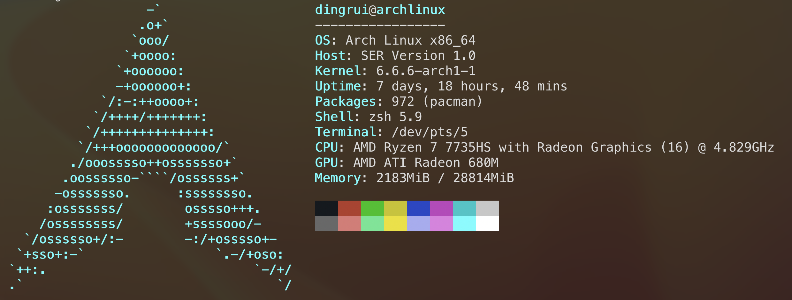

系统信息



### 1 aur helper

archlinux的yay包管理工具安装bochs

```shell
yay -Ss bochs
yay -S bochs
```

但是仍然需要下载bochs的源码包，因为在启动的时候需要在配置文件中指定romimage和vgaromimage的路径。

### 2 手动下载bochs源码编译

#### 2.1 源码下载

https://sourceforge.net/projects/bochs/files/bochs/2.7/

```shell
cd Documents/software/bochs
cp ~/Downloads/bochs-2.7.tar.gz ./
tar -zxvf bochs-2.7.tar.gz
mv bochs-2.7 bochs

make dist-clean
```

#### 2.2 编译

##### 2.2.1 生成make脚本 

```shell
./configure \
--with-x11 \
--with-wx \
--enable-plugins \
--enable-debugger \
--enable-debugger-gui \
--enable-readline \
--enable-xpm \
--enable-show-ips \
--enable-logging \
--enable-assert-checks \
--enable-cpp \
--enable-idle-hack \
--enable-cpu-level=6 \
--enable-smp \
--enable-fpu \
--enable-3dnow \
--enable-x86-64 \
--enable-vmx \
--enable-svm \
--enable-avx \
--enable-x86-debugger \
--enable-monitor-mwait \
--enable-alignment-check \
--enable-configurable-msrs \
--enable-long-phy-address \
--enable-a20-pin \
--enable-large-ramfile \
--enable-repeat-speedups \
--enable-fast-function-calls \
--enable-handlers-chaining \
--enable-all-optimizations \
--enable-cdrom \
--enable-voodoo \
--enable-iodebug \
--enable-pci \
--enable-usb \
--enable-disasm \
--enable-ltdl-install \
--enable-trace-linking \
--enable-evex
```

##### 2.2.2 执行make脚本构建

```shell
make
```

#### 2.3 编译报错

- make[1]: *** No rule to make target 'parser.cc', needed by 'parser.o'.  Stop.

    ```shell
    cp ./bx_debug/parser.cpp ./bx_debug/parser.cc
    ```

- debug.h:25:10: fatal error: config.h: No such file or directory

    ```shell
    vim ./bx_debug/debug.h


    #include "config.h" -> #include "../config.h"
    ```


- debug.h:26:10: fatal error: osdep.h: No such file or directory

    ```shell
    vim ./bx_debug/debug.h

    #include "osdep.h" -> #include "../osdep.h"
    ```


- debug.h:34:10: fatal error: cpu/decoder/decoder.h: No such file or directory

    ```shell
    vim ./bx_debug/debug.h

    #include "cpu/decoder/decoder.h" ->  #include "../cpu/decoder/decoder.h"
    ```


- make: *** No rule to make target 'misc/bximage.cc', needed by 'misc/bximage.o'.  Stop.

    ```shell
    cp misc/bximage.cpp misc/bximage.cc  
    ```

- make: *** No rule to make target 'iodev/hdimage/hdimage.cc', needed by 'misc/hdimage.o'.  Stop.

    ```shell
    cp iodev/hdimage/hdimage.cpp iodev/hdimage/hdimage.cc  
    ```

- make: *** No rule to make target 'iodev/hdimage/vmware3.cc', needed by 'misc/vmware3.o'.  Stop.

    ```shell
    cp iodev/hdimage/vmware3.cpp iodev/hdimage/vmware3.cc
    ```

- make: *** No rule to make target 'iodev/hdimage/vmware4.cc', needed by 'misc/vmware4.o'.  Stop.


    ```shell
    cp iodev/hdimage/vmware4.cpp iodev/hdimage/vmware4.cc
    ```

- make: *** No rule to make target 'iodev/hdimage/vpc.cc', needed by 'misc/vpc.o'.  Stop.

    ```shell
    cp iodev/hdimage/vpc.cpp iodev/hdimage/vpc.cc
    ```

- make: *** No rule to make target 'iodev/hdimage/vbox.cc', needed by 'misc/vbox.o'.  Stop.

    ```shell
    cp iodev/hdimage/vbox.cpp iodev/hdimage/vbox.cc
    ```

#### 2.4 install

```shell
cd Documents/software/bochs

sudo make install
```

将来想要删除就执行`sudo make uninstall`

#### 2.5 验证

```shell
whereis bochs
whereis bximage

bochs --help cpu
```

### 3 lib缺失

在调试的时候可能会报错，缺少lib

- display_library

    ```shell
    yay -Ss sdl2
    yay -S sdl2
    ```