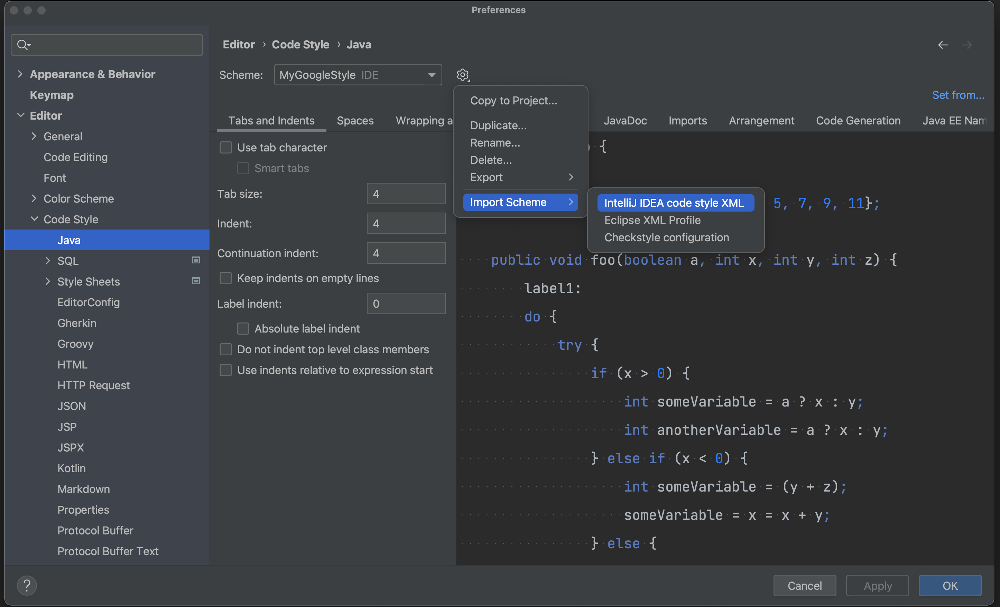
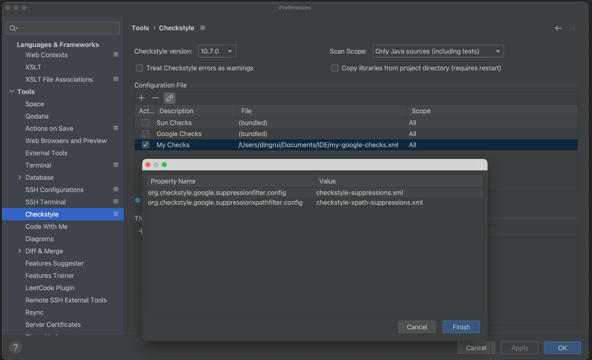
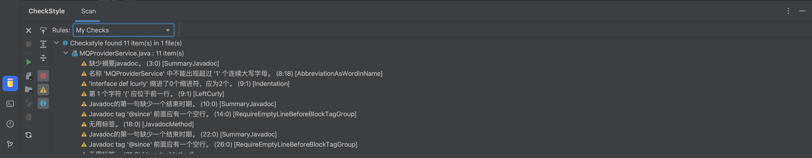

IDEA设置code style，通过format方式格式化代码，并设置配套的check style进行规范检查。


## 1 文件下载

### 1.1 code style

从[GitHub](https://github.com/google/styleguide.git)下载文件intellij-java-google-style.xml

```xml
<?xml version="1.0" encoding="UTF-8"?>
<code_scheme name="GoogleStyle">
    <option name="OTHER_INDENT_OPTIONS">
        <value>
            <option name="INDENT_SIZE" value="2" />
            <option name="CONTINUATION_INDENT_SIZE" value="4" />
            <option name="TAB_SIZE" value="2" />
            <option name="USE_TAB_CHARACTER" value="false" />
            <option name="SMART_TABS" value="false" />
            <option name="LABEL_INDENT_SIZE" value="0" />
            <option name="LABEL_INDENT_ABSOLUTE" value="false" />
            <option name="USE_RELATIVE_INDENTS" value="false" />
        </value>
    </option>
    <option name="INSERT_INNER_CLASS_IMPORTS" value="true" />
    <option name="CLASS_COUNT_TO_USE_IMPORT_ON_DEMAND" value="999" />
    <option name="NAMES_COUNT_TO_USE_IMPORT_ON_DEMAND" value="999" />
    <option name="PACKAGES_TO_USE_IMPORT_ON_DEMAND">
        <value />
    </option>
    <option name="IMPORT_LAYOUT_TABLE">
        <value>
            <package name="" withSubpackages="true" static="true" />
            <emptyLine />
            <package name="" withSubpackages="true" static="false" />
        </value>
    </option>
    <!-- 100->150 -->
    <option name="RIGHT_MARGIN" value="150" />
    <option name="JD_ALIGN_PARAM_COMMENTS" value="false" />
    <option name="JD_ALIGN_EXCEPTION_COMMENTS" value="false" />
    <option name="JD_P_AT_EMPTY_LINES" value="false" />
    <option name="JD_KEEP_EMPTY_PARAMETER" value="false" />
    <option name="JD_KEEP_EMPTY_EXCEPTION" value="false" />
    <option name="JD_KEEP_EMPTY_RETURN" value="false" />
    <option name="KEEP_CONTROL_STATEMENT_IN_ONE_LINE" value="false" />
    <option name="KEEP_BLANK_LINES_BEFORE_RBRACE" value="0" />
    <option name="KEEP_BLANK_LINES_IN_CODE" value="1" />
    <option name="BLANK_LINES_AFTER_CLASS_HEADER" value="0" />
    <option name="ALIGN_MULTILINE_PARAMETERS" value="false" />
    <option name="ALIGN_MULTILINE_FOR" value="false" />
    <option name="CALL_PARAMETERS_WRAP" value="1" />
    <option name="METHOD_PARAMETERS_WRAP" value="1" />
    <option name="EXTENDS_LIST_WRAP" value="1" />
    <option name="THROWS_KEYWORD_WRAP" value="1" />
    <option name="METHOD_CALL_CHAIN_WRAP" value="1" />
    <option name="BINARY_OPERATION_WRAP" value="1" />
    <option name="BINARY_OPERATION_SIGN_ON_NEXT_LINE" value="true" />
    <option name="TERNARY_OPERATION_WRAP" value="1" />
    <option name="TERNARY_OPERATION_SIGNS_ON_NEXT_LINE" value="true" />
    <option name="FOR_STATEMENT_WRAP" value="1" />
    <option name="ARRAY_INITIALIZER_WRAP" value="1" />
    <option name="WRAP_COMMENTS" value="true" />
    <option name="IF_BRACE_FORCE" value="3" />
    <option name="DOWHILE_BRACE_FORCE" value="3" />
    <option name="WHILE_BRACE_FORCE" value="3" />
    <option name="FOR_BRACE_FORCE" value="3" />
    <option name="SPACE_BEFORE_ARRAY_INITIALIZER_LBRACE" value="true" />
    <AndroidXmlCodeStyleSettings>
        <option name="USE_CUSTOM_SETTINGS" value="true" />
        <option name="LAYOUT_SETTINGS">
            <value>
                <option name="INSERT_BLANK_LINE_BEFORE_TAG" value="false" />
            </value>
        </option>
    </AndroidXmlCodeStyleSettings>
    <JSCodeStyleSettings>
        <option name="INDENT_CHAINED_CALLS" value="false" />
    </JSCodeStyleSettings>
    <Python>
        <option name="USE_CONTINUATION_INDENT_FOR_ARGUMENTS" value="true" />
    </Python>
    <TypeScriptCodeStyleSettings>
        <option name="INDENT_CHAINED_CALLS" value="false" />
    </TypeScriptCodeStyleSettings>
    <XML>
        <option name="XML_ALIGN_ATTRIBUTES" value="false" />
        <option name="XML_LEGACY_SETTINGS_IMPORTED" value="true" />
    </XML>
    <codeStyleSettings language="CSS">
        <indentOptions>
            <option name="INDENT_SIZE" value="2" />
            <option name="CONTINUATION_INDENT_SIZE" value="4" />
            <option name="TAB_SIZE" value="2" />
        </indentOptions>
    </codeStyleSettings>
    <codeStyleSettings language="ECMA Script Level 4">
        <option name="KEEP_BLANK_LINES_IN_CODE" value="1" />
        <option name="ALIGN_MULTILINE_PARAMETERS" value="false" />
        <option name="ALIGN_MULTILINE_FOR" value="false" />
        <option name="CALL_PARAMETERS_WRAP" value="1" />
        <option name="METHOD_PARAMETERS_WRAP" value="1" />
        <option name="EXTENDS_LIST_WRAP" value="1" />
        <option name="BINARY_OPERATION_WRAP" value="1" />
        <option name="BINARY_OPERATION_SIGN_ON_NEXT_LINE" value="true" />
        <option name="TERNARY_OPERATION_WRAP" value="1" />
        <option name="TERNARY_OPERATION_SIGNS_ON_NEXT_LINE" value="true" />
        <option name="FOR_STATEMENT_WRAP" value="1" />
        <option name="ARRAY_INITIALIZER_WRAP" value="1" />
        <option name="IF_BRACE_FORCE" value="3" />
        <option name="DOWHILE_BRACE_FORCE" value="3" />
        <option name="WHILE_BRACE_FORCE" value="3" />
        <option name="FOR_BRACE_FORCE" value="3" />
        <option name="PARENT_SETTINGS_INSTALLED" value="true" />
    </codeStyleSettings>
    <codeStyleSettings language="HTML">
        <indentOptions>
            <option name="INDENT_SIZE" value="2" />
            <option name="CONTINUATION_INDENT_SIZE" value="4" />
            <option name="TAB_SIZE" value="2" />
        </indentOptions>
    </codeStyleSettings>
    <codeStyleSettings language="JAVA">
        <option name="KEEP_CONTROL_STATEMENT_IN_ONE_LINE" value="false" />
        <option name="KEEP_BLANK_LINES_IN_CODE" value="1" />
        <option name="BLANK_LINES_AFTER_CLASS_HEADER" value="1" />
        <option name="ALIGN_MULTILINE_PARAMETERS" value="false" />
        <option name="ALIGN_MULTILINE_RESOURCES" value="false" />
        <option name="ALIGN_MULTILINE_FOR" value="false" />
        <option name="CALL_PARAMETERS_WRAP" value="1" />
        <option name="METHOD_PARAMETERS_WRAP" value="1" />
        <option name="EXTENDS_LIST_WRAP" value="1" />
        <option name="THROWS_KEYWORD_WRAP" value="1" />
        <option name="METHOD_CALL_CHAIN_WRAP" value="1" />
        <option name="BINARY_OPERATION_WRAP" value="1" />
        <option name="BINARY_OPERATION_SIGN_ON_NEXT_LINE" value="true" />
        <option name="TERNARY_OPERATION_WRAP" value="1" />
        <option name="TERNARY_OPERATION_SIGNS_ON_NEXT_LINE" value="true" />
        <option name="FOR_STATEMENT_WRAP" value="1" />
        <option name="ARRAY_INITIALIZER_WRAP" value="1" />
        <option name="WRAP_COMMENTS" value="true" />
        <option name="IF_BRACE_FORCE" value="3" />
        <option name="DOWHILE_BRACE_FORCE" value="3" />
        <option name="WHILE_BRACE_FORCE" value="3" />
        <option name="FOR_BRACE_FORCE" value="3" />
        <option name="PARENT_SETTINGS_INSTALLED" value="true" />
        <indentOptions>
            <!-- 2->4 -->
            <option name="INDENT_SIZE" value="4" />
            <!-- 4->8 -->
            <option name="CONTINUATION_INDENT_SIZE" value="8" />
            <!-- 2->4 -->
            <option name="TAB_SIZE" value="4" />
        </indentOptions>
    </codeStyleSettings>
    <codeStyleSettings language="JSON">
        <indentOptions>
            <option name="CONTINUATION_INDENT_SIZE" value="4" />
            <option name="TAB_SIZE" value="2" />
        </indentOptions>
    </codeStyleSettings>
    <codeStyleSettings language="JavaScript">
        <option name="RIGHT_MARGIN" value="80" />
        <option name="KEEP_BLANK_LINES_IN_CODE" value="1" />
        <option name="ALIGN_MULTILINE_PARAMETERS" value="false" />
        <option name="ALIGN_MULTILINE_FOR" value="false" />
        <option name="CALL_PARAMETERS_WRAP" value="1" />
        <option name="METHOD_PARAMETERS_WRAP" value="1" />
        <option name="BINARY_OPERATION_WRAP" value="1" />
        <option name="BINARY_OPERATION_SIGN_ON_NEXT_LINE" value="true" />
        <option name="TERNARY_OPERATION_WRAP" value="1" />
        <option name="TERNARY_OPERATION_SIGNS_ON_NEXT_LINE" value="true" />
        <option name="FOR_STATEMENT_WRAP" value="1" />
        <option name="ARRAY_INITIALIZER_WRAP" value="1" />
        <option name="IF_BRACE_FORCE" value="3" />
        <option name="DOWHILE_BRACE_FORCE" value="3" />
        <option name="WHILE_BRACE_FORCE" value="3" />
        <option name="FOR_BRACE_FORCE" value="3" />
        <option name="PARENT_SETTINGS_INSTALLED" value="true" />
        <indentOptions>
            <option name="INDENT_SIZE" value="2" />
            <option name="TAB_SIZE" value="2" />
        </indentOptions>
    </codeStyleSettings>
    <codeStyleSettings language="PROTO">
        <option name="RIGHT_MARGIN" value="80" />
        <indentOptions>
            <option name="INDENT_SIZE" value="2" />
            <option name="CONTINUATION_INDENT_SIZE" value="2" />
            <option name="TAB_SIZE" value="2" />
        </indentOptions>
    </codeStyleSettings>
    <codeStyleSettings language="protobuf">
        <option name="RIGHT_MARGIN" value="80" />
        <indentOptions>
            <option name="INDENT_SIZE" value="2" />
            <option name="CONTINUATION_INDENT_SIZE" value="2" />
            <option name="TAB_SIZE" value="2" />
        </indentOptions>
    </codeStyleSettings>
    <codeStyleSettings language="Python">
        <option name="KEEP_BLANK_LINES_IN_CODE" value="1" />
        <option name="RIGHT_MARGIN" value="80" />
        <option name="ALIGN_MULTILINE_PARAMETERS" value="false" />
        <option name="PARENT_SETTINGS_INSTALLED" value="true" />
        <indentOptions>
            <option name="INDENT_SIZE" value="2" />
            <option name="CONTINUATION_INDENT_SIZE" value="4" />
            <option name="TAB_SIZE" value="2" />
        </indentOptions>
    </codeStyleSettings>
    <codeStyleSettings language="SASS">
        <indentOptions>
            <option name="CONTINUATION_INDENT_SIZE" value="4" />
            <option name="TAB_SIZE" value="2" />
        </indentOptions>
    </codeStyleSettings>
    <codeStyleSettings language="SCSS">
        <indentOptions>
            <option name="CONTINUATION_INDENT_SIZE" value="4" />
            <option name="TAB_SIZE" value="2" />
        </indentOptions>
    </codeStyleSettings>
    <codeStyleSettings language="TypeScript">
        <indentOptions>
            <option name="INDENT_SIZE" value="2" />
            <option name="TAB_SIZE" value="2" />
        </indentOptions>
    </codeStyleSettings>
    <codeStyleSettings language="XML">
        <indentOptions>
            <option name="INDENT_SIZE" value="2" />
            <option name="CONTINUATION_INDENT_SIZE" value="2" />
            <option name="TAB_SIZE" value="2" />
        </indentOptions>
        <arrangement>
            <rules>
                <section>
                    <rule>
                        <match>
                            <AND>
                                <NAME>xmlns:android</NAME>
                                <XML_ATTRIBUTE />
                                <XML_NAMESPACE>^$</XML_NAMESPACE>
                            </AND>
                        </match>
                    </rule>
                </section>
                <section>
                    <rule>
                        <match>
                            <AND>
                                <NAME>xmlns:.*</NAME>
                                <XML_ATTRIBUTE />
                                <XML_NAMESPACE>^$</XML_NAMESPACE>
                            </AND>
                        </match>
                        <order>BY_NAME</order>
                    </rule>
                </section>
                <section>
                    <rule>
                        <match>
                            <AND>
                                <NAME>.*:id</NAME>
                                <XML_ATTRIBUTE />
                                <XML_NAMESPACE>http://schemas.android.com/apk/res/android</XML_NAMESPACE>
                            </AND>
                        </match>
                    </rule>
                </section>
                <section>
                    <rule>
                        <match>
                            <AND>
                                <NAME>style</NAME>
                                <XML_ATTRIBUTE />
                                <XML_NAMESPACE>^$</XML_NAMESPACE>
                            </AND>
                        </match>
                    </rule>
                </section>
                <section>
                    <rule>
                        <match>
                            <AND>
                                <NAME>.*</NAME>
                                <XML_ATTRIBUTE />
                                <XML_NAMESPACE>^$</XML_NAMESPACE>
                            </AND>
                        </match>
                        <order>BY_NAME</order>
                    </rule>
                </section>
                <section>
                    <rule>
                        <match>
                            <AND>
                                <NAME>.*:.*Style</NAME>
                                <XML_ATTRIBUTE />
                                <XML_NAMESPACE>http://schemas.android.com/apk/res/android</XML_NAMESPACE>
                            </AND>
                        </match>
                        <order>BY_NAME</order>
                    </rule>
                </section>
                <section>
                    <rule>
                        <match>
                            <AND>
                                <NAME>.*:layout_width</NAME>
                                <XML_ATTRIBUTE />
                                <XML_NAMESPACE>http://schemas.android.com/apk/res/android</XML_NAMESPACE>
                            </AND>
                        </match>
                    </rule>
                </section>
                <section>
                    <rule>
                        <match>
                            <AND>
                                <NAME>.*:layout_height</NAME>
                                <XML_ATTRIBUTE />
                                <XML_NAMESPACE>http://schemas.android.com/apk/res/android</XML_NAMESPACE>
                            </AND>
                        </match>
                    </rule>
                </section>
                <section>
                    <rule>
                        <match>
                            <AND>
                                <NAME>.*:layout_weight</NAME>
                                <XML_ATTRIBUTE />
                                <XML_NAMESPACE>http://schemas.android.com/apk/res/android</XML_NAMESPACE>
                            </AND>
                        </match>
                    </rule>
                </section>
                <section>
                    <rule>
                        <match>
                            <AND>
                                <NAME>.*:layout_margin</NAME>
                                <XML_ATTRIBUTE />
                                <XML_NAMESPACE>http://schemas.android.com/apk/res/android</XML_NAMESPACE>
                            </AND>
                        </match>
                    </rule>
                </section>
                <section>
                    <rule>
                        <match>
                            <AND>
                                <NAME>.*:layout_marginTop</NAME>
                                <XML_ATTRIBUTE />
                                <XML_NAMESPACE>http://schemas.android.com/apk/res/android</XML_NAMESPACE>
                            </AND>
                        </match>
                    </rule>
                </section>
                <section>
                    <rule>
                        <match>
                            <AND>
                                <NAME>.*:layout_marginBottom</NAME>
                                <XML_ATTRIBUTE />
                                <XML_NAMESPACE>http://schemas.android.com/apk/res/android</XML_NAMESPACE>
                            </AND>
                        </match>
                    </rule>
                </section>
                <section>
                    <rule>
                        <match>
                            <AND>
                                <NAME>.*:layout_marginStart</NAME>
                                <XML_ATTRIBUTE />
                                <XML_NAMESPACE>http://schemas.android.com/apk/res/android</XML_NAMESPACE>
                            </AND>
                        </match>
                    </rule>
                </section>
                <section>
                    <rule>
                        <match>
                            <AND>
                                <NAME>.*:layout_marginEnd</NAME>
                                <XML_ATTRIBUTE />
                                <XML_NAMESPACE>http://schemas.android.com/apk/res/android</XML_NAMESPACE>
                            </AND>
                        </match>
                    </rule>
                </section>
                <section>
                    <rule>
                        <match>
                            <AND>
                                <NAME>.*:layout_marginLeft</NAME>
                                <XML_ATTRIBUTE />
                                <XML_NAMESPACE>http://schemas.android.com/apk/res/android</XML_NAMESPACE>
                            </AND>
                        </match>
                    </rule>
                </section>
                <section>
                    <rule>
                        <match>
                            <AND>
                                <NAME>.*:layout_marginRight</NAME>
                                <XML_ATTRIBUTE />
                                <XML_NAMESPACE>http://schemas.android.com/apk/res/android</XML_NAMESPACE>
                            </AND>
                        </match>
                    </rule>
                </section>
                <section>
                    <rule>
                        <match>
                            <AND>
                                <NAME>.*:layout_.*</NAME>
                                <XML_ATTRIBUTE />
                                <XML_NAMESPACE>http://schemas.android.com/apk/res/android</XML_NAMESPACE>
                            </AND>
                        </match>
                        <order>BY_NAME</order>
                    </rule>
                </section>
                <section>
                    <rule>
                        <match>
                            <AND>
                                <NAME>.*:padding</NAME>
                                <XML_ATTRIBUTE />
                                <XML_NAMESPACE>http://schemas.android.com/apk/res/android</XML_NAMESPACE>
                            </AND>
                        </match>
                    </rule>
                </section>
                <section>
                    <rule>
                        <match>
                            <AND>
                                <NAME>.*:paddingTop</NAME>
                                <XML_ATTRIBUTE />
                                <XML_NAMESPACE>http://schemas.android.com/apk/res/android</XML_NAMESPACE>
                            </AND>
                        </match>
                    </rule>
                </section>
                <section>
                    <rule>
                        <match>
                            <AND>
                                <NAME>.*:paddingBottom</NAME>
                                <XML_ATTRIBUTE />
                                <XML_NAMESPACE>http://schemas.android.com/apk/res/android</XML_NAMESPACE>
                            </AND>
                        </match>
                    </rule>
                </section>
                <section>
                    <rule>
                        <match>
                            <AND>
                                <NAME>.*:paddingStart</NAME>
                                <XML_ATTRIBUTE />
                                <XML_NAMESPACE>http://schemas.android.com/apk/res/android</XML_NAMESPACE>
                            </AND>
                        </match>
                    </rule>
                </section>
                <section>
                    <rule>
                        <match>
                            <AND>
                                <NAME>.*:paddingEnd</NAME>
                                <XML_ATTRIBUTE />
                                <XML_NAMESPACE>http://schemas.android.com/apk/res/android</XML_NAMESPACE>
                            </AND>
                        </match>
                    </rule>
                </section>
                <section>
                    <rule>
                        <match>
                            <AND>
                                <NAME>.*:paddingLeft</NAME>
                                <XML_ATTRIBUTE />
                                <XML_NAMESPACE>http://schemas.android.com/apk/res/android</XML_NAMESPACE>
                            </AND>
                        </match>
                    </rule>
                </section>
                <section>
                    <rule>
                        <match>
                            <AND>
                                <NAME>.*:paddingRight</NAME>
                                <XML_ATTRIBUTE />
                                <XML_NAMESPACE>http://schemas.android.com/apk/res/android</XML_NAMESPACE>
                            </AND>
                        </match>
                    </rule>
                </section>
                <section>
                    <rule>
                        <match>
                            <AND>
                                <NAME>.*</NAME>
                                <XML_NAMESPACE>http://schemas.android.com/apk/res/android</XML_NAMESPACE>
                            </AND>
                        </match>
                        <order>BY_NAME</order>
                    </rule>
                </section>
                <section>
                    <rule>
                        <match>
                            <AND>
                                <NAME>.*</NAME>
                                <XML_NAMESPACE>http://schemas.android.com/apk/res-auto</XML_NAMESPACE>
                            </AND>
                        </match>
                        <order>BY_NAME</order>
                    </rule>
                </section>
                <section>
                    <rule>
                        <match>
                            <AND>
                                <NAME>.*</NAME>
                                <XML_NAMESPACE>http://schemas.android.com/tools</XML_NAMESPACE>
                            </AND>
                        </match>
                        <order>BY_NAME</order>
                    </rule>
                </section>
                <section>
                    <rule>
                        <match>
                            <AND>
                                <NAME>.*</NAME>
                                <XML_NAMESPACE>.*</XML_NAMESPACE>
                            </AND>
                        </match>
                        <order>BY_NAME</order>
                    </rule>
                </section>
            </rules>
        </arrangement>
    </codeStyleSettings>
    <Objective-C>
        <option name="INDENT_NAMESPACE_MEMBERS" value="0" />
        <option name="INDENT_C_STRUCT_MEMBERS" value="2" />
        <option name="INDENT_CLASS_MEMBERS" value="2" />
        <option name="INDENT_VISIBILITY_KEYWORDS" value="1" />
        <option name="INDENT_INSIDE_CODE_BLOCK" value="2" />
        <option name="KEEP_STRUCTURES_IN_ONE_LINE" value="true" />
        <option name="FUNCTION_PARAMETERS_WRAP" value="5" />
        <option name="FUNCTION_CALL_ARGUMENTS_WRAP" value="5" />
        <option name="TEMPLATE_CALL_ARGUMENTS_WRAP" value="5" />
        <option name="TEMPLATE_CALL_ARGUMENTS_ALIGN_MULTILINE" value="true" />
        <option name="ALIGN_INIT_LIST_IN_COLUMNS" value="false" />
        <option name="SPACE_BEFORE_SUPERCLASS_COLON" value="false" />
    </Objective-C>
    <Objective-C-extensions>
        <option name="GENERATE_INSTANCE_VARIABLES_FOR_PROPERTIES" value="ASK" />
        <option name="RELEASE_STYLE" value="IVAR" />
        <option name="TYPE_QUALIFIERS_PLACEMENT" value="BEFORE" />
        <file>
            <option name="com.jetbrains.cidr.lang.util.OCDeclarationKind" value="Import" />
            <option name="com.jetbrains.cidr.lang.util.OCDeclarationKind" value="Macro" />
            <option name="com.jetbrains.cidr.lang.util.OCDeclarationKind" value="Typedef" />
            <option name="com.jetbrains.cidr.lang.util.OCDeclarationKind" value="Enum" />
            <option name="com.jetbrains.cidr.lang.util.OCDeclarationKind" value="Constant" />
            <option name="com.jetbrains.cidr.lang.util.OCDeclarationKind" value="Global" />
            <option name="com.jetbrains.cidr.lang.util.OCDeclarationKind" value="Struct" />
            <option name="com.jetbrains.cidr.lang.util.OCDeclarationKind" value="FunctionPredecl" />
            <option name="com.jetbrains.cidr.lang.util.OCDeclarationKind" value="Function" />
        </file>
        <class>
            <option name="com.jetbrains.cidr.lang.util.OCDeclarationKind" value="Property" />
            <option name="com.jetbrains.cidr.lang.util.OCDeclarationKind" value="Synthesize" />
            <option name="com.jetbrains.cidr.lang.util.OCDeclarationKind" value="InitMethod" />
            <option name="com.jetbrains.cidr.lang.util.OCDeclarationKind" value="StaticMethod" />
            <option name="com.jetbrains.cidr.lang.util.OCDeclarationKind" value="InstanceMethod" />
            <option name="com.jetbrains.cidr.lang.util.OCDeclarationKind" value="DeallocMethod" />
        </class>
        <extensions>
            <pair source="cc" header="h" />
            <pair source="c" header="h" />
        </extensions>
    </Objective-C-extensions>
    <codeStyleSettings language="ObjectiveC">
        <option name="RIGHT_MARGIN" value="80" />
        <option name="KEEP_BLANK_LINES_BEFORE_RBRACE" value="1" />
        <option name="BLANK_LINES_BEFORE_IMPORTS" value="0" />
        <option name="BLANK_LINES_AFTER_IMPORTS" value="0" />
        <option name="BLANK_LINES_AROUND_CLASS" value="0" />
        <option name="BLANK_LINES_AROUND_METHOD" value="0" />
        <option name="BLANK_LINES_AROUND_METHOD_IN_INTERFACE" value="0" />
        <option name="ALIGN_MULTILINE_BINARY_OPERATION" value="false" />
        <option name="BINARY_OPERATION_SIGN_ON_NEXT_LINE" value="true" />
        <option name="FOR_STATEMENT_WRAP" value="1" />
        <option name="ASSIGNMENT_WRAP" value="1" />
        <indentOptions>
            <option name="INDENT_SIZE" value="2" />
            <option name="CONTINUATION_INDENT_SIZE" value="4" />
        </indentOptions>
    </codeStyleSettings>
</code_scheme>
```

### 1.2 check style

从[GitHub](https://github.com/checkstyle/checkstyle.git)下载google-checks.xml

```xml
<?xml version="1.0"?>
<!DOCTYPE module PUBLIC
  "-//Checkstyle//DTD Checkstyle Configuration 1.3//EN"
  "https://checkstyle.org/dtds/configuration_1_3.dtd">

<!--
    Checkstyle configuration that checks the Google coding conventions from Google Java Style
    that can be found at https://google.github.io/styleguide/javaguide.html

    Checkstyle is very configurable. Be sure to read the documentation at
    http://checkstyle.org (or in your downloaded distribution).

    To completely disable a check, just comment it out or delete it from the file.
    To suppress certain violations please review suppression filters.

    Authors: Max Vetrenko, Ruslan Diachenko, Roman Ivanov.
 -->

<module name="Checker">
  <module name="SuppressWarningsFilter"/>

  <property name="charset" value="UTF-8"/>

  <property name="severity" value="warning"/>

  <property name="fileExtensions" value="java, properties, xml"/>
  <!-- Excludes all 'module-info.java' files              -->
  <!-- See https://checkstyle.org/config_filefilters.html -->
  <module name="BeforeExecutionExclusionFileFilter">
    <property name="fileNamePattern" value="module\-info\.java$"/>
  </module>
  <!-- https://checkstyle.org/config_filters.html#SuppressionFilter -->
  <module name="SuppressionFilter">
    <property name="file" value="${org.checkstyle.google.suppressionfilter.config}"
      default="checkstyle-suppressions.xml" />
    <property name="optional" value="true"/>
  </module>

  <!-- Checks for whitespace                               -->
  <!-- See http://checkstyle.org/config_whitespace.html -->
  <module name="FileTabCharacter">
    <property name="eachLine" value="true"/>
  </module>

  <module name="LineLength">
    <property name="fileExtensions" value="java"/>
    <!-- 100->150 -->
    <property name="max" value="150"/>
    <property name="ignorePattern" value="^package.*|^import.*|a href|href|http://|https://|ftp://"/>
  </module>

  <module name="TreeWalker">
    <module name="OuterTypeFilename"/>
    <module name="IllegalTokenText">
      <property name="tokens" value="STRING_LITERAL, CHAR_LITERAL"/>
      <property name="format"
        value="\\u00(09|0(a|A)|0(c|C)|0(d|D)|22|27|5(C|c))|\\(0(10|11|12|14|15|42|47)|134)"/>
      <property name="message"
        value="Consider using special escape sequence instead of octal value or Unicode escaped value."/>
    </module>
    <module name="AvoidEscapedUnicodeCharacters">
      <property name="allowEscapesForControlCharacters" value="true"/>
      <property name="allowByTailComment" value="true"/>
      <property name="allowNonPrintableEscapes" value="true"/>
    </module>
    <module name="AvoidStarImport"/>
    <module name="OneTopLevelClass"/>
    <module name="NoLineWrap">
      <property name="tokens" value="PACKAGE_DEF, IMPORT, STATIC_IMPORT"/>
    </module>
    <module name="EmptyBlock">
      <property name="option" value="TEXT"/>
      <property name="tokens"
        value="LITERAL_TRY, LITERAL_FINALLY, LITERAL_IF, LITERAL_ELSE, LITERAL_SWITCH"/>
    </module>
    <module name="NeedBraces">
      <property name="tokens"
        value="LITERAL_DO, LITERAL_ELSE, LITERAL_FOR, LITERAL_IF, LITERAL_WHILE"/>
    </module>
    <module name="LeftCurly">
      <property name="tokens"
        value="ANNOTATION_DEF, CLASS_DEF, CTOR_DEF, ENUM_CONSTANT_DEF, ENUM_DEF,
                    INTERFACE_DEF, LAMBDA, LITERAL_CASE, LITERAL_CATCH, LITERAL_DEFAULT,
                    LITERAL_DO, LITERAL_ELSE, LITERAL_FINALLY, LITERAL_FOR, LITERAL_IF,
                    LITERAL_SWITCH, LITERAL_SYNCHRONIZED, LITERAL_TRY, LITERAL_WHILE, METHOD_DEF,
                    OBJBLOCK, STATIC_INIT, RECORD_DEF, COMPACT_CTOR_DEF"/>
    </module>
    <module name="RightCurly">
      <property name="id" value="RightCurlySame"/>
      <property name="tokens"
        value="LITERAL_TRY, LITERAL_CATCH, LITERAL_FINALLY, LITERAL_IF, LITERAL_ELSE,
                    LITERAL_DO"/>
    </module>
    <module name="RightCurly">
      <property name="id" value="RightCurlyAlone"/>
      <property name="option" value="alone"/>
      <property name="tokens"
        value="CLASS_DEF, METHOD_DEF, CTOR_DEF, LITERAL_FOR, LITERAL_WHILE, STATIC_INIT,
                    INSTANCE_INIT, ANNOTATION_DEF, ENUM_DEF, INTERFACE_DEF, RECORD_DEF,
                    COMPACT_CTOR_DEF"/>
    </module>
    <module name="SuppressionXpathSingleFilter">
      <!-- suppresion is required till https://github.com/checkstyle/checkstyle/issues/7541 -->
      <property name="id" value="RightCurlyAlone"/>
      <property name="query" value="//RCURLY[parent::SLIST[count(./*)=1]
                                     or preceding-sibling::*[last()][self::LCURLY]]"/>
    </module>
    <module name="WhitespaceAfter">
      <property name="tokens"
        value="COMMA, SEMI, TYPECAST, LITERAL_IF, LITERAL_ELSE, LITERAL_RETURN,
                    LITERAL_WHILE, LITERAL_DO, LITERAL_FOR, LITERAL_FINALLY, DO_WHILE, ELLIPSIS,
                    LITERAL_SWITCH, LITERAL_SYNCHRONIZED, LITERAL_TRY, LITERAL_CATCH, LAMBDA,
                    LITERAL_YIELD, LITERAL_CASE"/>
    </module>
    <module name="WhitespaceAround">
      <property name="allowEmptyConstructors" value="true"/>
      <property name="allowEmptyLambdas" value="true"/>
      <property name="allowEmptyMethods" value="true"/>
      <property name="allowEmptyTypes" value="true"/>
      <property name="allowEmptyLoops" value="true"/>
      <property name="ignoreEnhancedForColon" value="false"/>
      <property name="tokens"
        value="ASSIGN, BAND, BAND_ASSIGN, BOR, BOR_ASSIGN, BSR, BSR_ASSIGN, BXOR,
                    BXOR_ASSIGN, COLON, DIV, DIV_ASSIGN, DO_WHILE, EQUAL, GE, GT, LAMBDA, LAND,
                    LCURLY, LE, LITERAL_CATCH, LITERAL_DO, LITERAL_ELSE, LITERAL_FINALLY,
                    LITERAL_FOR, LITERAL_IF, LITERAL_RETURN, LITERAL_SWITCH, LITERAL_SYNCHRONIZED,
                    LITERAL_TRY, LITERAL_WHILE, LOR, LT, MINUS, MINUS_ASSIGN, MOD, MOD_ASSIGN,
                    NOT_EQUAL, PLUS, PLUS_ASSIGN, QUESTION, RCURLY, SL, SLIST, SL_ASSIGN, SR,
                    SR_ASSIGN, STAR, STAR_ASSIGN, LITERAL_ASSERT, TYPE_EXTENSION_AND"/>
      <message key="ws.notFollowed"
        value="WhitespaceAround: ''{0}'' is not followed by whitespace. Empty blocks
               may only be represented as '{}' when not part of a multi-block statement (4.1.3)"/>
      <message key="ws.notPreceded"
        value="WhitespaceAround: ''{0}'' is not preceded with whitespace."/>
    </module>
    <module name="OneStatementPerLine"/>
    <module name="MultipleVariableDeclarations"/>
    <module name="ArrayTypeStyle"/>
    <module name="MissingSwitchDefault"/>
    <module name="FallThrough"/>
    <module name="UpperEll"/>
    <module name="ModifierOrder"/>
    <module name="EmptyLineSeparator">
      <property name="tokens"
        value="PACKAGE_DEF, IMPORT, STATIC_IMPORT, CLASS_DEF, INTERFACE_DEF, ENUM_DEF,
                    STATIC_INIT, INSTANCE_INIT, METHOD_DEF, CTOR_DEF, VARIABLE_DEF, RECORD_DEF,
                    COMPACT_CTOR_DEF"/>
      <property name="allowNoEmptyLineBetweenFields" value="true"/>
    </module>
    <module name="SeparatorWrap">
      <property name="id" value="SeparatorWrapDot"/>
      <property name="tokens" value="DOT"/>
      <property name="option" value="nl"/>
    </module>
    <module name="SeparatorWrap">
      <property name="id" value="SeparatorWrapComma"/>
      <property name="tokens" value="COMMA"/>
      <property name="option" value="EOL"/>
    </module>
    <module name="SeparatorWrap">
      <!-- ELLIPSIS is EOL until https://github.com/google/styleguide/issues/259 -->
      <property name="id" value="SeparatorWrapEllipsis"/>
      <property name="tokens" value="ELLIPSIS"/>
      <property name="option" value="EOL"/>
    </module>
    <module name="SeparatorWrap">
      <!-- ARRAY_DECLARATOR is EOL until https://github.com/google/styleguide/issues/258 -->
      <property name="id" value="SeparatorWrapArrayDeclarator"/>
      <property name="tokens" value="ARRAY_DECLARATOR"/>
      <property name="option" value="EOL"/>
    </module>
    <module name="SeparatorWrap">
      <property name="id" value="SeparatorWrapMethodRef"/>
      <property name="tokens" value="METHOD_REF"/>
      <property name="option" value="nl"/>
    </module>
    <module name="PackageName">
      <property name="format" value="^[a-z]+(\.[a-z][a-z0-9]*)*$"/>
      <message key="name.invalidPattern"
        value="Package name ''{0}'' must match pattern ''{1}''."/>
    </module>
    <module name="TypeName">
      <property name="tokens" value="CLASS_DEF, INTERFACE_DEF, ENUM_DEF,
                    ANNOTATION_DEF, RECORD_DEF"/>
      <message key="name.invalidPattern"
        value="Type name ''{0}'' must match pattern ''{1}''."/>
    </module>
    <module name="MemberName">
      <property name="format" value="^[a-z][a-z0-9][a-zA-Z0-9]*$"/>
      <message key="name.invalidPattern"
        value="Member name ''{0}'' must match pattern ''{1}''."/>
    </module>
    <module name="ParameterName">
      <property name="format" value="^[a-z]([a-z0-9][a-zA-Z0-9]*)?$"/>
      <message key="name.invalidPattern"
        value="Parameter name ''{0}'' must match pattern ''{1}''."/>
    </module>
    <module name="LambdaParameterName">
      <property name="format" value="^[a-z]([a-z0-9][a-zA-Z0-9]*)?$"/>
      <message key="name.invalidPattern"
        value="Lambda parameter name ''{0}'' must match pattern ''{1}''."/>
    </module>
    <module name="CatchParameterName">
      <property name="format" value="^[a-z]([a-z0-9][a-zA-Z0-9]*)?$"/>
      <message key="name.invalidPattern"
        value="Catch parameter name ''{0}'' must match pattern ''{1}''."/>
    </module>
    <module name="LocalVariableName">
      <property name="format" value="^[a-z]([a-z0-9][a-zA-Z0-9]*)?$"/>
      <message key="name.invalidPattern"
        value="Local variable name ''{0}'' must match pattern ''{1}''."/>
    </module>
    <module name="PatternVariableName">
      <property name="format" value="^[a-z]([a-z0-9][a-zA-Z0-9]*)?$"/>
      <message key="name.invalidPattern"
        value="Pattern variable name ''{0}'' must match pattern ''{1}''."/>
    </module>
    <module name="ClassTypeParameterName">
      <property name="format" value="(^[A-Z][0-9]?)$|([A-Z][a-zA-Z0-9]*[T]$)"/>
      <message key="name.invalidPattern"
        value="Class type name ''{0}'' must match pattern ''{1}''."/>
    </module>
    <module name="RecordComponentName">
      <property name="format" value="^[a-z]([a-z0-9][a-zA-Z0-9]*)?$"/>
      <message key="name.invalidPattern"
        value="Record component name ''{0}'' must match pattern ''{1}''."/>
    </module>
    <module name="RecordTypeParameterName">
      <property name="format" value="(^[A-Z][0-9]?)$|([A-Z][a-zA-Z0-9]*[T]$)"/>
      <message key="name.invalidPattern"
        value="Record type name ''{0}'' must match pattern ''{1}''."/>
    </module>
    <module name="MethodTypeParameterName">
      <property name="format" value="(^[A-Z][0-9]?)$|([A-Z][a-zA-Z0-9]*[T]$)"/>
      <message key="name.invalidPattern"
        value="Method type name ''{0}'' must match pattern ''{1}''."/>
    </module>
    <module name="InterfaceTypeParameterName">
      <property name="format" value="(^[A-Z][0-9]?)$|([A-Z][a-zA-Z0-9]*[T]$)"/>
      <message key="name.invalidPattern"
        value="Interface type name ''{0}'' must match pattern ''{1}''."/>
    </module>
    <module name="NoFinalizer"/>
    <module name="GenericWhitespace">
      <message key="ws.followed"
        value="GenericWhitespace ''{0}'' is followed by whitespace."/>
      <message key="ws.preceded"
        value="GenericWhitespace ''{0}'' is preceded with whitespace."/>
      <message key="ws.illegalFollow"
        value="GenericWhitespace ''{0}'' should followed by whitespace."/>
      <message key="ws.notPreceded"
        value="GenericWhitespace ''{0}'' is not preceded with whitespace."/>
    </module>
    <module name="Indentation">
      <!-- 2->4 -->
      <property name="basicOffset" value="4"/>
      <property name="braceAdjustment" value="2"/>
      <property name="caseIndent" value="2"/>
      <property name="throwsIndent" value="4"/>
      <property name="lineWrappingIndentation" value="4"/>
      <property name="arrayInitIndent" value="2"/>
    </module>
    <module name="AbbreviationAsWordInName">
      <property name="ignoreFinal" value="false"/>
      <property name="allowedAbbreviationLength" value="0"/>
      <property name="tokens"
        value="CLASS_DEF, INTERFACE_DEF, ENUM_DEF, ANNOTATION_DEF, ANNOTATION_FIELD_DEF,
                    PARAMETER_DEF, VARIABLE_DEF, METHOD_DEF, PATTERN_VARIABLE_DEF, RECORD_DEF,
                    RECORD_COMPONENT_DEF"/>
    </module>
    <module name="NoWhitespaceBeforeCaseDefaultColon"/>
    <module name="OverloadMethodsDeclarationOrder"/>
    <module name="VariableDeclarationUsageDistance"/>
    <module name="CustomImportOrder">
      <property name="sortImportsInGroupAlphabetically" value="true"/>
      <property name="separateLineBetweenGroups" value="true"/>
      <property name="customImportOrderRules" value="STATIC###THIRD_PARTY_PACKAGE"/>
      <property name="tokens" value="IMPORT, STATIC_IMPORT, PACKAGE_DEF"/>
    </module>
    <module name="MethodParamPad">
      <property name="tokens"
        value="CTOR_DEF, LITERAL_NEW, METHOD_CALL, METHOD_DEF,
                    SUPER_CTOR_CALL, ENUM_CONSTANT_DEF, RECORD_DEF"/>
    </module>
    <module name="NoWhitespaceBefore">
      <property name="tokens"
        value="COMMA, SEMI, POST_INC, POST_DEC, DOT,
                    LABELED_STAT, METHOD_REF"/>
      <property name="allowLineBreaks" value="true"/>
    </module>
    <module name="ParenPad">
      <property name="tokens"
        value="ANNOTATION, ANNOTATION_FIELD_DEF, CTOR_CALL, CTOR_DEF, DOT, ENUM_CONSTANT_DEF,
                    EXPR, LITERAL_CATCH, LITERAL_DO, LITERAL_FOR, LITERAL_IF, LITERAL_NEW,
                    LITERAL_SWITCH, LITERAL_SYNCHRONIZED, LITERAL_WHILE, METHOD_CALL,
                    METHOD_DEF, QUESTION, RESOURCE_SPECIFICATION, SUPER_CTOR_CALL, LAMBDA,
                    RECORD_DEF"/>
    </module>
    <module name="OperatorWrap">
      <property name="option" value="NL"/>
      <property name="tokens"
        value="BAND, BOR, BSR, BXOR, DIV, EQUAL, GE, GT, LAND, LE, LITERAL_INSTANCEOF, LOR,
                    LT, MINUS, MOD, NOT_EQUAL, PLUS, QUESTION, SL, SR, STAR, METHOD_REF,
                    TYPE_EXTENSION_AND "/>
    </module>
    <module name="AnnotationLocation">
      <property name="id" value="AnnotationLocationMostCases"/>
      <property name="tokens"
        value="CLASS_DEF, INTERFACE_DEF, ENUM_DEF, METHOD_DEF, CTOR_DEF,
                      RECORD_DEF, COMPACT_CTOR_DEF"/>
    </module>
    <module name="AnnotationLocation">
      <property name="id" value="AnnotationLocationVariables"/>
      <property name="tokens" value="VARIABLE_DEF"/>
      <property name="allowSamelineMultipleAnnotations" value="true"/>
    </module>
    <module name="NonEmptyAtclauseDescription"/>
    <module name="InvalidJavadocPosition"/>
    <module name="JavadocTagContinuationIndentation"/>
    <module name="SummaryJavadoc">
      <property name="forbiddenSummaryFragments"
        value="^@return the *|^This method returns |^A [{]@code [a-zA-Z0-9]+[}]( is a )"/>
    </module>
    <module name="JavadocParagraph"/>
    <module name="RequireEmptyLineBeforeBlockTagGroup"/>
    <module name="AtclauseOrder">
      <property name="tagOrder" value="@param, @return, @throws, @deprecated"/>
      <property name="target"
        value="CLASS_DEF, INTERFACE_DEF, ENUM_DEF, METHOD_DEF, CTOR_DEF, VARIABLE_DEF"/>
    </module>
    <module name="JavadocMethod">
      <property name="accessModifiers" value="public"/>
      <property name="allowMissingParamTags" value="true"/>
      <property name="allowMissingReturnTag" value="true"/>
      <property name="allowedAnnotations" value="Override, Test"/>
      <property name="tokens" value="METHOD_DEF, CTOR_DEF, ANNOTATION_FIELD_DEF, COMPACT_CTOR_DEF"/>
    </module>
    <module name="MissingJavadocMethod">
      <property name="scope" value="public"/>
      <property name="minLineCount" value="2"/>
      <property name="allowedAnnotations" value="Override, Test"/>
      <property name="tokens" value="METHOD_DEF, CTOR_DEF, ANNOTATION_FIELD_DEF,
                                   COMPACT_CTOR_DEF"/>
    </module>
    <module name="MissingJavadocType">
      <property name="scope" value="protected"/>
      <property name="tokens"
        value="CLASS_DEF, INTERFACE_DEF, ENUM_DEF,
                      RECORD_DEF, ANNOTATION_DEF"/>
      <property name="excludeScope" value="nothing"/>
    </module>
    <module name="MethodName">
      <property name="format" value="^[a-z][a-z0-9]\w*$"/>
      <message key="name.invalidPattern"
        value="Method name ''{0}'' must match pattern ''{1}''."/>
    </module>
    <module name="SingleLineJavadoc"/>
    <module name="EmptyCatchBlock">
      <property name="exceptionVariableName" value="expected"/>
    </module>
    <module name="CommentsIndentation">
      <property name="tokens" value="SINGLE_LINE_COMMENT, BLOCK_COMMENT_BEGIN"/>
    </module>
    <!-- https://checkstyle.org/config_filters.html#SuppressionXpathFilter -->
    <module name="SuppressionXpathFilter">
      <property name="file" value="${org.checkstyle.google.suppressionxpathfilter.config}"
        default="checkstyle-xpath-suppressions.xml" />
      <property name="optional" value="true"/>
    </module>
    <module name="SuppressWarningsHolder" />
    <module name="SuppressionCommentFilter">
      <property name="offCommentFormat" value="CHECKSTYLE.OFF\: ([\w\|]+)" />
      <property name="onCommentFormat" value="CHECKSTYLE.ON\: ([\w\|]+)" />
      <property name="checkFormat" value="$1" />
    </module>
    <module name="SuppressWithNearbyCommentFilter">
      <property name="commentFormat" value="CHECKSTYLE.SUPPRESS\: ([\w\|]+)"/>
      <!-- $1 refers to the first match group in the regex defined in commentFormat -->
      <property name="checkFormat" value="$1"/>
      <!-- The check is suppressed in the next line of code after the comment -->
      <property name="influenceFormat" value="1"/>
    </module>
  </module>
</module>
```


## 2 根据自己风格修改对应配置项

## 3 配置code style



`IntelliJ IDEA code style xml`选项卡导入intellij-java-google-style.xml

`Checkstyle configuration`选项卡导入google-checks.xml

## 4 配置check style

### 4.1 插件下载

下载插件CheckStyle-IDEA

### 4.2 配置插件

如下配置项：

org.checkstyle.google.suppressionfilter.config = checkstyle-suppressions.xml

org.checkstyle.google.suppressionxpathfilter.config = checkstyle-xpath-suppressions.xml



### 4.3 使用插件


