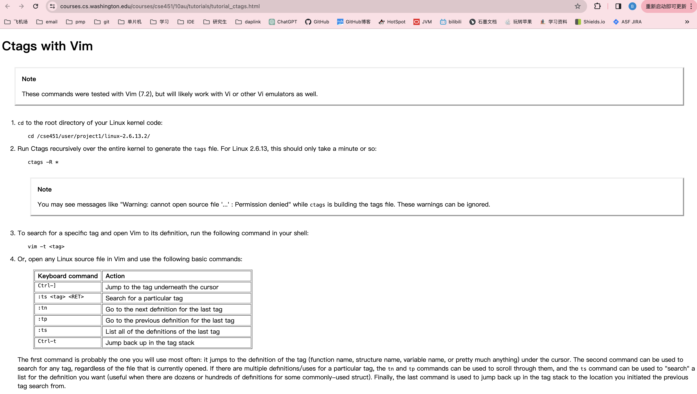

尤其是ssh远程服务器的时候，只能用vim，或者说用vim是较优选择。此时，就要让vim支持函数跳转。

1 安装ctags
---

### 1.1 mac

```shell
brew search ctags

brew install ctags
```

### 1.2 archlinux

```shell
yay -Ss ctags

yay -Syy ctags
```

2 使用ctags
---



### 2.1 生成ctag文件

在项目根目录下执行`ctags -R .`

### 2.2 跳转

实际中高频使用就2个

- ctrl+] 跳转到定义处

- ctrl+t 跳回到前一个地方