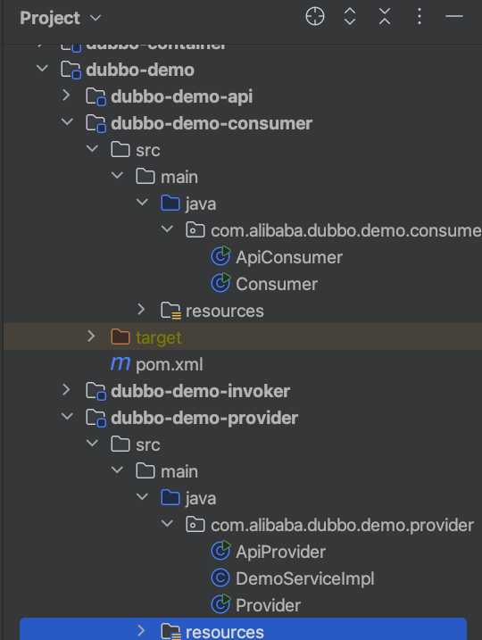

### 1 源码

```sh
git clone git@github.com:Bannirui/dubbo.git
cd dubbo
git remote add upstream git@github.com:apache/dubbo.git
git remote set-url --push upstream no_push
git remote -v
git checkout -b study-2.6.x origin/study-2.6.x
```

### 2 编译

改一下工程目录下的pom配置

```xml
        <java_source_version>1.8</java_source_version>
        <java_target_version>1.8</java_target_version>
```

### 3 调试


源码工程里面有Demo可以直接用来调试

- ApiProvider
- ApiConsumer