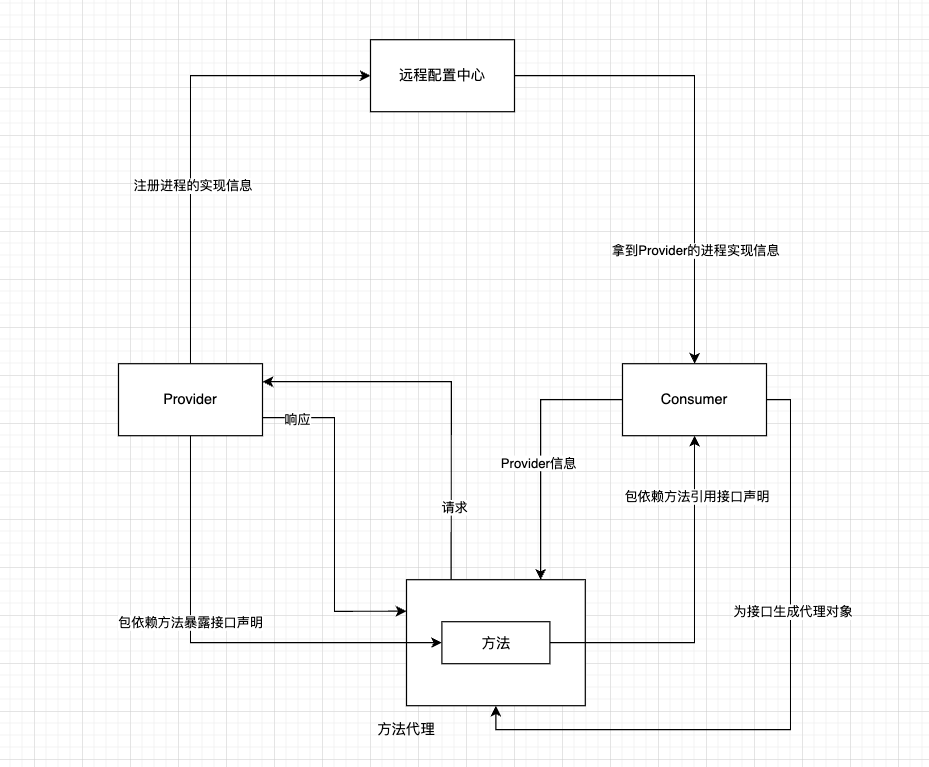

在正式学习源码实现之前首先要明确目的，目的性越强，收益越高。我主要是为了看看典型的RPC实现方式，以后有机会二开的时候能够快速上手。

产且，几乎所有成熟解决方案的代码量都是庞杂的，所以在阅读之前最好有个主线，不然迷失在各个脉络之中很容易崩溃，事倍功半。

大胆的想象，如果自己来做这个产品会怎样下手，即使想错了，在后面实际阅读中会纠正观点；如果恰好跟作者想的一样，观点也会得到印证。上面的图是我认为实现一RPC需要关注的功能点，下面我也就差不多按照这个顺序去探寻源码，过程中有展开的再细化添加

- [X] 想看注册中心的话
- [X] Provider怎么向注册中心登记自身信息
- [X] Consumer怎么从注册中心订阅
- [X] Consumer创建网络层代理跟Provider通信
- [X] Consumer怎么解决无感调用
- [X] dubbo中核心 也是被滥用的SPI