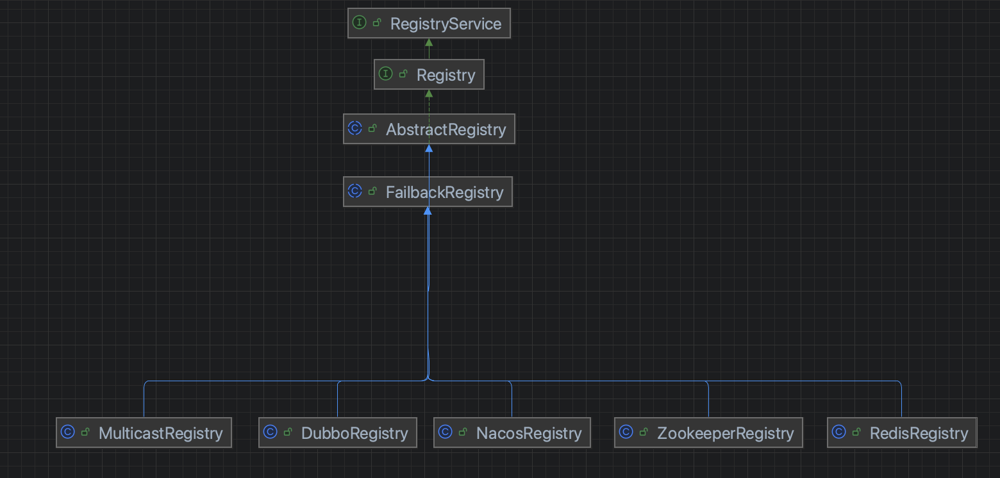
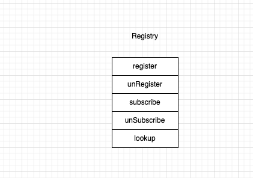
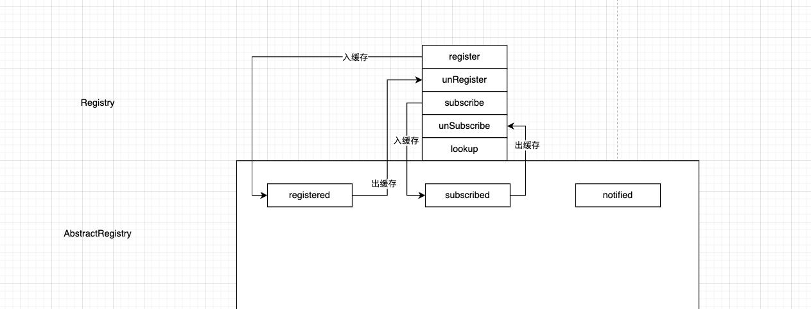
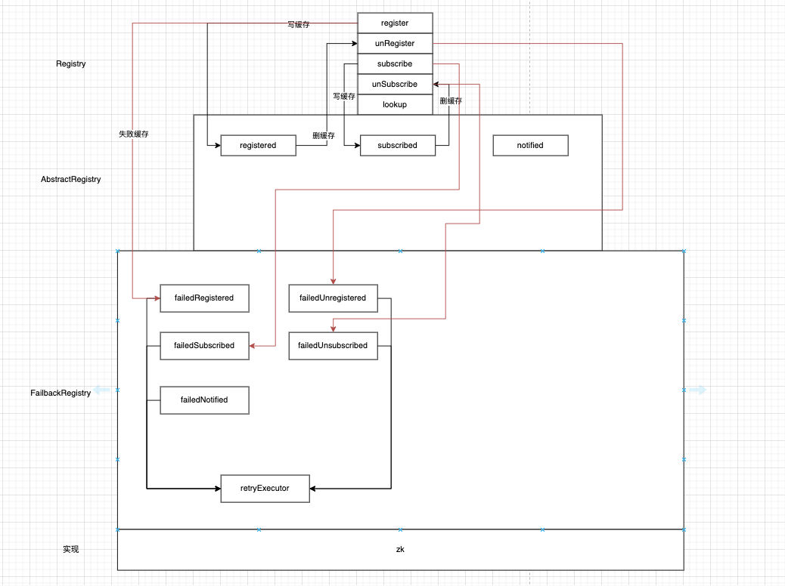

为什么要先看注册中心，因为从可以看到Provider和Consumer都要跟注册中心交互，换言之先研究注册中心可以弄清楚交互枢纽以及弄明白到底注册了服务的什么维度信息。



从类图很清晰看出来这是模板方法，对于使用了模板方法的设计模式的就是在基类中看共性特征，在子类中看个性化实现。

### 1 注册中心定义



注册中心的抽象很简单，因为它的使用方有两类，Provider和Consumer，所以API声明了两类。

- 注册
- 注销
- 订阅
- 取消订阅

### 2 服务的本地缓存



#### 2.1 registered缓存

```java
    /**
     * 写到缓存{@link AbstractRegistry#registered}
     */
    @Override
    public void register(URL url) {
        if (url == null) {
            throw new IllegalArgumentException("register url == null");
        }
        if (logger.isInfoEnabled()) {
            logger.info("Register: " + url);
        }
        // 入缓存
        registered.add(url);
    }
```

```java
    /**
     * 从缓存{@link AbstractRegistry#registered}中移除
     */
    @Override
    public void unregister(URL url) {
        if (url == null) {
            throw new IllegalArgumentException("unregister url == null");
        }
        if (logger.isInfoEnabled()) {
            logger.info("Unregister: " + url);
        }
        // 移除缓存
        registered.remove(url);
    }
```

#### 2.2 subscribed缓存

```java
    /**
     * 写到缓存{@link AbstractRegistry#subscribed}
     */
    @Override
    public void subscribe(URL url, NotifyListener listener) {
        if (url == null) {
            throw new IllegalArgumentException("subscribe url == null");
        }
        if (listener == null) {
            throw new IllegalArgumentException("subscribe listener == null");
        }
        if (logger.isInfoEnabled()) {
            logger.info("Subscribe: " + url);
        }
        Set<NotifyListener> listeners = subscribed.get(url);
        if (listeners == null) {
            // 入缓存
            subscribed.putIfAbsent(url, new ConcurrentHashSet<NotifyListener>());
            listeners = subscribed.get(url);
        }
        listeners.add(listener);
    }
```

```java
    /**
     * 从缓存{@link AbstractRegistry#subscribed}中移除
     */
    @Override
    public void unsubscribe(URL url, NotifyListener listener) {
        if (url == null) {
            throw new IllegalArgumentException("unsubscribe url == null");
        }
        if (listener == null) {
            throw new IllegalArgumentException("unsubscribe listener == null");
        }
        if (logger.isInfoEnabled()) {
            logger.info("Unsubscribe: " + url);
        }
        Set<NotifyListener> listeners = subscribed.get(url);
        if (listeners != null) {
            // 删除缓存
            listeners.remove(listener);
        }
    }
```

### 3 容错机制

注册中心可能面临的问题

- 网络不可用
- 注册中心重启
- 注册中心读写请求过大

面对这种情况，一般都会设计一些失败补偿机制，FailbackRegistry在AbstractRegistry的基础上扩展了失败后的安全重试。

实现方式就是定时任务扫描，将处理失败的请求缓存下来，定时任务周期性扫描缓存，将请求拿出来重新处理。

```java
    public FailbackRegistry(URL url) {
        super(url);
        this.retryPeriod = url.getParameter(Constants.REGISTRY_RETRY_PERIOD_KEY, Constants.DEFAULT_REGISTRY_RETRY_PERIOD);
        // 构造方法启动线程池启动定时任务去对失败的请求进行安全地补偿
        this.retryFuture = retryExecutor.scheduleWithFixedDelay(new Runnable() {
            @Override
            public void run() {
                // Check and connect to the registry
                try {
                    retry();
                } catch (Throwable t) { // Defensive fault tolerance
                    logger.error("Unexpected error occur at failed retry, cause: " + t.getMessage(), t);
                }
            }
        }, retryPeriod, retryPeriod, TimeUnit.MILLISECONDS);
    }
```

目前为止，注册中心如图，具体的实现只要看一种就行，下面我就会看借助zk的实现

