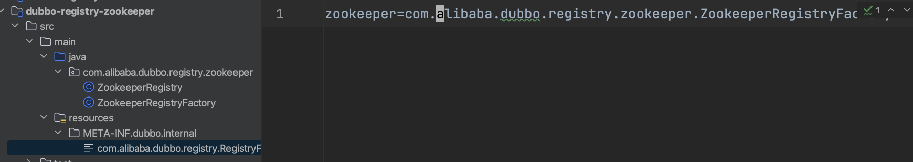
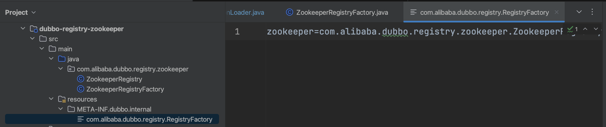

说实话我现在是不喜欢这种运行时扩展机制的，看似有很多选择很灵活，但其实只给一种选择在很多场景就是最优方案。但是没办法，SPI在dubbo中还真就绕不开。

已经介绍了URL，URL中承载了很多的配置信息，运行时根据URL中携带的配置参数选择对应的实现。

以zk的注册中心实现为例，看看怎么暴露出去，将来在应用中使用



- ZookeeperRegistry由ZookeeperRegistryFactory负责创建
- 在约定的配置文件中配置上ZookeeperRegistryFactory
  - 键是zookeeper，仅仅是给实现起的一个名字而已，不要跟其他实现重用就行
  - 值是实现的全限定类名
- ExtensionLoader拿着键去找对应实现的实例

dubbo的SPI实现机制都在ExtensionLoader中，从实现机制上来看，运行时实现可以分为

- 手动 自定义实现，打上Adaptive注解标识
- 自动 交给dubbo，dubbo通过SPI注解和Adaptive注解的组合创建代理，最终在URL的参数中拿到真正的实现别名

### 1 手动方式

这种肯定是不会存在的，如果使用这种方式就有悖于运行时动态获取实现了，相当于静态编码，所以压根不用看。

### 2 自动方式

```java
                /**
                 * dubbo的SPI核心 本质就是给要实现的方法套个代理方法 真正的实现在运行时候让代理去找
                 * 而代理方法就是在找实现的别名extName
                 * 比如
                 * RegistryFactory extension = (RegistryFactory)ExtensionLoader.getExtensionLoader(RegistryFactory.class).getExtension(zookeeper);
                 * return extension.当前的代理的这个方法;
                 */
                s = String.format("\n%s extension = (%<s)%s.getExtensionLoader(%s.class).getExtension(extName);",
                        type.getName(), ExtensionLoader.class.getSimpleName(), type.getName());
                code.append(s);
                // return statement
                if (!rt.equals(void.class)) {
                    code.append("\nreturn ");
                }

                s = String.format("extension.%s(", method.getName());
                code.append(s);
                for (int i = 0; i < pts.length; i++) {
                    if (i != 0)
                        code.append(", ");
                    code.append("arg").append(i);
                }
                code.append(");");
```

核心就是dubbo会先创建个代理对象，至于真正的实现对象，再通过SPI去找`extName`对应的真正实现

还是用`RegistryFactory`为例

#### 2.1 RegistryFactory接口

```java
@SPI("dubbo")
public interface RegistryFactory {
    @Adaptive({"protocol"})
    Registry getRegistry(URL url);
}
```

#### 2.2 ZookeeperRegistyFactory

写上配置文件，让dubbo的SPI可以扫描到



#### 2.3 dubbo创建代理类

会尝试从URL中找`protocol`对应的配置，没找到就用dubbo作为实现别名，在运行的时候用SPI去加载这个别名的真正的实现

#### 2.4 扫描配置好的实现

```java
    /**
     * <ul>
     *     <li>classpath:META-INF/dubbo/internal/</li>
     *     <li>classpath:META-INF/dubbo/</li>
     *     <li>classpath:META-INF/services/</li>
     * </ul>
     * 在配置目录下根据{@link ExtensionLoader#type}接口的全限定路径名找到具体的配置文件
     * 在配置文件中找到配置的实现缓存到合适的位置
     * <ul>
     *     <li>实现类上打了{@link Adaptive}注解的缓存在{@link ExtensionLoader#cachedAdaptiveClass}</li>
     *     <li>实现类有构造方法 参数类型是{@link ExtensionLoader#type} 这种实现类缓存在{@link ExtensionLoader#cachedWrapperClasses}</li>
     *     <li>除此之外的缓存在extensionClasses这个hash表</li>
     * </ul>
     * @return 配置文件中配置的常规的实现
     *         <ul>
     *             <li>key 实现的别名</li>
     *             <li>val 实现的实例</li>
     *         </ul>
     */
    private Map<String, Class<?>> loadExtensionClasses() {
        /**
         * 接口上打的{@link SPI}注解 用为作为实现别名的默认别名
         * 要是没用{@link Adaptive}指定从{@link URL}中解析参数作为别名 就用默认的别名找实现
         */
        final SPI defaultAnnotation = type.getAnnotation(SPI.class);
        if (defaultAnnotation != null) {
            String value = defaultAnnotation.value();
            if ((value = value.trim()).length() > 0) {
                String[] names = NAME_SEPARATOR.split(value);
                if (names.length > 1)
                    throw new IllegalStateException("more than 1 default extension name on extension " + type.getName() + ": " + Arrays.toString(names));
                if (names.length == 1) this.cachedDefaultName = names[0];
            }
        }

        /**
         * 缓存着接口的所有实现
         * <ul>
         *     <li>key=实现的别名</li>
         *     <li>val=实现的实例</li>
         * </ul>
         */
        Map<String, Class<?>> extensionClasses = new HashMap<String, Class<?>>();
        /**
         * 3个目录
         * <ul>
         *     <li>classpath:META-INF/dubbo/internal/</li>
         *     <li>classpath:META-INF/dubbo/</li>
         *     <li>classpath:META-INF/services/</li>
         * </ul>
         * 在配置目录下根据{@link ExtensionLoader#type}接口的全限定路径名找到具体的配置文件
         * 在配置文件中找到配置的实现缓存到合适的位置
         * <ul>
         *     <li>实现类上打了{@link Adaptive}注解的缓存在{@link ExtensionLoader#cachedAdaptiveClass}</li>
         *     <li>实现类有构造方法 参数类型是{@link ExtensionLoader#type} 这种实现类缓存在{@link ExtensionLoader#cachedWrapperClasses}</li>
         *     <li>除此之外的缓存在extensionClasses这个hash表</li>
         * </ul>
         */
        this.loadDirectory(extensionClasses, DUBBO_INTERNAL_DIRECTORY);
        this.loadDirectory(extensionClasses, DUBBO_DIRECTORY);
        this.loadDirectory(extensionClasses, SERVICES_DIRECTORY);
        return extensionClasses;
    }
```

#### 2.5 反射创建实例

```java
        Class<?> clazz = this.getExtensionClasses().get(name);
        if (clazz == null) throw findException(name);
        try {
            T instance = (T) EXTENSION_INSTANCES.get(clazz);
            if (instance == null) {
                // 反射创建实现的实例对象
                EXTENSION_INSTANCES.putIfAbsent(clazz, clazz.newInstance());
                instance = (T) EXTENSION_INSTANCES.get(clazz);
```

### 3 总结服务发现的策略

- 自己写个实现类打上`@Adaptive`注解，SPI退化
- 接口上打`@SPI`注解指定默认别名，方法打上`@Adaptive`注解
  - 没指定别名 -> 解析接口名，比如MyInterfaceName就被解析成my.interface.name
    - protocol特殊处理，直接url.getProtocol()拿到别名，再拿着别名去找实现
    - 其他的用url.getParameter(xxx)拿到别名，再拿着别名去找实现
  - 指定了key -> 用这个key去`url.getParamter(key)`作别名去找实现，没找到再用`@SPI`注解指定的别名去找