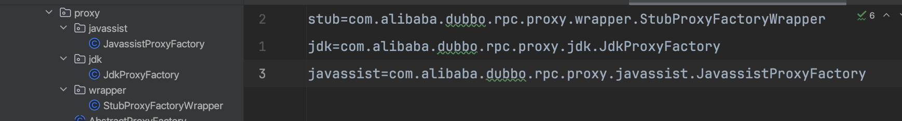

里面提及到dubbo在处理运行时动态发现的本质就是创建了代理，SPI在dubbo中的使用程度我个人评价是滥用，也就意味着代理和反射遍地都是。

在中就预料到至少在端到端的两头都是有代理的。

今天就看下dubbo对服务提供者和消费者的代理方式。

```java
@SPI("javassist")
public interface ProxyFactory {

    @Adaptive({Constants.PROXY_KEY})
    <T> T getProxy(Invoker<T> invoker) throws RpcException;

    @Adaptive({Constants.PROXY_KEY})
    <T> T getProxy(Invoker<T> invoker, boolean generic) throws RpcException;

    @Adaptive({Constants.PROXY_KEY})
    <T> Invoker<T> getInvoker(T proxy, Class<T> type, URL url) throws RpcException;
}
```

通常，代理就是对真正执行逻辑的代理，也就是proxy。dubbo一方面要跟注册中心通信，另一方面要彼此通信，还要考虑集群负载以及失败重试等等细节。所以dubbo在现有的proxy基础上又套了一层代理，就是invoker。

- 在框架层面的交互用的是invoker 
- 在本地交互就把执行权下放到proxy
- proxy再把执行逻辑委托给真正的实现

### 1 ProxyFactory的实现方式



搭配这个接口是通过SPI实现的动态发现，并且`StubProxyFactoryWrapper`的构造方法的参数类型是`ProxyFactory`所以它是wrapper

默认情况下

- ProxyFactory的实现是stub
- stub是wrapper，会持有javassist的实现
- 也就是说真正的实现方式就是`JavassistProxyFactory`

这里面的核心是反射，关于反射请看

### 2 jdk方式
```java
    public <T> Invoker<T> getInvoker(T proxy, Class<T> type, URL url) {
        // jdk的反射执行
        return new AbstractProxyInvoker<T>(proxy, type, url) {
            @Override
            protected Object doInvoke(T proxy, String methodName,
                                      Class<?>[] parameterTypes,
                                      Object[] arguments) throws Throwable {
                Method method = proxy.getClass().getMethod(methodName, parameterTypes); // Java反射调用目标对象的方法
                return method.invoke(proxy, arguments);
            }
        };
    }
```

### 3 javassist方式
```java
    public <T> Invoker<T> getInvoker(T proxy, Class<T> type, URL url) {
        // TODO Wrapper cannot handle this scenario correctly: the classname contains '$'
        /**
         * 编码方式创建代理对象
         * 为什么会判断$ 因为{@link com.alibaba.dubbo.common.extension.SPI}机制会创建默认的代理类 在{@link com.alibaba.dubbo.common.extension.ExtensionLoader}中能看到dubbo生成的Adaptive类命名方式
         * 接口名+$Adaptive
         * <ul>
         *     <li>所以这个地方发现已经是代理类了就对代理类再包一层代理</li>
         *     <li>不是代理类就直接对接口操作 基于接口创建代理</li>
         * </ul>
         */
        final Wrapper wrapper = Wrapper.getWrapper(proxy.getClass().getName().indexOf('$') < 0 ? proxy.getClass() : type);
        /**
         * 创建一个{@link Invoker}对象 典型的模板方法
         * 最终客户端拿到了{@link Invoker}实例调用{@link Invoker#invoke}会执行到这个匿名类对象的{@link AbstractProxyInvoker#doInvoke}方法
         * 而真正的执行逻辑又会委派给{@link Wrapper}执行
         */
        return new AbstractProxyInvoker<T>(proxy, type, url) {
            @Override
            protected Object doInvoke(T proxy, String methodName,
                                      Class<?>[] parameterTypes,
                                      Object[] arguments) throws Throwable {
                return wrapper.invokeMethod(proxy, methodName, parameterTypes, arguments); // 通过代理对象执行目标对象的方法
            }
        };
    }
```