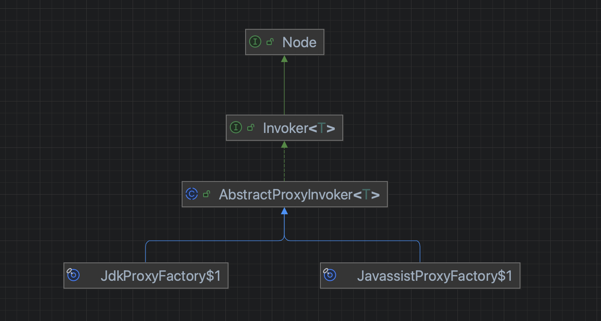

换言之dubbo在反射上用了两个机制
- 一个是jdk的反射
- 一个是字节码技术的反射

单从这个点而言，又可以看出来dubbo的偏好真的是为了动态而动态，正常人在二者之间肯定选字节码方式，所以为什么要提供选择而不是直接提供好最优方案呢。

### 1 jdk的反射

```java
                Method method = proxy.getClass().getMethod(methodName, parameterTypes); // Java反射调用目标对象的方法
                return method.invoke(proxy, arguments);
```

### 2 编码技术

先创建个代理类，提供`invokeMethod`方法

```java
        /**
         * 核心方法 构造代理方法
         * <ul>
         *     <li>o 要代理的对象</li>
         *     <li>n 要代理的方法</li>
         *     <li>p 要代理的方法n的形参类型</li>
         *     <li>v 要代理的方法n的实参</li>
         * </ul>
         */
        StringBuilder c3 = new StringBuilder("public Object invokeMethod(Object o, String n, Class[] p, Object[] v) throws " + InvocationTargetException.class.getName() + "{ ");
```

当调用方调用代对象的`invokeMethod`方法后，代理类会将请求转发给真正的目标对象

```java
                return wrapper.invokeMethod(proxy, methodName, parameterTypes, arguments); // 通过代理对象执行目标对象的方法
```