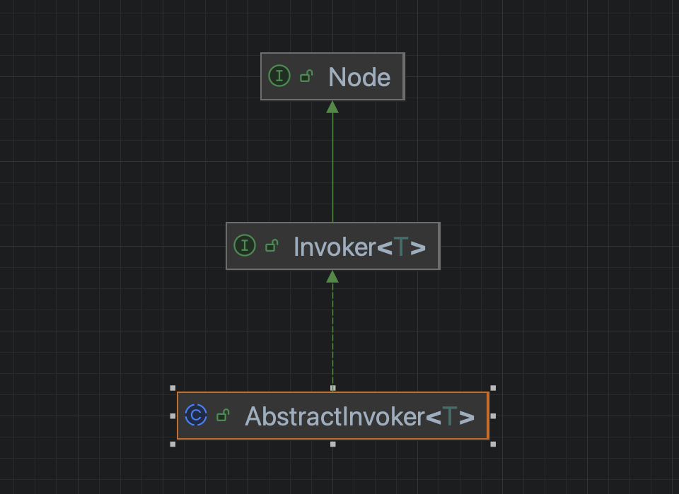

在中讲过dubbo层面的交互单元或者载体是`Invoker`，那么它是什么呢



本质而言它的存在主要目的是为了在代理对象和客户端之间增加一层屏蔽掉代理方式的差异。

### 1 在javassist代理中使用
```java
        /**
         * 创建一个{@link Invoker}对象 典型的模板方法
         * 最终客户端拿到了{@link Invoker}实例调用{@link Invoker#invoke}会执行到这个匿名类对象的{@link AbstractProxyInvoker#doInvoke}方法
         * 而真正的执行逻辑又会委派给{@link Wrapper}执行
         */
        return new AbstractProxyInvoker<T>(proxy, type, url) {
            @Override
            protected Object doInvoke(T proxy, String methodName,
                                      Class<?>[] parameterTypes,
                                      Object[] arguments) throws Throwable {
                return wrapper.invokeMethod(proxy, methodName, parameterTypes, arguments); // 通过代理对象执行目标对象的方法
            }
        };
```

### 2 在jdk代理使用
```java
        return new AbstractProxyInvoker<T>(proxy, type, url) {
            @Override
            protected Object doInvoke(T proxy, String methodName,
                                      Class<?>[] parameterTypes,
                                      Object[] arguments) throws Throwable {
                Method method = proxy.getClass().getMethod(methodName, parameterTypes); // Java反射调用目标对象的方法
                return method.invoke(proxy, arguments);
            }
        };
```

jdk的反射没啥可看的，javassist的字节码方式可以看