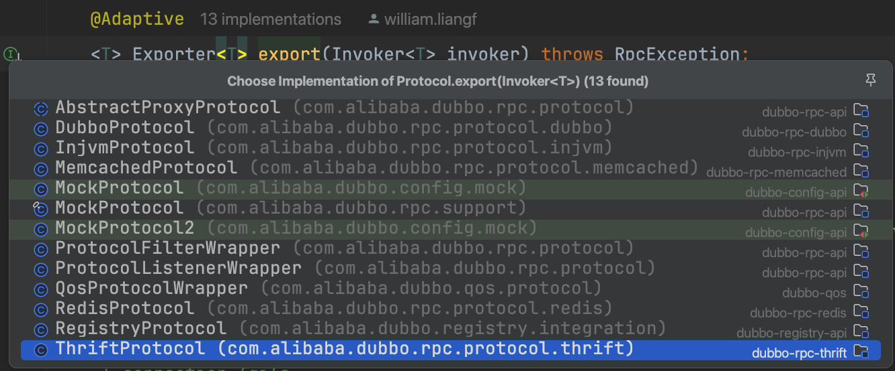
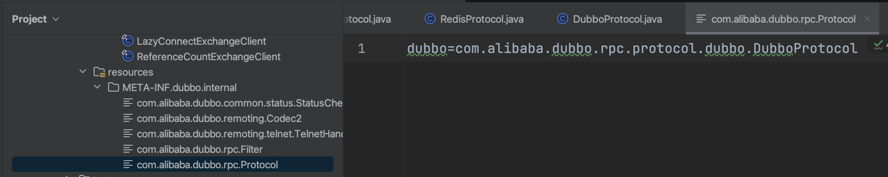

就我自己的理解，服务提供方和服务消费方的通信，不管是不是在同一台机器，本质都是两进程通信

进程通信的常用方法无非就是
- 共享内存
- 网络通信
  - 本地unix局域网
  - 远程网络

作为一个rpc框架，如果我认为http协议足够我应该就选用http就好了吧，我认为http协议太重，那么我就在tcp传输层基础上包装个专门的协议。

看到Protocol的基类我就感觉头晕目眩了，当然了就看默认基于netty的dubbo实现就行了

### 1 Protocol的动态

```java
    private static final Protocol protocol = ExtensionLoader.getExtensionLoader(Protocol.class).getAdaptiveExtension();

    /**
    * 这个地方的protocol是谁的实例
    * {@link Protocol}接口方法用了{@link com.alibaba.dubbo.common.extension.Adaptive}却没有指定别名
    * 那么就先用{@link Protocol}接口名protocol作为别名也找不到对应的实现
    * 最后用接口类上{@link com.alibaba.dubbo.common.extension.SPI}注解指定的dubbo作为别名找到{@link DubboProtocol}这个实现
    */
    Exporter<?> exporter = protocol.export(wrapperInvoker);
```

在dubbo中看到这种就要找对就的运行时实现是什么

Protocol接口类
- export方法用了@Adaptive注解，没指定url中key
- 类用了@SPI("dubbo")注解

所以运行时候就会
- 去wrapperInvoker中`getUrl`
- protocol特殊处理通过`url.getProtocol()`方法拿到的结果作别名是registry
- 用registry作为实现的别名用ExtensionLoader去找到对应的类反射出来实现就是RegistryProtocol

### 2 RegistryProtocol


它相当于是装饰器，并没有什么实质性逻辑，要做的事情有两个

- 在本地开放端口服务
- 把自身服务信息写到远程注册中心

#### 2.1 开放服务

```java
        /**
         * 调用{@link DubboProtocol}利用netty开放端口服务
         */
        final ExporterChangeableWrapper<T> exporter = this.doLocalExport(originInvoker);
```

#### 2.2 写注册中心

```java
            /**
             * 注册到远程注册中心 把什么注册到注册中心呢
             * 服务信息写到注册中心的目的是跟服务消费者共享自身连接信息 让其他人可以连接到自己
             * 所以服务提供者一定会将自己的下面几个信息暴露出去
             * <ul>
             *     <li>自己的服务端口 本机ip:port</li>
             *     <li>自己的服务接口</li>
             * </ul>
             * <ul>
             *     <li>zookeeper://localhost:2181/com.alibaba.dubbo.registry.RegistryService?application=native-provider&dubbo=2.0.2&export=dubbo%3A%2F%2F10.10.132.185%3A20880%2Fcom.alibaba.dubbo.demo.DemoService%3Fanyhost%3Dtrue%26application%3Dnative-provider%26bind.ip%3D10.10.132.185%26bind.port%3D20880%26dubbo%3D2.0.2%26generic%3Dfalse%26interface%3Dcom.alibaba.dubbo.demo.DemoService%26methods%3DsayHello%26pid%3D95899%26qos.port%3D22222%26side%3Dprovider%26timestamp%3D1669364001492&pid=95899&qos.port=22222&timestamp=1669364001477</li>
             *     <li>dubbo://10.10.132.185:20880/com.alibaba.dubbo.demo.DemoService?anyhost=true&application=native-provider&dubbo=2.0.2&generic=false&interface=com.alibaba.dubbo.demo.DemoService&methods=sayHello&pid=95899&side=provider&timestamp=1669364001492</li>
             * </ul>
             */
            this.register(registryUrl, registeredProviderUrl);
```

### 3 DubboProtocol在本机开放端口服务



这个就是配置给SPI去发现加载的，那么怎么加载到，前面讲过，SPI发现全靠URL的配置，所以可以看到dubbo在遍地复制URL，目的就是为了做动态发现

#### 3.1 改URL的协议为dubbo为了加载出DubboProtocol

```java
                    // 复制url协议从registry换成dubbo 放到invoker里面
                    final Invoker<?> invokerDelegete = new InvokerDelegete<T>(originInvoker, getProviderUrl(originInvoker));
                    /**
                     * 上面这一行代码的目的就是为了
                     * protocol.export(invoker)执行时候从invoker.getUrl()拿到的url的url.getProtocol()返回的是dubbo
                     * 这样就可以{@link DubboProtocol#export()}
                     */
                    exporter = new ExporterChangeableWrapper<T>((Exporter<T>) protocol.export(invokerDelegete), originInvoker);
```

#### 3.2 启动netty

加载出DubboProtocol后，后面又是一顿封装，兜兜转转最终终于见到了熟悉的netty

```java
    /**
     *
     * @param url dubbo://192.168.0.11:20880/com.alibaba.dubbo.demo.DemoService?anyhost=true&application=native-provider&bind.ip=192.168.0.11&bind.port=20880&channel.readonly.sent=true&codec=dubbo&dubbo=2.0.2&generic=false&heartbeat=60000&interface=com.alibaba.dubbo.demo.DemoService&methods=sayHello&pid=36435&qos.port=22222&side=provider&timestamp=1669555941396
     */
    @Override
    public Server bind(URL url, ChannelHandler listener) throws RemotingException {
        return new NettyServer(url, listener);
    }
```

### 4 自身服务信息写到注册中心

上面服务提供者已经在本地开启了网络服务，这个时候就坐等别人来连接，这个别人是谁，是dubbo封装的服务消费方的代理请求。所以这个时候提供方要把自身服务信息暴露到注册中心去。

```java
    /**
     * 把提供的服务信息写到注册中心去
     * @param registryUrl 注册中心的地址
     *                    比如zookeeper://localhost:2181/com.alibaba.dubbo.registry.RegistryService?application=native-provider&dubbo=2.0.2&export=dubbo%3A%2F%2F10.10.132.185%3A20880%2Fcom.alibaba.dubbo.demo.DemoService%3Fanyhost%3Dtrue%26application%3Dnative-provider%26bind.ip%3D10.10.132.185%26bind.port%3D20880%26dubbo%3D2.0.2%26generic%3Dfalse%26interface%3Dcom.alibaba.dubbo.demo.DemoService%26methods%3DsayHello%26pid%3D95948%26qos.port%3D22222%26side%3Dprovider%26timestamp%3D1669364071921&pid=95948&qos.port=22222&timestamp=1669364071907
     * @param registedProviderUrl 本地开放的端口服务
     *                            dubbo://10.10.132.185:20880/com.alibaba.dubbo.demo.DemoService?anyhost=true&application=native-provider&dubbo=2.0.2&generic=false&interface=com.alibaba.dubbo.demo.DemoService&methods=sayHello&pid=95948&side=provider&timestamp=1669364071921
     */
    public void register(URL registryUrl, URL registedProviderUrl) {
        /**
         * {@link RegistryFactory#getRegistry(URL)}这个方法的SPI方式是用protocol取url的配置
         * 因为protocol特殊 所以调用{@link URL#getProtocol()}拿到结果是zookeeper
         * SPI会去找别名是zookeeper的{@link ZookeeperRegistry}
         */
        Registry registry = registryFactory.getRegistry(registryUrl);
        /**
         * 不同注册中心实现关注各自的读写
         * <ul>
         *     <li>zookeeper {@link ZookeeperRegistry}实现zk的注册中心</li>
         * </ul>
         */
        registry.register(registedProviderUrl);
    }
```

具体用哪个注册中心看

### 5 