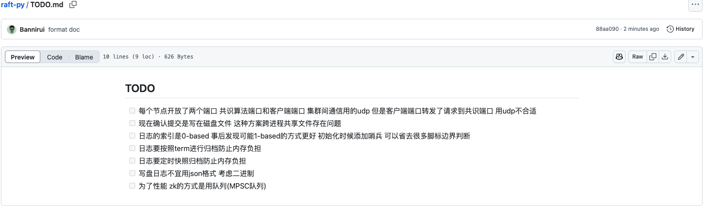
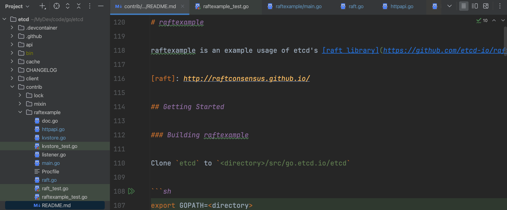

还是老生常谈，为什么读源码和怎么读，其实第一个问题的答案就是第二个问题的方法，漫步目的的遨游方式可以，但是收效甚微。

在[raft-py todo](https://github.com/Bannirui/raft-py/blob/master/TODO.md)中留的todo，其实就是我想在etcd中找的答案。

况且etcd本身作为中坚技术，项目复杂度肯定很高，直接从头到尾啃完也不现实。恰好我在源码里面看到了对raft最小实现的demo，管中窥豹即可，就从它入手。

我会带着下面的问题，每找到对应的解决方案就附上对应的链接

- [X] 每个节点开放了两个端口 共识算法端口和客户端端口 集群间通信用的udp 但是客户端端口转发了请求到共识端口 用udp不合适 
- [X] 现在确认提交是写在磁盘文件 这种方案跨进程共享文件存在问题 
- [ ] 日志的索引是0-based 事后发现可能1-based的方式更好 初始化时候添加哨兵 可以省去很多脚标边界判断
- [ ] 日志要按照term进行归档防止内存负担
- [ ] 日志要定时快照归档防止内存负担
- [ ] 写盘日志不宜用json格式 考虑二进制
- [X] 为了性能 zk的方式是用队列(MPSC队列) 