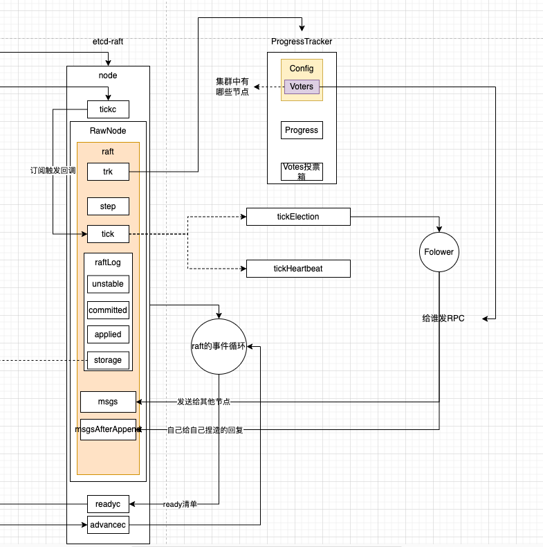

要结合，先熟悉数据怎么交互的

假使系统启动的时候已经有WAL或者snap日志，系统会从WAL日志进行恢复启动。但是总归会存在一种场景是系统首次启动的时候，没有任何历史遗留的数据，这种时候就需要特殊处理。

在`raftexample/raft.go`中

```go 
	// 这个地方为什么要设计成这样 因为选主拉票流程需要依赖有Voters 所以这个地方手动让raft感知到Voters是谁
	if oldwal || rc.join {
		rc.node = raft.RestartNode(c)
	} else {
		// 人为模拟AppendEntries和ApplyConfChange 目的是让raft#trk#Config#Voters里面有整个集群的节点信息 后面Leader心跳定时到期后Follower升级成Candidate发送竞选Leader消息才知道发给谁
		rc.node = raft.StartNode(c, rpeers)
	}
```

至于手动准备的Voters怎么使用的就看

### 1 手动AppendEntries

```go
// 方法的名称可能有误导 并不是真正的启动节点
// raft是典型的EDA架构 log entry就是线程事件循环的事件源
// 在系统最开始启动时 磁盘上是干净的 没有任何log entry 所以这个地方仅仅在给启动做准备工作
// 人为构建LogEntry 模拟AppendEntries和applyConfChange的流程 让raft节点的Voters能感知到整个集群的配置
// 1 初始化节点角色是Follower 等心跳超时事件进来 发现自己是Follower 触发选主
// 2 造LogEntry 复位Voters 在选主流程中要用到
func (rn *RawNode) Bootstrap(peers []Peer) error {
	if len(peers) == 0 {
		return errors.New("must provide at least one peer to Bootstrap")
	}
	// 在初始化storage的时候会默认放上一个哨兵 它的index=0 这个地方拿到的lastIndex=0 语义是在storage#ents中最后一条数据的index
	lastIndex, err := rn.raft.raftLog.storage.LastIndex()
	if err != nil {
		return err
	}

	if lastIndex != 0 {
		// 这个地方为什么要这样校验呢 因为能调用这个方法的地方只有一个 就是raft启动时候节点机器是干净的 没有snap 也没有wal 需要手工造日志entry 让后面的选主流程能走下去
		return errors.New("can't bootstrap a nonempty Storage")
	}

	// We've faked out initial entries above, but nothing has been
	// persisted. Start with an empty HardState (thus the first Ready will
	// emit a HardState update for the app to persist).
	rn.prevHardSt = emptyState

	// TODO(tbg): remove StartNode and give the application the right tools to
	// bootstrap the initial membership in a cleaner way.
	// 角色初始化为Follower 为什么是Follower 因为心跳超时事件后发现自己是Follower就会触发选主
	rn.raft.becomeFollower(1, None)
	// 集群的配置 模拟成RPC 既然是模拟 这个地方就假装收到了Leader的AppendEntries就行
	// 下面就模拟收到AppendEntries的候选流程先放到unstable中 因为是模拟的 所以并不需要对这些模拟的RPC进行回复 直接commit然后应用到raft状态机
	ents := make([]pb.Entry, len(peers))
	for i, peer := range peers {
		cc := pb.ConfChange{Type: pb.ConfChangeAddNode, NodeID: peer.ID, Context: peer.Context}
		data, err := cc.Marshal()
		if err != nil {
			return err
		}

		ents[i] = pb.Entry{Type: pb.EntryConfChange, Term: 1, Index: uint64(i + 1), Data: data}
	}
	// 缓存到unstable中
	rn.raft.raftLog.append(ents...)

	// Now apply them, mainly so that the application can call Campaign
	// immediately after StartNode in tests. Note that these nodes will
	// be added to raft twice: here and when the application's Ready
	// loop calls ApplyConfChange. The calls to addNode must come after
	// all calls to raftLog.append so progress.next is set after these
	// bootstrapping entries (it is an error if we try to append these
	// entries since they have already been committed).
	// We do not set raftLog.applied so the application will be able
	// to observe all conf changes via Ready.CommittedEntries.
	//
	// TODO(bdarnell): These entries are still unstable; do we need to preserve
	// the invariant that committed < unstable?
	// 模拟这些日志被集群大多数节点认可 也就是直接commit就行
	rn.raft.raftLog.committed = uint64(len(ents))
	for _, peer := range peers {
		// 应用到状态机 这边就会轮询把集群中节点都加到Voters中
		rn.raft.applyConfChange(pb.ConfChange{NodeID: peer.ID, Type: pb.ConfChangeAddNode}.AsV2())
	}
	return nil
}
```

### 2 raft处理ConfChangeAddNode消息

```go
// ConfChangeAddNode类型的消息已经被raft执行完 unstable->commit
// 现在要把应用到raft状态机
// raft#trk会根据类型ConfChangeAddNode把集群节点id加到raft#trk#Config#Voters中
func (r *raft) applyConfChange(cc pb.ConfChangeV2) pb.ConfState {
	// 匿名函数
	cfg, trk, err := func() (tracker.Config, tracker.ProgressMap, error) {
		changer := confchange.Changer{
			Tracker:   r.trk,
			LastIndex: r.raftLog.lastIndex(),
		}
		if cc.LeaveJoint() {
			return changer.LeaveJoint()
		} else if autoLeave, ok := cc.EnterJoint(); ok {
			// 把集群节点id加到Voters
			return changer.EnterJoint(autoLeave, cc.Changes...)
		}
		return changer.Simple(cc.Changes...)
	}()

	if err != nil {
		// TODO(tbg): return the error to the caller.
		panic(err)
	}

	return r.switchToConfig(cfg, trk)
}
```

### 3 集群节点加到Voters中

```go
// raft#trk#Config#Voters中维护着集群节点 每个raft节点可以通过这个Voters知道谁跟自己在同一个集群 发送拉票请求的时候知道可以向谁发起拉票
func (c Changer) makeVoter(cfg *tracker.Config, trk tracker.ProgressMap, id uint64) {
	pr := trk[id]
	if pr == nil {
		c.initProgress(cfg, trk, id, false /* isLearner */)
		return
	}

	pr.IsLearner = false
	nilAwareDelete(&cfg.Learners, id)
	nilAwareDelete(&cfg.LearnersNext, id)
	incoming(cfg.Voters)[id] = struct{}{}
}
```

最终会执行到`initProgress`方法中

```go
		// 把id加到了Voters中
		incoming(cfg.Voters)[id] = struct{}{}
```

至此raft就知道谁跟自己同处一个集群了，后面发生了竞选Leader也知道可以向谁拉票

