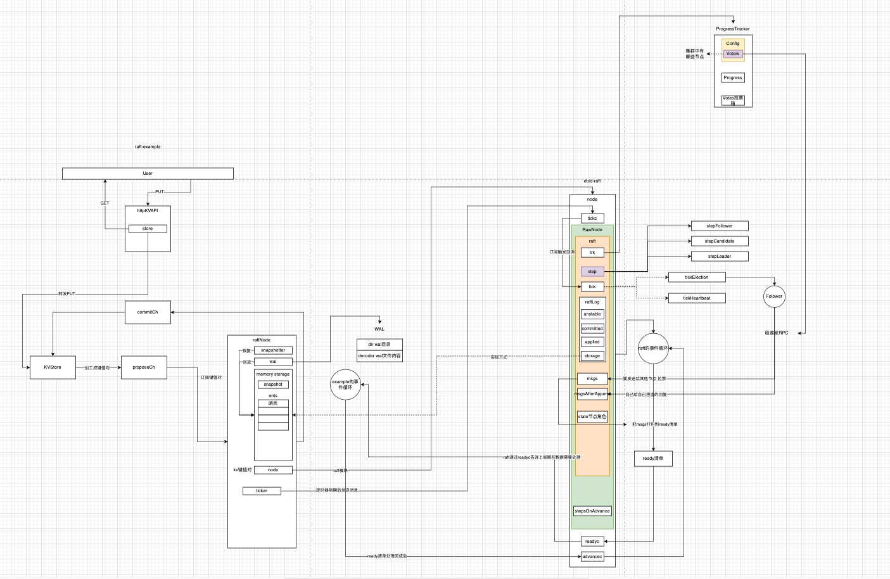

### 1 关于定时

etcd的做法是并没有显式定义心跳超时多长，而是先定义一个定时器，这个定时器的精度比较高，作为作为一个时钟周期，然后在raft中对时钟周期计数。这样的方式比较灵活通用。

上层定义时钟

```go
	// raft上层定义的定时器 100ms到期一次 这个定时器对于raft而言就是一个时钟刻度 raft的定时语义就是多少个这个刻度算一个周期
	// 比如raftexample定义的一个Leader心跳超时是10个tick 每10个tick就算一个心跳超时 Follower开始选主
	ticker := time.NewTicker(100 * time.Millisecond)
```

raft检查定时有没有到期

```go
		case <-n.tickc:
			// 上层的时钟到期 尝试看看raft的定时到期没 驱动心跳和选举
			n.rn.Tick()
```

### 2 初始化状态为Follower

raft抽象了3个角色状态

- Follower
- Candidate
- Leader

```go
// 当前节点角色转换为Follower
// @Param term 任期号 1-based
// @Param lead 集群Leader的id 1-based 0表示集群没有Leader或者集群虽然事实上存在Leader但是当前节点感知不到
func (r *raft) becomeFollower(term uint64, lead uint64) {
	// Follower的回调 处理消息
	r.step = stepFollower
	r.reset(term)
	// Follower的定时回调
	r.tick = r.tickElection
	// 当前节点能感知到的集群Leader是谁 节点初始化启动的时候感知不到谁是Leader 那么就是0
	r.lead = lead
	// 节点角色
	r.state = StateFollower
	r.logger.Infof("%x became follower at term %d", r.id, r.Term)

	traceBecomeFollower(r)
}
```

```go
// 上层时钟到期就是raft执行定时任务的一个契机 此时定时任务可能到期可能还没到期
// Follower在这个时机点有机会竞选Leader
func (rn *RawNode) Tick() {
	rn.raft.tick()
}
```

### 3 校验状态进行竞选

```go
// 上层时钟到期后看看raft的心跳超时没有 超时就竞选
func (r *raft) tickElection() {
	// 一个心跳超时定时对时钟计数 到达阈值后触发raft的定时任务
	r.electionElapsed++

	// 当前节点有资格晋升为Leader 心跳超时
	if r.promotable() && r.pastElectionTimeout() {
		// 准备进入下一轮心跳超时 重置对上层时钟计数
		r.electionElapsed = 0
		// EDA驱动
		if err := r.Step(pb.Message{From: r.id, Type: pb.MsgHup}); err != nil {
			r.logger.Debugf("error occurred during election: %v", err)
		}
	}
}
```

最终会执行到`campaign`方法中

### 4 向哪些节点发送拉票

在正式发送拉票前有个重要步骤，把自己角色从`Follower`升级为`Candidate`

```go
		// 启动后节点的初始化角色是Follower term是0 这个时候会转化角色为Candidate term变成1
		// 这个地方最重要的是step回调 将来处理收到的投票
		r.becomeCandidate()
```

```go
	// 从Voters中拿到集群中节点id 准备向这些节点发送拉票
	var ids []uint64
	// Voters就是启动时候手动AppendEntries和applyConfChange添加的集群配置
	// 如果当初不手动添加Voters这个地方拿到的ids就是空的 也就没办法继续了
	{
		idMap := r.trk.Voters.IDs()
		ids = make([]uint64, 0, len(idMap))
		for id := range idMap {
			ids = append(ids, id)
		}
		slices.Sort(ids)
	}
```

这个地方拿到的集群节点信息就是在手工写入的配置信息

### 5 发送拉票

#### 5.1 自己给自己投票

```go
		if id == r.id {
			// The candidate votes for itself and should account for this self
			// vote once the vote has been durably persisted (since it doesn't
			// send a MsgVote to itself). This response message will be added to
			// msgsAfterAppend and delivered back to this node after the vote
			// has been written to stable storage.
			// 自己给自己发送拉票请求 并不需要真的从发送请求到接收响应走完 既然是自己给自己投票 那肯定是同意 所以直接给自己模拟个赞成票就行
			// 这个赞成的响应信息会被放到msgsAfterAppend
			r.send(pb.Message{To: id, Term: term, Type: voteRespMsgType(voteMsg)})
			continue
		}
```

```go
		r.msgsAfterAppend = append(r.msgsAfterAppend, m)
```

#### 5.2 让其他节点投票

```go
		// 向集群中其他节点拉票 RPC方式发送拉票请求 放到raft的msgs表示要立即发送的消息 上层etcd会来这取数据进行发送
		// 然后等待其他节点响应这个拉票请求 也就是发过来投票 触发自己的得票统计
		r.send(pb.Message{To: id, Term: term, Type: voteMsg, Index: last.index, LogTerm: last.term, Context: ctx})
```

### 6 raft让上层把拉票发送出去

在raft的事件循环中，每一轮都会检查看看自己有没有ready的数据需要告诉上层，刚才准备好的拉票请求就需要告诉上层。

```go
		// advancec的用途是什么 在不是异步存储的场景 默认就是同步方式 怎么保证相间的顺序是同步的呢 就是靠这个通信
		// raft把ready清单 这个清单里面就有要给集群其他节点发送的 告诉etcd后就把advancec赋值 上层处理完后通过advancec告诉raft 在上层通知处理完之前raft不再向上层发送ready清单
		if advancec == nil && n.rn.HasReady() {
			// Populate a Ready. Note that this Ready is not guaranteed to
			// actually be handled. We will arm readyc, but there's no guarantee
			// that we will actually send on it. It's possible that we will
			// service another channel instead, loop around, and then populate
			// the Ready again. We could instead force the previous Ready to be
			// handled first, but it's generally good to emit larger Readys plus
			// it simplifies testing (by emitting less frequently and more
			// predictably).
			// ready清单
			rd = n.rn.readyWithoutAccept()
			readyc = n.readyc
		}
```

#### 6.1 ready清单

##### 6.1.1 检查有没有ready数据

```go
// 看看当前raft节点有没有ready清单要交给上层的
func (rn *RawNode) HasReady() bool {
	// TODO(nvanbenschoten): order these cases in terms of cost and frequency.
	r := rn.raft
	if softSt := r.softState(); !softSt.equal(rn.prevSoftSt) {
		return true
	}
	if hardSt := r.hardState(); !IsEmptyHardState(hardSt) && !isHardStateEqual(hardSt, rn.prevHardSt) {
		return true
	}
	if r.raftLog.hasNextUnstableSnapshot() {
		return true
	}
	// 心跳超时后 Follower会向自己的这两个集合放上数据 msgs放的是要立即给其他节点发送的拉票请求 msgsAfterAppend是自己给自己捏造的投票响应
	if len(r.msgs) > 0 || len(r.msgsAfterAppend) > 0 {
		return true
	}
	if r.raftLog.hasNextUnstableEnts() || r.raftLog.hasNextCommittedEnts(rn.applyUnstableEntries()) {
		return true
	}
	if len(r.readStates) != 0 {
		return true
	}
	return false
}
```

##### 6.1.1 打包ready

```go
	// 从当前raft状态中提取出一个完整的Ready结构体 只读快照 用于外部逻辑处理 如WAL持久化\发送消息\应用日志等
	// 收集当前还未持久化的日志条目
	// 外部收到Ready后 先持久化entries 然后才可以发Messages
	rd := Ready{
		// 未写入WAL的unstable entries 从unstable.offset开始
		Entries:          r.raftLog.nextUnstableEnts(),
		// 已经committed但还没apply的entries
		CommittedEntries: r.raftLog.nextCommittedEnts(rn.applyUnstableEntries()),
		// 立刻发送给其他节点的消息 必须等待Entries被WAL持久化之后再发送 raft只负责把要发送的数据告诉上层 至于持久化这个动作 也是由上层调用raft
		Messages:         r.msgs,
	}
```

#### 6.2 raft通过readyc通知上层

```go
		case readyc <- rd: // 把ready清单通过readyc通知给上层
			// Ready是Raft给上层etcd的一份任务清单 包括 要写入WAL的entry 要发送给其他节点的消息 要apply到状态机的entry
			// 写完WAL\发送消息\apply后 要等advancec通知继续
			// 标记这一轮的ready清单已经被接收 仅仅是标记 我已经把ready清单交给上层了
			n.rn.acceptReady(rd)
			if !n.rn.asyncStorageWrites {
				// 没有启用异步存储的情况意味着 我需要等上层处理完Ready清单(WAL写入+网络发送+状态应用)之后 再通过advancec回调通知我继续推进状态
				advancec = n.advancec
			} else {
				rd = Ready{}
			}
			readyc = nil
```

golang的设计哲学是利用通信共享内存，所以在上层中也会有一个事件循环监听这个readyc，一旦发现有数据到达就立马进行处理

### 7 raftexample处理收到的ready清单

```go
		case rd := <-rc.node.Ready():
			// raftexample收到raft给的readyc通知 readyc里面有raft打包好的ready清单
			// Must save the snapshot file and WAL snapshot entry before saving any other entries
			// or hardstate to ensure that recovery after a snapshot restore is possible.
			if !raft.IsEmptySnap(rd.Snapshot) {
				rc.saveSnap(rd.Snapshot)
			}
			rc.wal.Save(rd.HardState, rd.Entries)
			if !raft.IsEmptySnap(rd.Snapshot) {
				rc.raftStorage.ApplySnapshot(rd.Snapshot)
				rc.publishSnapshot(rd.Snapshot)
			}
			rc.raftStorage.Append(rd.Entries)
			// 走RPC向其他节点发送
			rc.transport.Send(rc.processMessages(rd.Messages))
			applyDoneC, ok := rc.publishEntries(rc.entriesToApply(rd.CommittedEntries))
			if !ok {
				rc.stop()
				return
			}
			rc.maybeTriggerSnapshot(applyDoneC)
			// raft给的ready清单已经处理完 raftexample再通过advancec通知raft已经处理完了
			rc.node.Advance()
```

### 8 raft处理投票

```go
// raft把ready清单通过readyc投递给raftexample
// raftexample处理完后通过advancec通知raft
func (rn *RawNode) Advance(_ Ready) {
	// The actions performed by this function are encoded into stepsOnAdvance in
	// acceptReady. In earlier versions of this library, they were computed from
	// the provided Ready struct. Retain the unused parameter for compatibility.
	if rn.asyncStorageWrites {
		rn.raft.logger.Panicf("Advance must not be called when using AsyncStorageWrites")
	}
	// raft在打包ready清单时候已经把自己给自己的投票放到了stepsOnAdvance里面了
	// 在收到raftexample的advance通知后 这个时机就可以处理到那个投票 进入得票统计流程
	for i, m := range rn.stepsOnAdvance {
		_ = rn.raft.Step(m)
		rn.stepsOnAdvance[i] = pb.Message{}
	}
	rn.stepsOnAdvance = rn.stepsOnAdvance[:0]
}
```



下面就进入了得票统计阶段