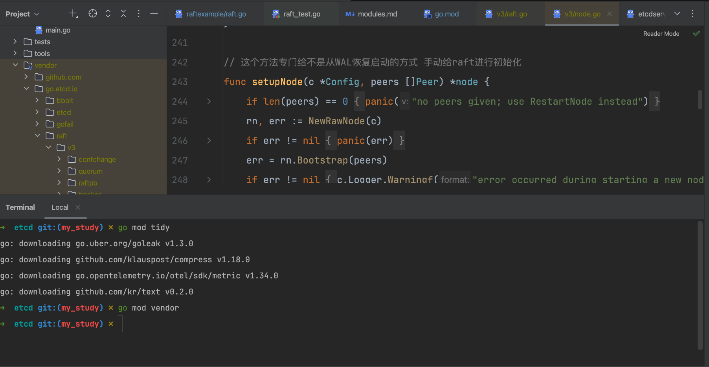

在中已经拉了两份源码，学习的笔记也都是注释在自己的分支上。怎么在etcd中依赖自己切出来的raft代码。

### 1 etcd中replace依赖

在etcd项目根目录的`go.mod`中添加replace项

```sh
	// raft模块换成自己fork的地址 分支用自己的
	go.etcd.io/raft/v3 => github.com/Bannirui/raft/v3 my_study
```

这个地方my_study是raft代码的分支

### 2 重新拉依赖

在etcd项目下执行

```sh
go mod tidy
go mod vendor
```

tidy后上面的replace会自动更新为

```sh
	// raft模块换成自己fork的地址 分支用自己的
	go.etcd.io/raft/v3 => github.com/Bannirui/raft/v3 v3.0.0-20250618092935-4dc7908ea8fc
```

时间戳+commit hash 是Go modules支持的无tag版本表示

在vendor目录下会缓存raft模块，可以看到自己写的注释，说明已经etcd拉到的依赖已经是自己的分支了

