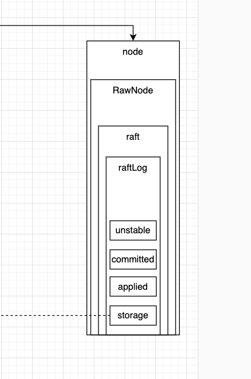

```go
// 比如 当前快照是Index=10 当前ents=[entry11, entry12, ..., entry20] committed=18 applied=16
// 那么 entry11~entry20都保存在MemoryStorage.ents中
//     entry11~entry18被认为是committed可以下发到状态机
//     entry11~entry16被认为是applied已在状态机执行
//     entry19~entry20虽然在ents中 也许已经复制到其他节点但尚未被集群确认提交
type raftLog struct {
	// storage contains all stable entries since the last snapshot.
	// storage中数据在启动的时候会从snap和wal中恢复 包含两部分数据
	// 已持久化/已提交 被quorum确认
	// 已持久化/未提交 已写入wal但是还没同步给多数节点
	// 也就是说Storage#ents中存放是的所有还未被快照删除的日志条目
	storage Storage

	// unstable contains all unstable entries and snapshot.
	// they will be saved into storage.
	// 未持久化/未提交 刚生成
	// 在raftLog中还没持久化到Storage的日志条目
	unstable unstable

	// committed is the highest log position that is known to be in
	// stable storage on a quorum of nodes.
	// 已在多数派节点同步成功的index 已提交 wal中也有
	// 也就是最大已被大多数节点确认复制的index
	committed uint64
	// applying is the highest log position that the application has
	// been instructed to apply to its state machine. Some of these
	// entries may be in the process of applying and have not yet
	// reached applied.
	// Use: The field is incremented when accepting a Ready struct.
	// Invariant: applied <= applying && applying <= committed
	applying uint64
	// applied is the highest log position that the application has
	// successfully applied to its state machine.
	// Use: The field is incremented when advancing after the committed
	// entries in a Ready struct have been applied (either synchronously
	// or asynchronously).
	// Invariant: applied <= committed
	// 已提交/已应用
	// 也就是已被状态机应用的最大index
	applied uint64

	logger Logger

	// maxApplyingEntsSize limits the outstanding byte size of the messages
	// returned from calls to nextCommittedEnts that have not been acknowledged
	// by a call to appliedTo.
	maxApplyingEntsSize entryEncodingSize
	// applyingEntsSize is the current outstanding byte size of the messages
	// returned from calls to nextCommittedEnts that have not been acknowledged
	// by a call to appliedTo.
	applyingEntsSize entryEncodingSize
	// applyingEntsPaused is true when entry application has been paused until
	// enough progress is acknowledged.
	applyingEntsPaused bool
}
```

