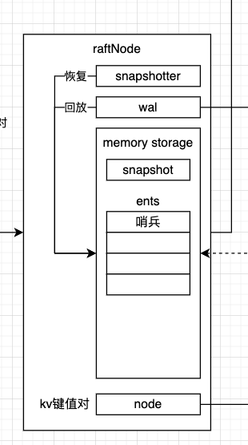

### 1 组件布局

```go
type MemoryStorage struct {
	// Protects access to all fields. Most methods of MemoryStorage are
	// run on the raft goroutine, but Append() is run on an application
	// goroutine.
	sync.Mutex

	hardState pb.HardState
	// 记录是最新的snap 如果是启动恢复就记录用来恢复的那个snap
	snapshot  pb.Snapshot
	// ents[i] has raft log position i+snapshot.Metadata.Index
	// 这个里面放在就是所有没有被snap删除的日志 一定为有个哨兵
	// 启动时没有snap 也没有wal 那么哨兵就是(term=0 index=0)
	// 启动时有snap snap的term和index会被封装成哨兵放在首位(term=snap的term index=snap的index)
	// 启动时没有wal 此时里面还是就躺着哨兵
	// 启动时有wal 里面除了哨兵 如实放着wal里面的日志
	ents []pb.Entry

	callStats inMemStorageCallStats
}
```



### 2 用wal恢复完后哨兵是谁

提过数据恢复的流程，raft会给数据都安一个哨兵，杜绝了数据脚标越界的判断，那么恢复完这个哨兵是怎么处理的呢

#### 2.1 用snap恢复完

```go
// 用snap恢复数据
// 在raft中几乎只要有数据的地方 为了避免对边界的考虑 都会放置一个哨兵 snap也不例外 即使没有snap文件 也会创建个内存上的概念snap 它的term是0 index是0
// snap有效的话 恢复完后storage#ents的哨兵就是(term=snap的term index=snap的index)
// snap无效的话 恢复完后storage#ents的哨兵依然是之前storage初始化的(term=0 index=0)
// @Param snap 准备用来恢复数据的snap
func (ms *MemoryStorage) ApplySnapshot(snap pb.Snapshot) error {
	ms.Lock()
	defer ms.Unlock()

	// handle check for old snapshot being applied
	// storage初始化的时候只会在ents中放一个(term=0 index=0)的哨兵 其他的都是默认初始化值 那么这个ms.snapshot.Metadata.Index就是0
	// 它的语义是storage的最新的一个snap
	msIndex := ms.snapshot.Metadata.Index
	// 用来恢复数据的snap文件可能存在 可能不存在 如果不存在 此时的snap就是哨兵 它的index就是默认值0
	snapIndex := snap.Metadata.Index
	if msIndex >= snapIndex {
		// 为什么做这个 上一个snap的index肯定是<准备用的snap的index 为什么有=呢 如果上一个snap和这一个相等就没必要用来作恢复 效果不变
		// 所以在初始启动时候 没有snap文件场景下 会走到这
		// 那么此时storage#ents中还是只有一个哨兵(term=0 index=0)
		return ErrSnapOutOfDate
	}
	// snap是有效的 用它来恢复数据
	ms.snapshot = snap
	// 此时storage#ents的哨兵就变了(term=0 index=0)->(term=snap的term index=snap的index)
	ms.ents = []pb.Entry{{Term: snap.Metadata.Term, Index: snap.Metadata.Index}}
	return nil
}
```

#### 2.2 用wal回放完

```go
// 在做wal回放的时候会调到这
// @Param entries wal中的数据
func (ms *MemoryStorage) Append(entries []pb.Entry) error {
	if len(entries) == 0 {
		return nil
	}

	ms.Lock()
	defer ms.Unlock()
	// storage中第一个index raft已经做了兼容考虑 不管有没有snap文件 这个地方都能取到正确的值
	// 如果空机器启动啥也没的时候 这个地方拿到的first就是1
	first := ms.firstIndex()
	// 要回放的最后一个index
	last := entries[0].Index + uint64(len(entries)) - 1

	// shortcut if there is no new entry.
	if last < first {
		// 要回放的都已经在storage中了
		return nil
	}
	// truncate compacted entries
	if first > entries[0].Index {
		// 要回放的数据有部分已经存在storage中了 做截断
		entries = entries[first-entries[0].Index:]
	}

	offset := entries[0].Index - ms.ents[0].Index
	switch {
	case uint64(len(ms.ents)) > offset:
		// NB: full slice expression protects ms.ents at index >= offset from
		// rewrites, as they may still be referenced from outside MemoryStorage.
		ms.ents = append(ms.ents[:offset:offset], entries...)
	case uint64(len(ms.ents)) == offset:
		ms.ents = append(ms.ents, entries...)
	default:
		getLogger().Panicf("missing log entry [last: %d, append at: %d]",
			ms.lastIndex(), entries[0].Index)
	}
	return nil
}
```