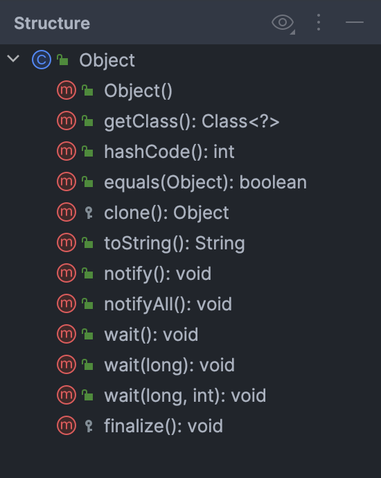
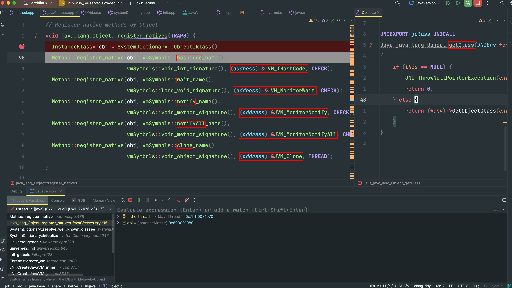
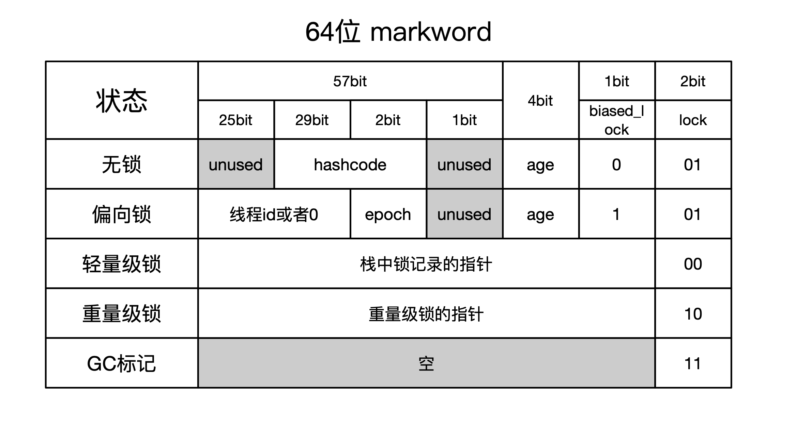
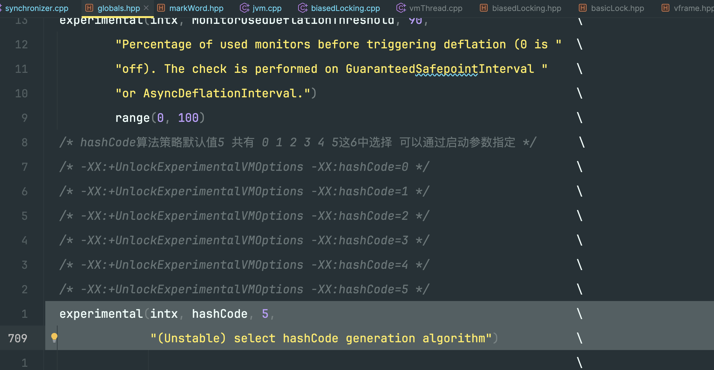
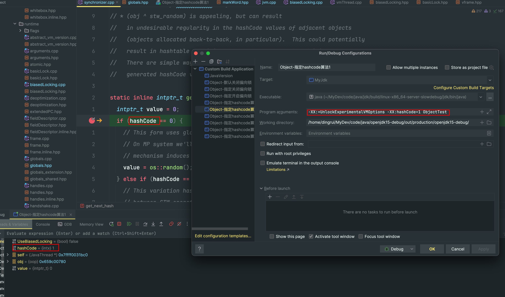

Object是java世界的基类，放在第一个进行分析也是理所当然的。因为是基石

- 注定该类的结构不可能复杂，甚至是最简单的

- 涉及到的方法一定是底层的，所以类结构虽然简单，但是方法实现可能比较复杂



native方法

- [getClass](#2)

- [hashCode](#3)

- [clone](#4)

- [notify](#5)

- [notifyAll](#6)

- [wait](#7)

需要研究的就是上述几个方法，都是native方法，既然想使用native方法，就必然要在链接的时候找到对应方法的实现，那么无外乎以下几种情况

- native方法写在jdk源码中，一起编译

- native方法单独写的，编译成库文件

  - 从库文件类型角度分为

    - 静态库

    - 动态库

  - 从开发角度分为

    - jdk源码编写好的一份

    - 我们自己开发的

首先这个native方法肯定不是我们开发的，所以是伴随着jdk源码提供的，那么既然都放在源码文件里面了，肯定不会把这个编译成动态库的，毕竟太影响性能了。那么是否有可能把源码编译成静态库来链接呢，我想正常情况下做项目都不会这样选择的。

所以初步的结论是

- openjdk提供了Object类中这几个native方法的实现

- 因为Object是基类，所以这些方法一定会在jvm启动的时候就指定好内存地址，不然对象实例没法调用

### 1 时机



在jvm启动的过程中，会将Object类需要的几个native方法注册到klass对象中

|方法名称|声明位置|实现位置|
|---|---|---|
|getClass|java_lang_Object.h|Object.c|
|hashCode|java_lang_Object.h|绑定jvm.h的JVM_IHashCode|
|clone|java_lang_Object.h|绑定jvm.h的JVM_Clone|
|notify|java_lang_Object.h|绑定jvm.h的JVM_MonitorNotify|
|notifyAll|java_lang_Object.h|绑定jvm.h的JVM_MonitorNotifyAll|
|wait|java_lang_Object.h|绑定jvm.h的JVM_MonitorWait|

下面就跟进这几个方法看看具体的实现

### <a id="2">2 getClass方法</a>

### <a id="3">3 hashCode方法</a>

#### 3.1 JVM_IHashCode

java对象的hashcode值是直接或者间接存储在对象头的markword中的，并且还会跟不同锁状态有直接关联，甚至在偏向锁的场景下还会引起锁膨胀升级

关于markword请看

文件`src/hotspot/share/prims/jvm.cpp`

```cpp
/**
 * Object的hashCode方法实现
 *   - handle是Object对象
 */
JVM_ENTRY(jint, JVM_IHashCode(JNIEnv* env, jobject handle))
  JVMWrapper("JVM_IHashCode");
  // as implemented in the classic virtual machine; return 0 if object is NULL
  return handle == NULL ? 0 : ObjectSynchronizer::FastHashCode (THREAD, JNIHandles::resolve_non_null(handle)) ;
JVM_END
```

#### 3.2 hashcode存储



以64位系统为例，hashcode最多31位，上图可以看出

- 无锁状态下，hashcode记录在markword的位[38...8]上

- 偏向锁状态下，没有空间记录hashcode，换言之如果某个对象被加了偏向锁

  - 要么撤销偏向锁退化到无锁，在markword上记录hashcode

  - 要么撤销偏向锁膨胀到轻量级锁，甚至重量级锁，hashcode记录在彼时对应的位置

- 轻量级锁状态下，hashcode记录在栈中，在markword中用指针引用

- 重量级锁状态下，hashcode记录在堆中，在markword中用指针引用

- 被标记为GC的状态，hashcode已经没有记录的意义

#### 3.3 偏向锁撤销

如果开启了`-XX:+UseBiasedLocking`偏向锁，因为在偏向锁状态下没有空间记录hashcode，所以要关闭偏向锁状态位

也就是要把markword的第3位置为0，此时低3位就是`001`就是无锁状态

偏向锁的有关方法请看

#### 3.4 hashcode算法

hashcode的算法策略可以通过jvm启动参数指定



比如，指定`-XX:+UnlockExperimentalVMOptions -XX:hashCode=1`



文件`src/hotspot/share/runtime/synchronizer.cpp`

```cpp
/**
 * hashcode的算法实现
 * 提供了6种算法策略
 *   - 算法0 随机数
 *   - 算法1 内存地址+1个随机数->随机数
 *   - 算法2 固定值1
 *   - 算法3 自增序列
 *   - 算法4 内存地址
 *   - 算法5 当前线程有关的1个随机数+3个固定常数->随机数
 */
static inline intptr_t get_next_hash(Thread* self, oop obj) {
  intptr_t value = 0;
  /**
   * jvm的hashcode算法策略默认是5
   * 通过启动参数可以指定 -XX:+UnlockExperimentalVMOptions -XX:hashCode=0
   */
  if (hashCode == 0) {
  } else if (hashCode == 1) {
  } else if (hashCode == 2) {
  } else if (hashCode == 3) {
  } else if (hashCode == 4) {
  } else {
  }
```

##### 3.4.1 算法0

```cpp
// 随机数
value = os::random();
```

##### 3.4.2 算法1

```cpp
// 内存地址和随机数计算出来的随机值
intptr_t addr_bits = cast_from_oop<intptr_t>(obj) >> 3;
value = addr_bits ^ (addr_bits >> 5) ^ GVars.stw_random;
```

##### 3.4.3 算法2

```cpp
// 固定值1
value = 1;            // for sensitivity testing
```

##### 3.4.4 算法3

```cpp
// 自增序列
value = ++GVars.hc_sequence;
```

##### 3.4.5 算法4

```cpp
// 内存地址
value = cast_from_oop<intptr_t>(obj);
```

##### 3.4.6 算法5

```cpp
// Marsaglia's xor-shift scheme with thread-specific state
// This is probably the best overall implementation -- we'll
// likely make this the default in future releases.
// 线程相关的1个随机值+3个常数 xor-shift算法计算出来的随机值
  unsigned t = self->_hashStateX;
  t ^= (t << 11);
  self->_hashStateX = self->_hashStateY;
  self->_hashStateY = self->_hashStateZ;
  self->_hashStateZ = self->_hashStateW;
  unsigned v = self->_hashStateW;
  v = (v ^ (v >> 19)) ^ (t ^ (t >> 8));
  self->_hashStateW = v;
  value = v;
```

Thread类中的这几个成员的赋值在构造方法中可以看到

- _hashStateX

- _hashStateY

- _hashStateZ

- _hashStateW

文件`src/hotspot/share/runtime/thread.cpp`

```cpp
  /**
   * 下面这4个成员将来用来计算hashcode值的
   * jvm默认的hashcode计算方式用的就是xor-shift算法
   * 本质就是1个随机数+3个常数->计算出一个随机数
   */
  _hashStateX = os::random();
  _hashStateY = 842502087;
  _hashStateZ = 0x8767;    // (int)(3579807591LL & 0xffff) ;
  _hashStateW = 273326509;
```

### <a id="4">4 clone方法</a>

### <a id="5">5 notify方法</a>

### <a id="6">6 notifyAll方法</a>

### <a id="7">7 wait方法</a>