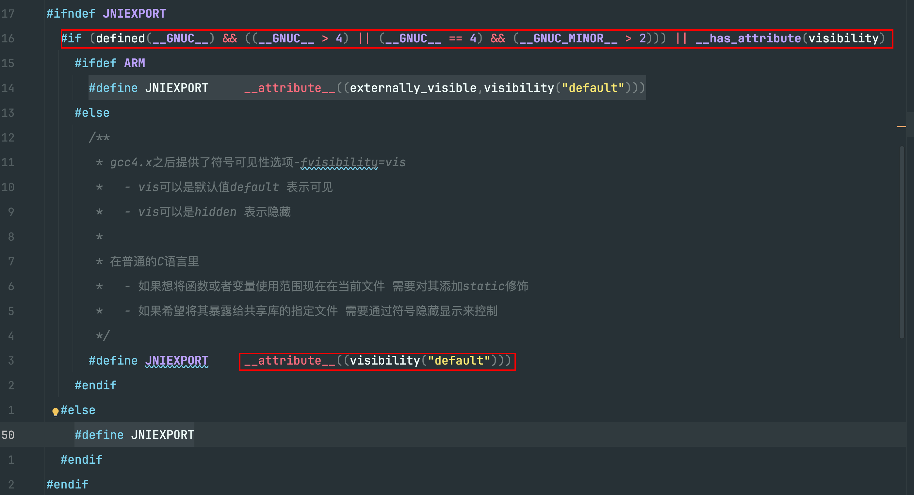

### 1 宏定义

宏定义着实太多，甚至有的嵌套地太深，只能遇到了就记录一下

当然了，很多宏的定义都是跨平台的，所以以linux+gcc的环境为例

- [JNIEXPORT](#1)

- [JNICALL](#2)

- [JVM_ENTRY](#3)

- [JVM_END](#4)

#### <a id="1">1.1 JNIEXPORT</a>



#### <a id="2">1.2 JNICALL</a>

```cpp
#define JNICALL
```

#### <a id="3">1.3 JVM_ENTRY</a>

```cpp
#define JVM_ENTRY(result_type, header)                               \
extern "C" {                                                         \
  result_type JNICALL header {                                       \
    JavaThread* thread=JavaThread::thread_from_jni_environment(env); \
    ThreadInVMfromNative __tiv(thread);                              \
    debug_only(VMNativeEntryWrapper __vew;)                          \
    VM_ENTRY_BASE(result_type, header, thread)
```

#### <a id="4">1.4 JVM_END</a>

```cpp
#define JVM_END } }
```

### 2 示例

#### 2.1 JNIEXPORT和JNICALL

```cpp
JNIEXPORT void JNICALL
JVM_MonitorWait(JNIEnv *env, jobject obj, jlong ms);
```

替换为

```cpp
__attribute__((visibility("default")))
void JVM_MonitorWait(JNIEnv *env, jobject obj, jlong ms);
```

#### 2.2 JVM_ENTRY和JVM_END

```cpp
JVM_ENTRY(void, JVM_MonitorWait(JNIEnv* env, jobject handle, jlong ms))
  JVMWrapper("JVM_MonitorWait");
  Handle obj(THREAD, JNIHandles::resolve_non_null(handle));
  JavaThreadInObjectWaitState jtiows(thread, ms != 0);
  if (JvmtiExport::should_post_monitor_wait()) {
    JvmtiExport::post_monitor_wait((JavaThread *)THREAD, (oop)obj(), ms);

    // The current thread already owns the monitor and it has not yet
    // been added to the wait queue so the current thread cannot be
    // made the successor. This means that the JVMTI_EVENT_MONITOR_WAIT
    // event handler cannot accidentally consume an unpark() meant for
    // the ParkEvent associated with this ObjectMonitor.
  }
  ObjectSynchronizer::wait(obj, ms, CHECK);
JVM_END
```

替换为

```cpp
extern "C" {
  void JVM_MonitorWait(JNIEnv* env, jobject handle, jlong ms))
  {
    JavaThread* thread=JavaThread::thread_from_jni_environment(env);
    ThreadInVMfromNative __tiv(thread);
    debug_only(VMNativeEntryWrapper __vew;)
    VM_ENTRY_BASE(result_type, header, thread)
  JVMWrapper("JVM_MonitorWait");
  Handle obj(THREAD, JNIHandles::resolve_non_null(handle));
  JavaThreadInObjectWaitState jtiows(thread, ms != 0);
  if (JvmtiExport::should_post_monitor_wait())
  {
    JvmtiExport::post_monitor_wait((JavaThread *)THREAD, (oop)obj(), ms);

    // The current thread already owns the monitor and it has not yet
    // been added to the wait queue so the current thread cannot be
    // made the successor. This means that the JVMTI_EVENT_MONITOR_WAIT
    // event handler cannot accidentally consume an unpark() meant for
    // the ParkEvent associated with this ObjectMonitor.
  }
  ObjectSynchronizer::wait(obj, ms, CHECK);
  }
}
```