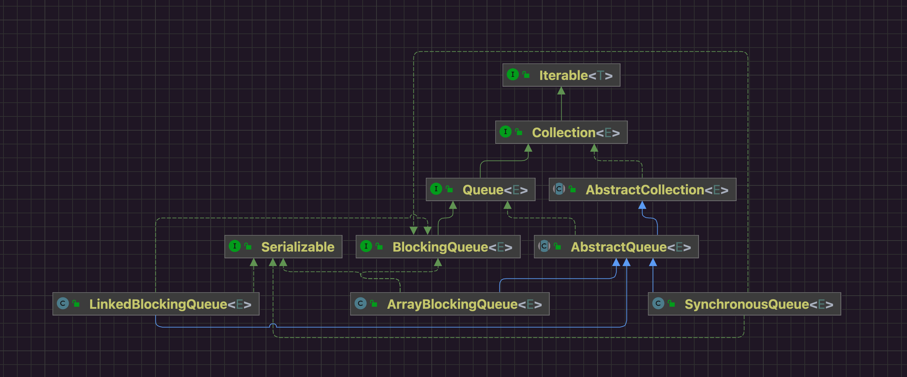

## 1 类图



## 2 构造方法

```java
// LinkedBlockingQueue.java

// take锁
    private final ReentrantLock takeLock = new ReentrantLock();
    
// put锁
    private final ReentrantLock putLock = new ReentrantLock();
    
public LinkedBlockingQueue() {
        this(Integer.MAX_VALUE);
    }

    /**
     * Creates a {@code LinkedBlockingQueue} with the given (fixed) capacity.
     *
     * @param capacity the capacity of this queue
     * @throws IllegalArgumentException if {@code capacity} is not greater
     *         than zero
     */
    public LinkedBlockingQueue(int capacity) {
        if (capacity <= 0) throw new IllegalArgumentException();
        this.capacity = capacity;
        last = head = new Node<E>(null); // 初始化单链表 头节点跟尾节点都是哑节点
    }
```

## 3 API


### 3.1 put


```java
// LinkedBlockingQueue.java
public void put(E e) throws InterruptedException {
        if (e == null) throw new NullPointerException();
        final int c;
        final Node<E> node = new Node<E>(e); // 单链表节点
        final ReentrantLock putLock = this.putLock; // 竞争put锁
        final AtomicInteger count = this.count;
        putLock.lockInterruptibly();
        try {
            /*
             * Note that count is used in wait guard even though it is
             * not protected by lock. This works because count can
             * only decrease at this point (all other puts are shut
             * out by lock), and we (or some other waiting put) are
             * signalled if it ever changes from capacity. Similarly
             * for all other uses of count in other wait guards.
             */
            while (count.get() == this.capacity) {
                notFull.await(); // 队列满了不能再放元素了 将put线程阻塞在条件队列上 等待有线程take元素打破条件唤醒阻塞的put线程
            }
            this.enqueue(node); // 元素入队
            c = count.getAndIncrement(); // 元素入队完更新元素数量
            if (c + 1 < capacity)
                notFull.signal(); // 队列还没满 尝试唤醒曾经因为队列满了而阻塞等待的put线程
        } finally {
            putLock.unlock();
        }
        if (c == 0)
            this.signalNotEmpty(); // 队列已经至少有一个元素了 尝试唤醒曾经因为队列空了而阻塞等待的take线程
    }
```

```java
// LinkedBlockingQueue.java
private void enqueue(Node<E> node) { // 元素入队 操作单链表
        // assert putLock.isHeldByCurrentThread();
        // assert last.next == null;
        last = last.next = node;
    }
```

### 3.2 take

```java
// LinkedBlockingQueue.java
 public E take() throws InterruptedException {
        final E x;
        final int c;
        final AtomicInteger count = this.count;
        final ReentrantLock takeLock = this.takeLock; // take锁
        takeLock.lockInterruptibly(); // 竞争take锁
        try {
            while (count.get() == 0) {
                this.notEmpty.await(); // 队列为空 让take线程阻塞在take锁的条件队列上 等待有其他线程put元素后唤醒这个take线程
            }
            x = dequeue(); // 元素出队操作
            c = count.getAndDecrement(); // 出队完成 更新队列中元素的数量
            if (c > 1)
                notEmpty.signal(); // 取完这个元素之后队列中依然还有元素可以取 尝试唤醒之前因为队列为空而阻塞的take线程
        } finally {
            takeLock.unlock();
        }
        if (c == capacity)
            signalNotFull(); // 取完这个元素之后队列肯定就不是满的 尝试唤醒之前因为队列满而阻塞的put线程
        return x;
    }
```

```java
private E dequeue() { // 元素出队 操作单链表
        // assert takeLock.isHeldByCurrentThread();
        // assert head.item == null;
        Node<E> h = head; // 单链表头节点
        Node<E> first = h.next; // 出队节点
        h.next = h; // help GC
        head = first;
        E x = first.item;
        first.item = null;
        return x;
    }
```

## 4 总结

|                  | LinkedBlockingQueue                                   |
| ---------------- | ----------------------------------------------------- |
| 数据结构         | 单链表                                                |
| 是否有界         | 是，可以不显示指定容量，默认值Integer.MAX_VALUE       |
| 锁实现           | ReentrantLock                                         |
| 锁数量           | 2                                                     |
| 线程阻塞机制     | ReentrantLock条件队列阻塞/通知唤醒                    |
| 生产者消费者用锁 | 生产者使用put锁操作链表尾，消费者使用take锁操作链表头 |
