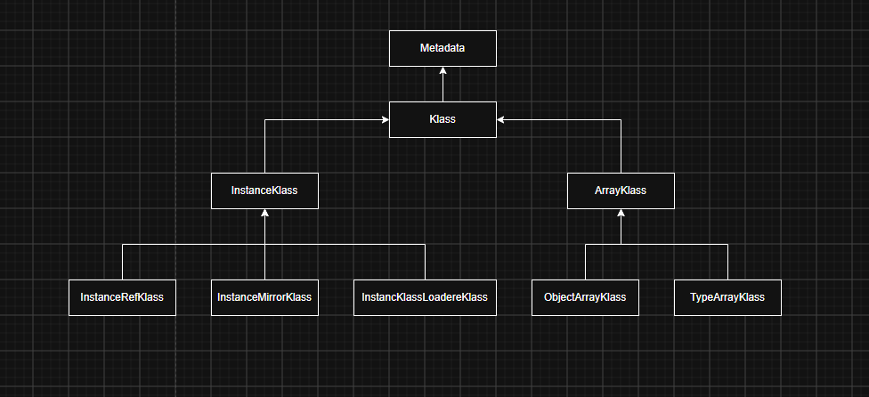

HotSpot采用oop-Klass模型表示Java的对象，oop指向对象，Klass表示对象的具体类型

为了不想每个对象都含有vtable，就把对象模型一拆为二

- oop中不包含任何虚函数，自然就没有了虚函数表
- Klass中含有虚函数表，进行方法的分发

Klass就是Java对象的具体类型

因为普通的Java类和数组的内存布局方式不同，所以体系派生出两类



- 
- 

## 1 layout_helper

快速判断是普通类型还是数组类型

```cpp
  /**
   * 对象的布局描述
   * 这个值只可能是3种情况
   *   - 1 什么都不是 用0表示
   *   - 2 普通的Java类型 最高位是0 用正数表示 含义是这个Java类的对象创建需要的内存大小
   *   - 3 Java数组类型 最高位是1 用负数表示 它是一个组合值 包含了tag hsize etype esize
   * 只要判断_layout_helper是正数还是负数就可以区分数组和对象
   */
  jint        _layout_helper;
```

## 2 继承体系

### 2.1 继承链

按照根类到当前类的严格顺序放在primary_suppers数组

```cpp
    // 记录直接父类
    set_super(k);
    Klass* sup = k;
    // 父类的继承深度
    int sup_depth = sup->super_depth();
    // 限制_primary_suppers数组只能放8个类
    juint my_depth  = MIN2(sup_depth + 1, (int)primary_super_limit());
    if (!can_be_primary_super_slow())
      my_depth = primary_super_limit();
    for (juint i = 0; i < my_depth; i++) {
      // 把直接父类的继承链放到自己的primary_suppers数组 再补充上自己这个类就完整了
      _primary_supers[i] = sup->_primary_supers[i];
    }
    Klass* *super_check_cell;
    if (my_depth < primary_super_limit()) {
      // 类的继承深度没有超过8个 _primary_suppers能放得下
      _primary_supers[my_depth] = this;
      super_check_cell = &_primary_supers[my_depth];
    }
```

### 2.2 实现了哪些接口

```cpp
  // 首先这个数组里面是要存储当前类的所有实现接口的包括直接和间接实现的接口 其次当类的继承深度太长超过8个时 会把_primary_suppers里面放不下的类也放到这个数组里面
  Array<Klass*>* _secondary_supers;
```

### 2.3 兄弟链

```cpp
void Klass::append_to_sibling_list() {
  if (Universe::is_fully_initialized()) {
    assert_locked_or_safepoint(Compile_lock);
  }
  debug_only(verify();)
  // add ourselves to superklass' subklass list
  InstanceKlass* super = superklass();
  // 什么时候才会有兄弟链的情况 大家都是派生于一个直接父类的时候
  if (super == nullptr) return;     // special case: class Object
  assert((!super->is_interface()    // interfaces cannot be supers
          && (super->superklass() == nullptr || !is_interface())),
         "an interface can only be a subklass of Object");

  // Make sure there is no stale subklass head
  super->clean_subklass();

  for (;;) {
    // 兄弟链上的第一个 也就是单链表的表头
    Klass* prev_first_subklass = Atomic::load_acquire(&_super->_subklass);
    if (prev_first_subklass != nullptr) {
      // set our sibling to be the superklass' previous first subklass
      assert(prev_first_subklass->is_loader_alive(), "May not attach not alive klasses");
      set_next_sibling(prev_first_subklass);
    }
    // Note that the prev_first_subklass is always alive, meaning no sibling_next links
    // are ever created to not alive klasses. This is an important invariant of the lock-free
    // cleaning protocol, that allows us to safely unlink dead klasses from the sibling list.
    if (Atomic::cmpxchg(&super->_subklass, prev_first_subklass, this) == prev_first_subklass) {
      return;
    }
  }
  debug_only(verify();)
}
```

## 3 HotSpot VM创建Klass类的实例过程

```cpp
// HotSpot VM创建Klass类的实例过程
InstanceKlass* InstanceKlass::allocate_instance_klass(const ClassFileParser& parser, TRAPS) {
  // 计算创建InstanceKlass实例要多大内存空间=InstanKlass本身大小+vtable+itable+nonstatic_oop_map+接口的实现类
  const int size = InstanceKlass::size(parser.vtable_size(),
                                       parser.itable_size(),
                                       nonstatic_oop_map_size(parser.total_oop_map_count()),
                                       parser.is_interface());

  const Symbol* const class_name = parser.class_name();
  assert(class_name != nullptr, "invariant");
  ClassLoaderData* loader_data = parser.loader_data();
  assert(loader_data != nullptr, "invariant");

  InstanceKlass* ik;

  // Allocation
  if (parser.is_instance_ref_klass()) {
    // java.lang.ref.Reference
    ik = new (loader_data, size, THREAD) InstanceRefKlass(parser);
  } else if (class_name == vmSymbols::java_lang_Class()) {
    // mirror - java.lang.Class
    ik = new (loader_data, size, THREAD) InstanceMirrorKlass(parser);
  } else if (is_stack_chunk_class(class_name, loader_data)) {
    // stack chunk
    ik = new (loader_data, size, THREAD) InstanceStackChunkKlass(parser);
  } else if (is_class_loader(class_name, parser)) {
    // class loader - java.lang.ClassLoader
    ik = new (loader_data, size, THREAD) InstanceClassLoaderKlass(parser);
  } else {
    // normal
    ik = new (loader_data, size, THREAD) InstanceKlass(parser);
  }

  // Check for pending exception before adding to the loader data and incrementing
  // class count.  Can get OOM here.
  if (HAS_PENDING_EXCEPTION) {
    return nullptr;
  }

  return ik;
}
```

重点是什么，重点是重载了new运算符，控制了C++类实例的内存空间

## 4 Java的元数据为什么没有放到堆上

```cpp
  /**
   * 重载了new运算符 目的是控制Klass类实例的空间放在元数据区
   * Klass一般不会卸载 因此没有放到堆中进行管理 堆是垃圾回收的重点区域 将类的元数据放到堆中时回收的效率会降低
   */
  void* operator new(size_t size, ClassLoaderData* loader_data, size_t word_size, TRAPS) throw();

  void* Klass::operator new(size_t size, ClassLoaderData* loader_data, size_t word_size, TRAPS) throw() {
  // 在元数据区分配内存空间
  return Metaspace::allocate(loader_data, word_size, MetaspaceObj::ClassType, THREAD);
}
```