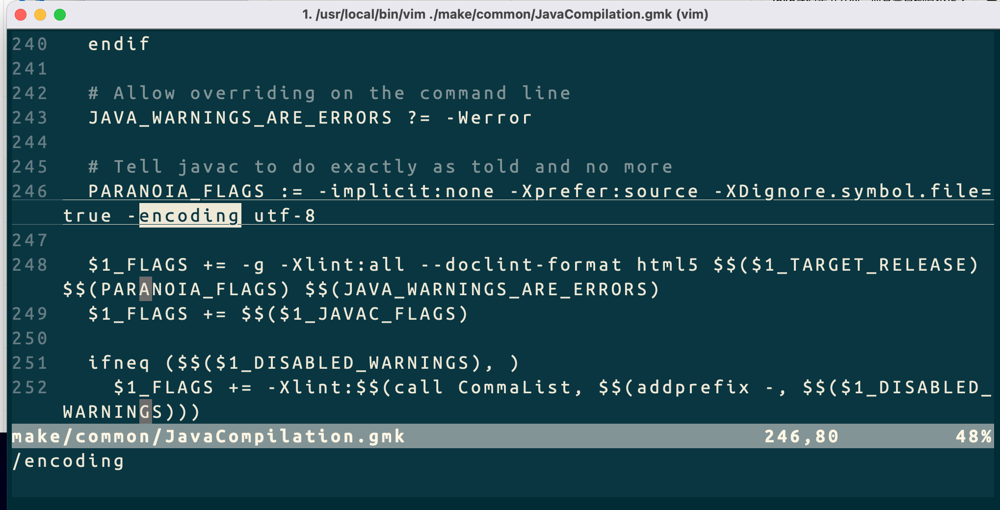

### 1 jdk编译

[参考官方文档](https://openjdk.org/groups/build/doc/building.html)

前言

* 大于openjdk11u的源码中都含有CompileCommands.gmk，修改即可解决openjdk在Clion中引入头文件问题。
* Java源码换行注释后重新编译一下就行，即可解决class与src对应不上问题。

#### 1.1 源码下载

[Git地址](https://github.com/Bannirui/jdk.git)

```sh
git clone git@github.com:Bannirui/jdk.git
cd jdk
git remote add upstream git@github.com:openjdk/jdk.git
git remote set-url --push upstream no_push
git remote -v
git fetch upstream
git checkout jdk-22+0
git rebase upstream/jdk-22+0
git checkout -b jdk_22_study
```

#### 1.2 系统工具准备
- AppStore安装xcode
- brew install autoconf
- brew install make
- brew install libtool
- brew install freetype

#### 1.3 环境变量

```sh
        # 编译openjdk源码时的编译设置
        # 设定语言选项，必须设置
        export LANG=C
        export CC=/usr/bin/clang
        export CXX=/usr/bin/clang++
        # 跳过clang的一些严格的语法检查
        export COMPILER_WARNINGS_FATAL=false
        # 链接时使用的参数
        export LFLAGS='-Xlinker -lstdc++'
        # 是否使用clang
        export USE_CLANG=true
        # 使用64位数据模型
        export LP64=1
        # 告诉编译平台是64位，不然会按32位来编译
        export ARCH_DATA_MODEL=64
        # 允许自动下载依赖
        export ALLOW_DOWNLOADS=true
        # 并行编译的线程数
        export HOTSPOT_BUILD_JOBS=2
        # 是否跳过与先前版本的比较
        export SKIP_COMPARE_IMAGES=true
        # 是否使用预编译头文件 加快编译速度
        export USE_PRECOMPILED_HEADER=true
        # 是否使用增量编译
        export INCREMENTAL_BUILD=true
        # 编译内容
        export BUILD_LANGTOOLS=true
        export BUILD_JAXP=true
        export BUILD_JAXWS=true
        export BUILD_CORBA=true
        export BUILD_HOTSPOT=true
        export BUILD_JDK=true
        # 编译版本
        export SKIP_DEBUG_BUILD=true
        export SKIP_FASTDEBUG_BUILD=false
        export DEBUG_NAME=debug
        # 避开javaws和浏览器Java插件之类的部分的build
        export BUILD_DEPLOY=false
        export BUILD_INSTALL=false
```

#### 1.4 Boot JDK安装


因为jdk15我在现在的电脑环境上已经编译不成功了，因为macos sdk新版本已经不维护某个工具了，因此先到homebrew上看看x86支持的最新的jdk是openjdk21
因此以jdk21为BootJDK来编译jdk22

#### 1.5 字符集修改


#### 1.6 configure脚本

因为我在环境变量中指定`LDFLAGS`，而configure识别不出来，所以先执行`unset LDFLAGS`，再执行下面脚本

```shell
bash ./configure \
--with-debug-level=slowdebug \
--with-jvm-variants=server \
--with-freetype=bundled \
--with-boot-jdk=/usr/local/Cellar/openjdk@21/21.0.4 \
--with-target-bits=64 \
--disable-warnings-as-errors \
--enable-dtrace \
--with-extra-cxxflags="-std=c++14"
```

如果提示有环境变量可能导致后续编译报错就先执行`unset ALT_PARALLEL_COMPILE_JOBS`

如果在linux上执行报错`Could not find required tool for ZIPEXE`就安装`zip`

```shell
sudo pacman -Ss zip
sudo pacman -S zip
```

#### 1.7 编译

```shell
make CONF=macosx-x86_64-server-slowdebug compile-commands

sudo make CONF=macosx-x86_64-server-slowdebug
```

#### 1.8 验证编译结果

```shell
./build/macosx-x86_64-server-slowdebug/jdk/bin/java -version
```


#### 1.9 重新编译

比如在jdk源码中进行了注释导致调试发现断点错行了，这个时候就需要重新编译。

```sh
sudo make CONF=macosx-x86_64-server-slowdebug
```

### 2 Clion调试jvm

在jdk源码根目录下新建文件夹my_test用来放java源码文件
- 先用javac编译java文件
- 再用java执行class文件


麻烦的地方在于每新建一个新的java文件就要新增一个对应的调试配置


### 3 IDea调试java

在调试Jdk源码过程中可能需要追踪c/cpp甚至汇编指令，方便起见新建项目不需要package路径。

#### 3.1 新建项目

[Git地址](https://github.com/Bannirui/openjdk15-debug.git)


#### 3.2 新建SDK

用编译好的jdk作为自己项目的sdk，Sourcepath选择jdk源码路径src下所有文件，这样后面就可以随便写注释，写完注释只要重新build一下jdk源码就行

